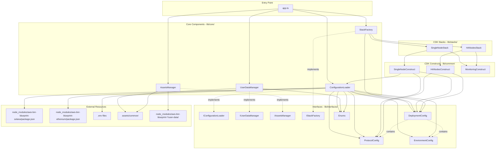
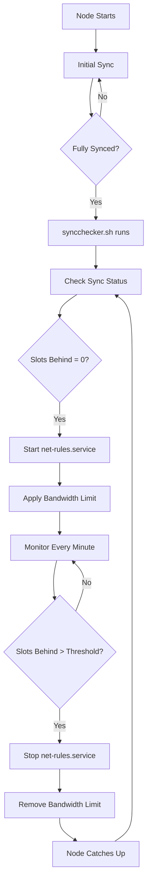
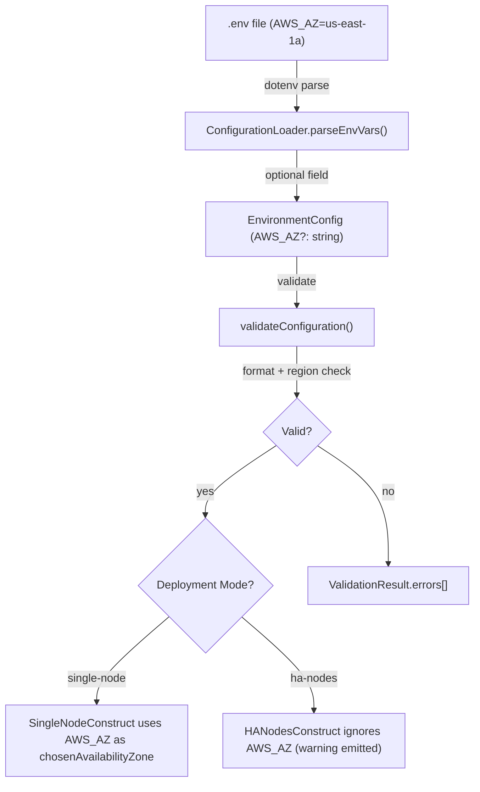
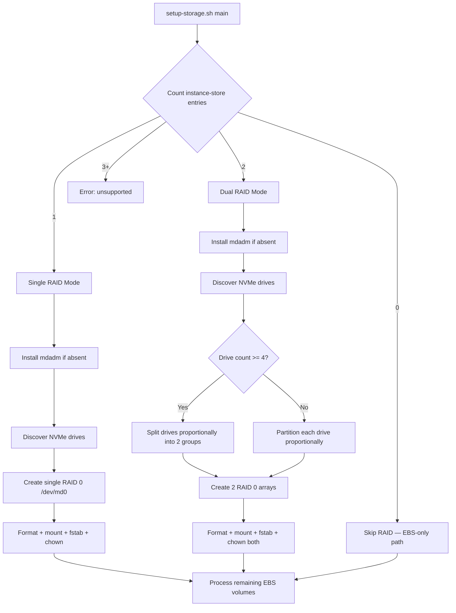
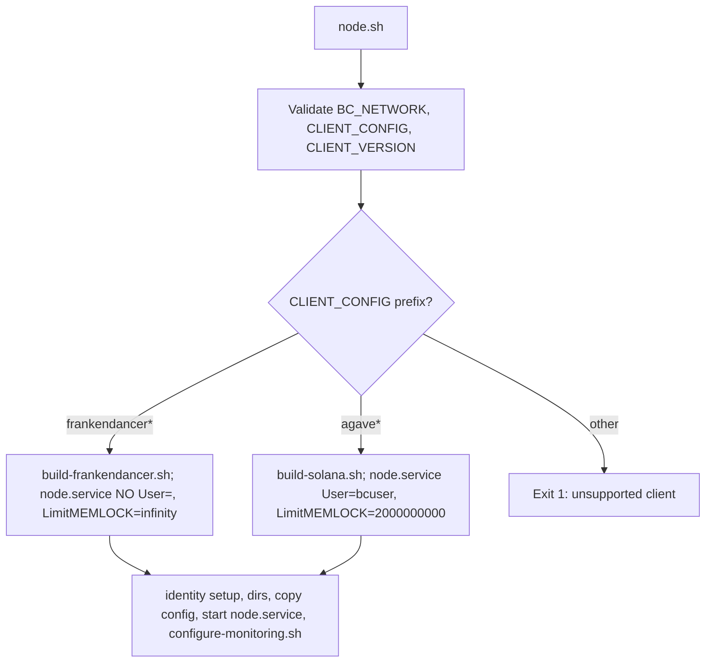
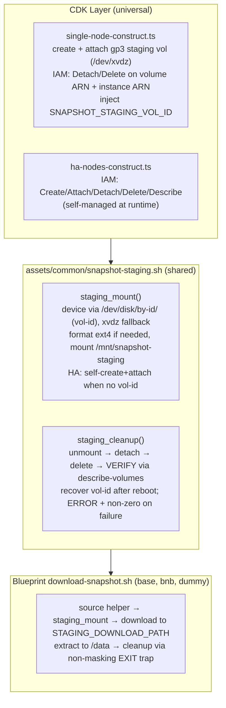

# Design Document

## Overview

The Universal Blockchain Node Runner is a refactored CDK application that consolidates all existing blockchain-specific CDK applications into a single, configuration-driven universal application. This design enables developers to easily add new blockchain protocols as pluggable NPM packages, without needing deep CDK knowledge.

Blueprints are NPM packages — both built-in protocols (ethereum, solana, dummy) and community-contributed external protocols follow the same package structure. Built-in blueprints live in `blueprints/` and are referenced as `file:` path dependencies in the root `package.json`, so they land in `node_modules/` alongside any external blueprints after `npm install`. The `ConfigurationLoader` is extended to resolve blueprint packages from `node_modules/` by looking up the protocol name among the root `package.json` dependencies — no separate loader component, no directory scanning.

All protocol configuration (ports, storage, instance types, deployment modes, etc.) is declared inside the `"aws-blockchain-node-runner"` field of each blueprint's `package.json`. There is no separate `config.json`. Standard `package.json` fields (`name`, `version`, `description`) are reused directly.

Each deployment creates a self-contained stack with all necessary resources (security groups, IAM roles, etc.) integrated directly, eliminating the need for separate common stack deployments. The stacks use the default VPC in the AWS account.

**Operating System**: All deployments use Ubuntu 24.04 LTS as the default operating system, with support for both x86_64 and ARM_64 architectures.

## Architecture

### High-Level Architecture



### Blueprint Package Structure

Each blockchain protocol is an NPM package with a standardized structure. Built-in blueprints live in `blueprints/` and are referenced via `file:` paths in the root `package.json`. External blueprints are installed from the NPM registry or GitHub URLs. Both use the identical structure:

```
aws-bnr-blueprint-<protocol>/         # Blueprint package root
├── package.json                      # NPM package metadata + "aws-blockchain-node-runner" protocol config
├── README.md                         # Protocol-specific documentation
├── samples/                          # Sample .env files
│   ├── .env-mainnet                  # Mainnet configuration template
│   └── .env-testnet                  # Testnet configuration template
├── configurations/                   # (optional) Node configuration templates
│   └── <client>-<version>-<type>.yml # e.g. geth-1.16.8-lighthouse-8.1.0-full.yml
├── user-data/                        # Protocol-specific initialization scripts
│   ├── node.sh                       # REQUIRED: Main node initialization script
│   ├── syncchecker.sh                # (optional) Sync checker and metrics reporter
│   └── common/                       # (optional) Shared helper scripts
└── monitoring/                       # (optional) CloudWatch dashboard templates
    └── single-node-dashboard-template.json
```

The root `package.json` references built-in blueprints as local packages:

```json
{
  "name": "aws-blockchain-node-runners",
  "version": "1.0.0",
  "dependencies": {
    "aws-bnr-blueprint-ethereum": "file:blueprints/ethereum",
    "aws-bnr-blueprint-solana":   "file:blueprints/solana",
    "aws-bnr-blueprint-dummy":    "file:blueprints/dummy"
  }
}
```

See the "Blueprint package.json — Protocol Configuration" section below for a full example.

### Project Structure

```
aws-blockchain-node-runners/
├── app.ts                            # Universal CDK app entry point
├── package.json                      # Root package with file: refs to built-in blueprints
├── tsconfig.json
├── cdk.json
├── lib/
│   ├── common/
│   │   ├── single-node-construct.ts
│   │   ├── ha-nodes-construct.ts
│   │   └── monitoring-construct.ts
│   ├── core/
│   │   ├── configuration-loader.ts   # Extended: resolves blueprint package.json from node_modules/
│   │   ├── user-data-manager.ts
│   │   ├── assets-manager.ts
│   │   └── stack-factory.ts
│   ├── interfaces/
│   │   ├── protocol-config.ts        # Updated: ProtocolConfig no longer includes name/version/description
│   │   └── ...
│   └── stacks/
│       ├── single-node-stack.ts
│       └── ha-nodes-stack.ts
├── assets/
│   └── common/
│       ├── user-data-ubuntu.sh
│       ├── setup-storage.sh
│       ├── cfn-hup-setup.sh
│       └── cw-agent.json
├── blueprints/                       # Built-in blueprints (each is a local NPM package)
│   ├── ethereum/
│   │   ├── package.json              # "aws-blockchain-node-runner" field + standard npm fields
│   │   ├── README.md
│   │   ├── samples/
│   │   ├── configurations/
│   │   ├── user-data/
│   │   └── monitoring/
│   ├── solana/
│   │   ├── package.json
│   │   ├── README.md
│   │   ├── samples/
│   │   ├── configurations/
│   │   ├── user-data/
│   │   └── monitoring/
│   └── dummy/
│       ├── package.json
│       ├── README.md
│       ├── samples/
│       ├── user-data/
│       └── monitoring/
├── docs/
│   ├── ageai-deploy-prompt.md
│   ├── ageai-add-protocol-prompt.md
│   ├── ageai-blueprint-security-review.md  # NEW: security review guide for GenAI
│   ├── configuration-reference.md
│   ├── deployment-guide.md
│   └── troubleshooting.md
└── test/
    ├── unit/
    └── integration/
```

### Configuration System

#### Configuration Flow

The configuration system follows this flow:

1. **User creates .env file** with variables like `BLOCKCHAIN_PROTOCOL="ethereum"`, `DATA_VOL_1_TYPE="gp3"`
2. **ConfigurationLoader.loadProtocolConfig(protocolName)** reads `BLOCKCHAIN_PROTOCOL`, looks up the matching package name in root `package.json` dependencies, resolves `node_modules/<package>/package.json`, reads and validates the `"aws-blockchain-node-runner"` field, and returns a `ProtocolConfig`
3. **ConfigurationLoader.loadEnvironmentConfig()** parses the .env file
4. **ConfigurationLoader.parseDataVolumes()** transforms numbered volume variables into `StorageVolumeConfig[]` array
5. **UserDataManager.injectVariables()** stringifies the array to JSON for injection
6. **CDK Fn.sub()** substitutes variables into the user data script at deployment time

Example transformation:
```bash
# .env file format
DATA_VOL_1_TYPE="gp3"
DATA_VOL_1_SIZE="4000"
DATA_VOL_1_MOUNT_PATH="/data"

# Parsed into EnvironmentConfig
DATA_VOLUMES: [
  {
    TYPE: "gp3",
    SIZE: 4000,
    MOUNT_PATH: "/data"
  }
]

# Injected into user data as JSON string
DATA_VOLUMES='[{"TYPE":"gp3","SIZE":4000,"MOUNT_PATH":"/data"}]'
```

#### Blueprint package.json — Protocol Configuration

The `"aws-blockchain-node-runner"` field in each blueprint's `package.json` contains all protocol-specific configuration. Standard `package.json` fields (`name`, `version`, `description`) are used directly and not duplicated inside this field.

Example (Ethereum):

```json
{
  "name": "aws-bnr-blueprint-ethereum",
  "version": "1.0.0",
  "description": "Ethereum blockchain node blueprint for AWS Blockchain Node Runners",
  "aws-blockchain-node-runner": {
    "BLOCKCHAIN_PROTOCOL": "ethereum",
    "supportedDeploymentModes": ["single-node", "ha-nodes"],
    "defaultConfiguration": "geth-1.16.8-lighthouse-8.1.0-full.yml",
    "availableConfigurations": [
      { "name": "geth-1.16.8-lighthouse-8.1.0-full.yml", "version": "v1.16.8-v8.1.0" },
      { "name": "reth-1.10.2-lighthouse-8.1.0-archive.yml", "version": "v1.10.2-v8.1.0" },
      { "name": "erigon-3.3.7-prysm-7.1.2-archive.yml", "version": "v3.3.7-v7.1.2" }
    ],
    "BC_NETWORKS": ["mainnet", "sepolia", "holesky"],
    "defaultInstanceTypes": { "x86_64": "r7g.2xlarge", "ARM_64": "r7g.2xlarge" },
    "requiredPorts": [
      { "port": 8545, "protocol": "tcp", "description": "JSON RPC", "public": false },
      { "port": 8546, "protocol": "tcp", "description": "WebSocket", "public": false },
      { "port": 8551, "protocol": "tcp", "description": "Engine API", "public": false },
      { "port": 30303, "protocol": "tcp", "description": "Execution P2P", "public": true },
      { "port": 30303, "protocol": "udp", "description": "Execution P2P UDP", "public": true },
      { "port": 9000, "protocol": "tcp", "description": "Consensus P2P", "public": true },
      { "port": 9000, "protocol": "udp", "description": "Consensus P2P UDP", "public": true }
    ],
    "monitoring": { "healthCheckPath": "/", "metricsPort": 8545, "clientNames": ["Execution Client", "Consensus Client"] },
    "storage": {
      "defaultDataVolumes": [
        { "name": "data", "sizeGiB": 3072, "type": "gp3", "iops": 16000, "throughput": 1000, "mountPath": "/data", "fileSystem": "ext4" }
      ]
    },
    "snapshot": { "enabled": true, "downloadUrl": "https://snapshots.ethereum.org/mainnet/latest.tar.lz4" },
    "customEnvVarsNamePrefix": "ETH",
    "customEnvVars": ["ETH_CONSENSUS_CHECKPOINT_SYNC_URL=https://beaconstate.info"]
  }
}
```
##### CloudWatch Dashboard Templates

The monitoring system provides a default dashboard template for single-node deployments:

**Single-Node Dashboard Template** (`lib/common/monitoring-dashboards/single-node-dashboard-template.json`):
- Instance-specific metrics with `${INSTANCE_ID}` substitution
- CPU utilization, memory usage, I/O wait times
- Per-volume disk I/O metrics (read/write operations, throughput, latency)
- Network traffic (in/out)
- Protocol-specific metrics (block height, blocks behind) for up to 2 clients
- Disk space utilization per mount point
- Supports dynamic filtering based on number of data volumes and clients

**Protocol-Specific Metrics Convention**:
- **Namespace**: Must use `CWAgent` namespace (not protocol-specific namespaces)
- **Metric Names**: 
  - `c1_block_height` - Block height for primary/single client
  - `c1_blocks_behind` - Blocks behind for primary/single client
  - `c2_block_height` - Block height for secondary client (multi-client protocols only)
  - `c2_blocks_behind` - Blocks behind for secondary client (multi-client protocols only)
- **Single-Client Protocols** (e.g., Solana): Use only `c1_` metrics
- **Multi-Client Protocols** (e.g., Ethereum with execution + consensus): Use both `c1_` and `c2_` metrics
- **Dashboard Variables**: `${Client1}` and `${Client2}` are substituted with actual client names

**HA Deployments:**
- HA deployments do not include a default monitoring dashboard
- Users should create custom CloudWatch dashboards tailored to their specific monitoring needs
- Custom dashboards can include ALB metrics, ASG metrics, and aggregate instance metrics as needed

Example protocol metrics in user-data script:
```bash
# Single-client protocol (Solana)
aws cloudwatch put-metric-data \
    --namespace "CWAgent" \
    --metric-name "c1_block_height" \
    --value "$block_height" \
    --dimensions "InstanceId=$INSTANCE_ID" \
    --region "$AWS_REGION"

# Multi-client protocol (Ethereum)
# Execution client (c1_)
aws cloudwatch put-metric-data \
    --namespace "CWAgent" \
    --metric-name "c1_block_height" \
    --value "$execution_block_height" \
    --dimensions "InstanceId=$INSTANCE_ID" \
    --region "$AWS_REGION"

# Consensus client (c2_)
aws cloudwatch put-metric-data \
    --namespace "CWAgent" \
    --metric-name "c2_block_height" \
    --value "$consensus_slot_height" \
    --dimensions "InstanceId=$INSTANCE_ID" \
    --region "$AWS_REGION"
```

### Universal Environment Configuration

The universal application uses a standardized .env format with common and protocol-specific sections:

```bash
# Universal Configuration
AWS_ACCOUNT_ID="123456789012"
AWS_REGION="us-east-1"
BLOCKCHAIN_PROTOCOL="ethereum"
DEPLOYMENT_MODE="single-node"  # single-node | ha-nodes
INSTANCE_TYPE="m6a.2xlarge"
CPU_TYPE="x86_64"

# Stack Name Prefix (optional - enables multiple deployments of same config on one account)
# STACK_NAME_PREFIX="DEV"       # Alphanumeric + hyphens, must start with alpha, combined stack name ≤ 128 chars

# VPC Configuration (uses default VPC automatically)
# No VPC configuration required - system uses default VPC

# Block Storage Configuration (supports multiple volumes per instance)

# Number of data volumes to configure (1-6 supported)
DATA_VOLUMES_COUNT="2"

# Volume 1 - Primary Data
DATA_VOL_1_TYPE="gp3"                    # Volume type: gp3, io1, io2, instance-store
DATA_VOL_1_SIZE="4000"                   # Size in GiB
DATA_VOL_1_IOPS="16000"                  # IOPS (not applicable for instance-store)
DATA_VOL_1_THROUGHPUT="1000"             # Throughput in MB/s (gp3 only)
DATA_VOL_1_MOUNT_PATH="/data"            # Mount path on the instance
DATA_VOL_1_DEVICE_NAME="/dev/xvdg"       # Device name (auto-generated if not specified)

# Volume 2 - Accounts/State (example for Solana)
DATA_VOL_2_TYPE="gp3"
DATA_VOL_2_SIZE="500"
DATA_VOL_2_IOPS="7000"
DATA_VOL_2_THROUGHPUT="700"
DATA_VOL_2_MOUNT_PATH="/accounts"
DATA_VOL_2_DEVICE_NAME="/dev/xvdh"

# High Availability Configuration (only used when DEPLOYMENT_MODE="ha-nodes")
HA_NUMBER_OF_NODES="2"                     # Desired number of nodes in auto scaling group
HA_ALB_HEALTHCHECK_PORT="8545"             # Port for ALB health checks
HA_ALB_HEALTHCHECK_PATH="/"                # Path for ALB health checks
HA_ALB_HEALTHCHECK_GRACE_PERIOD_MIN="60"   # Grace period for health checks (minutes)
HA_ALB_HEALTHCHECK_INTERVAL_SEC="30"       # Health check interval (seconds)
HA_ALB_HEALTHCHECK_TIMEOUT_SEC="5"         # Health check timeout (seconds)
HA_ALB_HEALTHCHECK_HEALTHY_THRESHOLD="3"   # Healthy threshold count
HA_ALB_HEALTHCHECK_UNHEALTHY_THRESHOLD="2" # Unhealthy threshold count
HA_NODES_HEARTBEAT_DELAY_MIN="10"          # Lifecycle hook heartbeat delay (minutes)
HA_ALB_DEREGISTRATION_DELAY_SEC="30"       # Target deregistration delay (seconds)

# Generic Protocol Configuration (loaded from protocol config)
BC_NETWORK="mainnet"
CLIENT_CONFIG="geth-1.14.12-lighthouse-6.0.1-full.yml"  # Selected configuration script/template file with versions
CLIENT_VERSION="v1.14.12-v6.0.1"        # Optional: override default component version. Multiple versions for multi-client setups (or client combinations) can be specified with "-" in the middle

# Snapshot Configuration (optional - speeds up node initialization)
SNAPSHOT_ENABLED="true"                                    # Enable/disable snapshot download
SNAPSHOT_DOWNLOAD_URL="https://snapshots.ethereum.org/mainnet/latest.tar.lz4"  # Snapshot download URL

# Traffic Shaping Configuration (optional - reduces outbound data transfer costs)
TRAFFIC_SHAPING_ENABLED="false"                           # Enable/disable dynamic traffic shaping
TRAFFIC_SHAPING_RATE_MBIT="40"                            # Outbound bandwidth limit in Mbit/s (40-100 recommended for RPC nodes)
TRAFFIC_SHAPING_CHECK_INTERVAL_SEC="60"                   # How often to check sync status (seconds)
TRAFFIC_SHAPING_MAX_BLOCKS_BEHIND="10"                     # Max slots/blocks behind before removing limit

# Custom Protocol-Specific configuration paramters
ETH_CONSENSUS_CHECKPOINT_SYNC_URL="https://beaconstate.info" # Unique configuration parameter for Ethereum blueprints
```

## Components and Interfaces

### Traffic Shaping System

The traffic shaping system provides dynamic bandwidth management to optimize outbound data transfer costs for RPC nodes. This feature is particularly effective for high-traffic protocols like Solana, where it can reduce data transfer costs by up to 85% while maintaining node synchronization.

#### Architecture

The traffic shaping system consists of three universal components and one protocol-specific component:

**Universal Components (assets/common/network/):**
1. **net-rules-start.sh**: Enables traffic shaping by configuring nftables and tc (traffic control)
2. **net-rules-stop.sh**: Disables traffic shaping by removing all rules
3. **net-rules.service**: Systemd service that manages the traffic shaping lifecycle

**Protocol-Specific Component (blueprints/{protocol}/user-data/):**
4. **syncchecker.sh**: Protocol-specific script that monitors node synchronization, dynamically enables/disables traffic shaping, and reports block height and blocks behind metrics to CloudWatch

#### How It Works



#### Traffic Shaping Scripts

**net-rules-start.sh**:
- Creates nftables rules to mark packets destined for public IPs
- Excludes internal AWS traffic (10.0.0.0/8, 172.16.0.0/12, 192.168.0.0/16, 169.254.0.0/16)
- Configures tc with token bucket filter (tbf) to limit outbound bandwidth
- Bandwidth limit is configurable via TRAFFIC_SHAPING_RATE_MBIT environment variable

**net-rules-stop.sh**:
- Removes all tc rules
- Deletes nftables mangle table
- Restores unrestricted network traffic

**net-rules.service**:
- Systemd oneshot service with RemainAfterExit=yes
- ExecStart calls net-rules-start.sh
- ExecStop calls net-rules-stop.sh
- Managed by systemctl start/stop commands

**syncchecker.sh** (Protocol-Specific):
- Located in `node_modules/<blueprint-package>/user-data/` directory (resolved via `ConfigurationLoader.getBlueprintFilePath()`)
- Runs periodically (default: every 60 seconds) via systemd timer
- Queries node's protocol-specific API to check synchronization status
- Uses protocol-specific sync check endpoint and metric extraction logic
- Automatically starts traffic shaping when node is fully synced (slots/blocks behind = 0)
- Automatically stops traffic shaping when node falls behind threshold (default: 10 slots/blocks)
- Reports block height (c1_block_height) and blocks behind (c1_blocks_behind) metrics to CloudWatch
- For multi-client protocols, reports metrics for both clients (c1_* and c2_*)
- Only runs after initial sync is complete (checks for /data/data/init-completed file)
- Each protocol implements its own version with protocol-specific API calls and metric extraction

#### Environment Configuration

Users can enable and configure traffic shaping in their .env file:

```bash
# Traffic Shaping Configuration
TRAFFIC_SHAPING_ENABLED="true"
TRAFFIC_SHAPING_RATE_MBIT="40"              # 40-100 recommended for RPC nodes
TRAFFIC_SHAPING_CHECK_INTERVAL_SEC="60"     # Check sync status every minute
TRAFFIC_SHAPING_MAX_BLOCKS_BEHIND="10"       # Remove limit if more than 10 blocks behind
```

**Note**: Traffic shaping configuration is entirely environment-driven through .env variables. The `trafficShaping` property in the blueprint's `"aws-blockchain-node-runner"` field is optional and only used to indicate whether traffic shaping is supported/recommended for the protocol.

#### Cost Optimization

Testing with Solana Agave nodes showed:
- **20 Mbit/s**: Minimum viable rate (~0.2 TiB/month, 99%+ cost reduction)
- **40-100 Mbit/s**: Optimal price-to-performance ratio (~0.4-1 TiB/month, 99% cost reduction)
- **No limit**: ~100-200 TiB/month baseline

Nodes with traffic shaping stayed synchronized 5% more consistently than unrestricted nodes.

#### Important Considerations

1. **RPC Nodes Only**: Traffic shaping is highly effective for RPC nodes
2. **Not for Consensus Nodes**: Do not use on consensus/validator nodes - will compromise performance
3. **Protocol-Specific Implementation**: Each protocol implements its own `syncchecker.sh` with protocol-specific API calls and metric extraction
4. **Dual Responsibility**: The sync checker both controls traffic shaping and reports CloudWatch metrics
5. **Internal Traffic Excluded**: AWS internal traffic (VPC, services) is never restricted
6. **Dynamic Adjustment**: System automatically adapts to node sync status

#### Integration with Universal Application

The traffic shaping system integrates with the universal application through:

1. **ConfigurationLoader**: Parses traffic shaping configuration from .env files
2. **AssetsManager**: Uploads universal traffic shaping scripts (net-rules-start.sh, net-rules-stop.sh, net-rules.service) to common assets
3. **UserDataManager**: Injects traffic shaping variables into user data scripts
4. **Protocol Scripts**: Each protocol implements its own `syncchecker.sh` in its blueprint package's `user-data/` directory (resolved via `ConfigurationLoader.getBlueprintFilePath()`) that:
   - Queries protocol-specific APIs for sync status
   - Controls traffic shaping via systemctl commands
   - Reports block height and blocks behind metrics to CloudWatch
   - Is set up with systemd timer/cron by the protocol's node.sh script

### Core Components

#### 1. IConfigurationLoader (Extended)

The existing `ConfigurationLoader` is extended with blueprint resolution capability. The new `loadProtocolConfig(protocolName)` method will be updated to resolve from `node_modules/` via root `package.json` dependencies. Two new methods — `listAvailableProtocols()` and `getBlueprintFilePath()` — are added for the NPM-based blueprint management feature.

```typescript
interface IConfigurationLoader {
  // --- Existing methods (already implemented) ---

  loadEnvFile(envFilePath?: string): boolean;
  getProtocolName(): string;
  protocolExists(protocolName: string): boolean;
  getAvailableProtocols(): string[];
  loadDeploymentConfig(envFilePath?: string): DeploymentConfig;
  getStackName(deploymentConfig: DeploymentConfig): string;

  /**
   * Get dashboard template path for a protocol based on deployment mode
   */
  getDashboardTemplatePath(protocolName: string, deploymentMode?: DeploymentMode): string | undefined;

  /**
   * Load protocol configuration.
   * Currently reads from blueprints/{protocol}/config.json.
   * Will be extended to resolve from node_modules/ via root package.json dependencies.
   */
  loadProtocolConfig(protocolName: string): ProtocolConfig;

  loadEnvironmentConfig(envPath: string): EnvironmentConfig;
  loadEnvironmentFromProcessEnv(protocolConfig?: ProtocolConfig): EnvironmentConfig;
  validateConfiguration(config: EnvironmentConfig): ValidationResult;
  validateHAConfigVariables(config: EnvironmentConfig): ValidationResult;
  validateProtocolConfiguration(protocolName: string, configName: string): ValidationResult;
  extractProtocolCustomEnvVars(protocol: ProtocolConfig, env: EnvironmentConfig): Record<string, string>;

  // --- New methods for NPM-based blueprint management (not yet implemented) ---

  /**
   * List all protocols available from root package.json dependencies.
   * Used by the GenAI assistant for blueprint discovery.
   */
  listAvailableProtocols(): Array<{
    BLOCKCHAIN_PROTOCOL: string;
    packageName: string;
    version: string;
    description: string;
    isBuiltIn: boolean;  // true if dependency uses file: path prefix
  }>;

  /**
   * Resolve the absolute path to a file within a blueprint package.
   * @example getBlueprintFilePath('ethereum', 'user-data/node.sh')
   */
  getBlueprintFilePath(protocolName: string, relativePath: string): string;
}
```

#### 2. IUserDataManager

Interface for managing user data scripts and variable injection.

```typescript
interface IUserDataManager {
  /**
   * Inject variables into a user data script template.
   * 
   * Variables in the template are expected to be in the format ${VARIABLE_NAME}
   * and will be replaced with the corresponding values from the variables object.
   * 
   * Variable Processing Rules:
   * - First-level string/number/boolean parameters are stringified directly
   * - DATA_VOLUMES array is flattened into individual DATA_VOL_1_TYPE, DATA_VOL_1_SIZE, etc. variables
   * - CUSTOM_VARIABLES object is flattened into individual environment variables
   * - The method uses ##FLATTENED_DATA_VOLUMES## and ##FLATTENED_CUSTOM_VARIABLES## placeholders
   * - CDK's Fn.sub() performs the actual substitution at CloudFormation deployment time
   * 
   * Example DATA_VOLUMES flattening:
   * - Input: environment.DATA_VOLUMES = [{TYPE: "gp3", SIZE: 100, MOUNT_PATH: "/data"}]
   * - Output in script:
   *     echo "DATA_VOL_1_TYPE=gp3"
   *     echo "DATA_VOL_1_SIZE=100"
   *     echo "DATA_VOL_1_MOUNT_PATH=/data"
   * 
   * Example CUSTOM_VARIABLES flattening:
   * - Input: environment.CUSTOM_VARIABLES = {ETH_CONSENSUS_CHECKPOINT_SYNC_URL: "https://beaconstate.info"}
   * - Output in script:
   *     echo "ETH_CONSENSUS_CHECKPOINT_SYNC_URL=https://beaconstate.info"
   * 
   * @param userDataScript - The script template with variable placeholders
   * @param environment - An object containing EnvironmentConfig
   * @param cfnandCDKUserDataConfig - An object containing CFNandCDKUserDataConfig objects
   * @returns The script with variables injected as stringified values of 1st level parameters
   */
  injectVariables(
    userDataScript: string, 
    environment: EnvironmentConfig, 
    cfnandCDKUserDataConfig: CFNandCDKUserDataConfig
  ): string;

  /**
   * Load the universal user data script from the assets directory.
   * 
   * The universal script is located at assets/common/user-data-ubuntu.sh and contains
   * placeholders for deployment-specific variables that will be injected at deployment time.
   * 
   * @returns The universal user data script content as a string
   * @throws Error if the script file cannot be found or read
   */
  loadUserDataScript(): string;

  /**
   * Get the path to the universal user data script.
   * 
   * @returns The path to the universal user data script
   */
  getuserDataScriptPath(): string;
}
```

#### 3. IAssetsManager

Interface for managing asset uploads to S3 for blockchain node deployments.

```typescript
interface IAssetsManager {
  /**
   * Upload common assets (universal scripts and configurations) to S3.
   * 
   * Uses CDK's Asset construct to package the common assets directory and upload
   * it to S3. The asset is cached, so subsequent calls return the same S3 path.
   * 
   * @returns S3 URI to the uploaded common assets (s3://bucket/key)
   * @throws Error if common assets directory doesn't exist or validation fails
   */
  uploadAssets(): string;

  /**
   * Upload protocol-specific assets to S3.
   * 
   * Uses CDK's Asset construct to package the protocol assets directory and upload
   * it to S3. Assets are cached per protocol, so subsequent calls for the same
   * protocol return the same S3 path.
   * 
   * @param protocolName - Name of the blockchain protocol
   * @returns S3 URI to the uploaded protocol assets (s3://bucket/key)
   * @throws Error if protocol assets directory doesn't exist or validation fails
   */
  uploadProtocolAssets(protocolName: string): string;

  /**
   * Validate that common assets directory exists and contains required files.
   * 
   * @returns true if common assets are valid, false otherwise
   */
  validateAssets(): boolean;

  /**
   * Validate that protocol-specific assets directory exists and contains required files.
   * 
   * @param protocolName - Name of the blockchain protocol
   * @returns true if protocol assets are valid, false otherwise
   */
  validateProtocolAssets(protocolName: string): boolean;

  /**
   * Get the expected path for common assets directory.
   * 
   * @returns The expected directory path for common assets
   */
  getAssetsPath(): string;

  /**
   * Get the expected path for protocol-specific assets directory.
   * 
   * @param protocolName - Name of the blockchain protocol
   * @returns The expected directory path for protocol assets
   */
  getProtocolAssetssPath(protocolName: string): string;

  /**
   * Load user-data script from specified directory
   * 
   * @param userDataScriptPath - Path to user data scripts
   * @returns The user data script as text file
   */
  loadUserDataScript(userDataScriptPath: string): string;
}
```

### Common Asset Scripts

The universal application provides several common scripts that are uploaded to S3 and used by all protocols:

#### setup-storage.sh
Handles EBS volume formatting, mounting, and filesystem setup. Reads the flattened `DATA_VOL_*` environment variables and:
- Formats volumes with specified filesystem (ext4 or xfs)
- Creates mount points
- Mounts volumes
- Updates /etc/fstab for persistence

#### cfn-hup-setup.sh
Installs and configures CloudFormation helper scripts for stack updates and signaling.

#### cw-agent.json
CloudWatch agent configuration template for collecting system and application metrics, including systemd service logs.

**Log Collection Configuration:**
- Collects /var/log/syslog containing all systemd service logs (Ubuntu's rsyslog automatically forwards systemd logs to syslog)
- Uploads to CloudWatch log group: /aws/ec2/blockchain-nodes/systemd-services
- Enables viewing logs from node.service, syncchecker.service, net-rules.service, and other systemd services
- Provides centralized logging for troubleshooting without SSH access

#### Systemd Log Collection

The universal application relies on Ubuntu's default rsyslog configuration, which automatically forwards all systemd service logs to /var/log/syslog. The CloudWatch agent is configured to collect this file.

**Benefits:**
- Centralized logging for all systemd services in CloudWatch
- No need for SSH access to view service logs
- Enables CloudWatch Logs Insights queries for troubleshooting
- Persistent log storage beyond instance lifecycle
- Uses Ubuntu's native logging configuration without additional setup
- Consistent logging approach across all deployments

#### 4. IStackFactory

Interface for creating different types of CDK stacks.

```typescript
/**
 * Resources required for stack creation
 */
interface StackAssetResources {
  userDataScriptPath: string;
  dashboardTemplatePath?: string;
  vpc?: ec2.IVpc;
  azIndex?: number;  // Optional Availability Zone index [1-10]
}
}

interface IStackFactory {
  /**
   * Creates a single node stack for deploying a single blockchain node
   * @param app The CDK app
   * @param config The deployment configuration
   * @param stackName The name of the stack to be deployed
   * @param resources Resources for stack creation such as user data script file path and path to CloudWatch dashboard
   * @returns The created single node stack
   */
  createSingleNodeStack(
    app: cdk.App,
    config: DeploymentConfig,
    stackName: string,
    resources: StackAssetResources
  ): cdk.Stack;

  /**
   * Creates a high availability nodes stack with auto scaling and load balancing
   * @param app The CDK app
   * @param config The deployment configuration
   * @param stackName The name of the stack to be deployed
   * @param resources Resources for stack creation such as user data script file path and path to CloudWatch dashboard
   * @returns The created HA nodes stack
   */
  createHANodesStack(
    app: cdk.App,
    config: DeploymentConfig,
    stackName: string,
    resources: StackAssetResources
  ): cdk.Stack;

  /**
   * Creates the appropriate stack based on deployment mode
   * @param app The CDK app
   * @param config The deployment configuration
   * @param stackName The name of the stack to be deployed
   * @param resources Resources for stack creation such as user data script file path and path to CloudWatch dashboard
   * @returns The created stack
   */
  createStack(
    app: cdk.App,
    config: DeploymentConfig,
    stackName: string,
    resources: StackAssetResources
  ): cdk.Stack;
}
```

### Universal Constructs

#### Enhanced Single Node Construct

```typescript
export interface SingleNodeProps {
  /**
   * Protocol configuration containing blockchain-specific settings
   */
  protocolConfig: ProtocolConfig;

  /**
   * Deployment configuration combining protocol and environment settings
   */
  deploymentConfig: DeploymentConfig;

  /**
   * Path to user data script to run on instance startup
   */
  userDataScriptPath: string;

  /**
   * Optional VPC to deploy into. If not provided, uses default VPC.
   */
  vpc?: ec2.IVpc;

  /**
   * Optional Availability Zone index [1-10]. If not provided, uses [1].
   */
  azIndex?: number;
}

export class SingleNodeConstruct extends Construct {
  // Supports any blockchain protocol through configuration
  // Handles protocol-specific ports, storage, and monitoring
  // Includes all necessary shared resources (security groups, IAM roles)
  // Uses default VPC
  // Creates EC2 instance with configurable instance type
  // Creates and attaches EBS volumes based on storage configuration
  // Injects user data with CDK-managed variables
}
```

#### Enhanced HA Nodes Construct

```typescript
export interface HANodesProps {
  /**
   * Protocol configuration containing blockchain-specific settings
   */
  protocolConfig: ProtocolConfig;

  /**
   * Deployment configuration combining protocol and environment settings
   */
  deploymentConfig: DeploymentConfig;

  /**
   * Path to user data script to run on instance startup
   */
  userDataScriptPath: string;

  /**
   * Optional VPC to deploy into. If not provided, uses default VPC.
   */
  vpc?: ec2.IVpc;
}

export class HANodesConstruct extends Construct {
  // Supports any blockchain protocol in HA mode
  // Configurable health checks and load balancer settings
  // Includes all necessary shared resources (security groups, IAM roles, ALB)
  // Uses default VPC
  // Creates Application Load Balancer with target group
  // Creates Auto Scaling Group with launch template
  // Creates lifecycle hooks for graceful node startup/shutdown
  // Injects user data with CDK-managed variables
}
```

## Data Models

### Enums

```typescript
/**
 * Deployment modes supported by the universal blockchain node runner
 */
enum DeploymentMode {
  SINGLE_NODE = "single-node",
  HA_NODES = "ha-nodes"
}

/**
 * CPU architectures supported for blockchain node deployment
 */
enum CpuType {
  X86_64 = "x86_64",
  ARM_64 = "ARM_64"
}
```

### Protocol Configuration Models

```typescript
/**
 * Configuration for a specific blockchain client/version combination
 */
interface Configuration {
  name: string;
  version: string;
}

/**
 * Port configuration for blockchain protocols
 */
interface PortConfig {
  port?: number;
  portRange?: {
    from: number;
    to: number;
  };
  protocol: "tcp" | "udp";
  description: string;
  public?: boolean;
}

/**
 * Storage volume configuration
 * 
 * Note: Property names use uppercase to match the parsed format from .env files.
 * In .env files, volumes are specified as DATA_VOL_1_TYPE, DATA_VOL_1_SIZE, etc.
 * The ConfigurationLoader parses these into StorageVolumeConfig objects with uppercase properties.
 */
interface StorageVolumeConfig {
  TYPE: "gp3" | "io1" | "io2" | "instance-store";
  SIZE: number;       // In GiB
  FILESYSTEM?: "ext4" | "xfs";
  IOPS?: number;
  THROUGHPUT?: number;
  MOUNT_PATH: string;
  DEVICE_NAME: string;
}

/**
 * Storage configuration for a protocol
 */
interface StorageConfig {
  defaultDataVolumes: StorageVolumeConfig[];
}

/**
 * Monitoring configuration for health checks and metrics
 */
interface MonitoringConfig {
  healthCheckPath: string;
  metricsPort: number;
  clientNames: string[];  // e.g. ["Execution Client", "Consensus Client"] or ["Agave Validator"]
}

/**
 * Snapshot configuration for blockchain data initialization
 */
interface SnapshotConfig {
  enabled: boolean;
  downloadUrl?: string;
}

/**
 * Traffic shaping configuration for optimizing outbound data transfer costs
 */
interface TrafficShapingConfig {
  supported: boolean;
  defaultRateMbps?: number;
}

/**
 * Complete protocol configuration — sourced from the "aws-blockchain-node-runner" field
 * in a blueprint's package.json. Does NOT include name, version, or description,
 * which are read from the top-level package.json fields instead.
 */
interface ProtocolConfig {
  BLOCKCHAIN_PROTOCOL: string;
  BC_NETWORKS: string[];
  supportedDeploymentModes: DeploymentMode[];
  defaultConfiguration: string;
  availableConfigurations: Configuration[];
  defaultInstanceTypes: Partial<Record<CpuType, string>>;
  requiredPorts: PortConfig[];
  monitoring: MonitoringConfig;
  storage: StorageConfig;
  customEnvVarsNamePrefix: string;
  customEnvVars?: string[];
  snapshot?: SnapshotConfig;
  userDataScriptFileName?: string;  // Optional override for the node.sh filename
  trafficShaping?: TrafficShapingConfig;
}
```

### Environment Configuration Models

```typescript
/**
 * High Availability configuration parameters
 */
interface HAConfig {
  HA_NUMBER_OF_NODES: number;
  HA_ALB_HEALTHCHECK_PORT: number;
  HA_ALB_HEALTHCHECK_PATH: string;
  HA_ALB_HEALTHCHECK_GRACE_PERIOD_MIN: number;
  HA_ALB_HEALTHCHECK_INTERVAL_SEC: number;
  HA_ALB_HEALTHCHECK_TIMEOUT_SEC: number;
  HA_ALB_HEALTHCHECK_HEALTHY_THRESHOLD: number;
  HA_ALB_HEALTHCHECK_UNHEALTHY_THRESHOLD: number;
  HA_NODES_HEARTBEAT_DELAY_MIN: number;
  HA_ALB_DEREGISTRATION_DELAY_SEC: number;
}

/**
 * Environment configuration loaded from .env files
 */
interface EnvironmentConfig {
  // AWS Configuration
  AWS_ACCOUNT_ID: string;
  AWS_REGION: string;
  
  // Blockchain Configuration
  BLOCKCHAIN_PROTOCOL: string;
  DEPLOYMENT_MODE: DeploymentMode;
  
  // Instance Configuration
  INSTANCE_TYPE: string;
  CPU_TYPE: CpuType;

  // Stack Name Prefix (optional - enables multiple deployments of same config on one account)
  STACK_NAME_PREFIX?: string;
  
  // Generic Protocol Configuration
  BC_NETWORK: string;
  CLIENT_CONFIG: string;
  CLIENT_VERSION: string;

  // Snapshot Configuration
  SNAPSHOT_ENABLED: boolean;
  SNAPSHOT_DOWNLOAD_URL?: string;
  
  // Storage Configuration
  DATA_VOLUMES_COUNT: number;
  DATA_VOLUMES: StorageVolumeConfig[]; // Parsed storage volume configurations

  // Traffic Shaping Configuration
  TRAFFIC_SHAPING_ENABLED: boolean;
  TRAFFIC_SHAPING_RATE_MBIT?: number;
  TRAFFIC_SHAPING_CHECK_INTERVAL_SEC?: number;
  TRAFFIC_SHAPING_MAX_SLOTS_BEHIND?: number;

  // Protocol-specific Configuration Variables
  CUSTOM_VARIABLES: Record<string, string>; // Protocol-specific environment variables

  // High Availability Configuration
  HA_CONFIG: HAConfig;
}
```

### Deployment Configuration Models

```typescript
/**
 * Validation result for configuration validation
 */
interface ValidationResult {
  isValid: boolean;
  errors: string[];
  warnings?: string[];
}

/**
 * Complete deployment configuration combining protocol and environment settings
 */
interface DeploymentConfig {
  protocol: ProtocolConfig;
  environment: EnvironmentConfig;
}

/**
 * CloudFormation and CDK-specific user data configuration
 * These variables are managed by CDK and injected into user data scripts
 */
interface CFNandCDKUserDataConfig {
  STACK_NAME: string;              // CloudFormation stack name
  LOGICAL_RESOURCE_ID: string;     // CloudFormation logical resource ID (for single-node) or "none"
  ASG_NAME: string;                // Auto Scaling Group name (for HA) or "none"
  LIFECYCLE_HOOK_NAME: string;     // Lifecycle hook name (for HA) or "none"
  COMMON_ASSETS_S3_PATH: string;   // S3 path to common assets
  PROTOCOL_ASSETS_S3_PATH: string; // S3 path to protocol-specific assets
}
```

### User Data Script Structure

User data scripts follow a standardized template with variable injection using CDK's Fn.sub():

```bash
#!/bin/bash
set +e

# Create secure environment file for CDK-injected variables
touch /etc/cdk_environment
chmod 600 /etc/cdk_environment
{
  #AWS Configuration
  echo "AWS_ACCOUNT_ID=${AWS_ACCOUNT_ID}"
  echo "AWS_REGION=${AWS_REGION}"
  
  #Blockchain Configuration
  echo "BLOCKCHAIN_PROTOCOL=${BLOCKCHAIN_PROTOCOL}"
  echo "DEPLOYMENT_MODE=${DEPLOYMENT_MODE}"
  
  #Instance Configuration
  echo "INSTANCE_TYPE=${INSTANCE_TYPE}"
  echo "CPU_TYPE=${CPU_TYPE}"
  
  #Generic Protocol Configuration
  echo "BC_NETWORK=${BC_NETWORK}"
  echo "CLIENT_CONFIG=${CLIENT_CONFIG}"
  echo "CLIENT_VERSION=${CLIENT_VERSION}"

  #Snapshot Configuration
  echo "SNAPSHOT_ENABLED=${SNAPSHOT_ENABLED}"
  echo "SNAPSHOT_DOWNLOAD_URL=${SNAPSHOT_DOWNLOAD_URL}"

  #Traffic Shaping Configuration
  echo "TRAFFIC_SHAPING_ENABLED=${TRAFFIC_SHAPING_ENABLED}"
  echo "TRAFFIC_SHAPING_RATE_MBIT=${TRAFFIC_SHAPING_RATE_MBIT}"
  echo "TRAFFIC_SHAPING_CHECK_INTERVAL_SEC=${TRAFFIC_SHAPING_CHECK_INTERVAL_SEC}"
  echo "TRAFFIC_SHAPING_MAX_SLOTS_BEHIND=${TRAFFIC_SHAPING_MAX_SLOTS_BEHIND}"

  #Storage Configuration
  echo "DATA_VOLUMES_COUNT=${DATA_VOLUMES_COUNT}"
  
  # Flattened Data Volumes Configuration (injected by CDK)
  # DATA_VOL_1_TYPE, DATA_VOL_1_SIZE, etc. will be added here
  ##FLATTENED_DATA_VOLUMES##
  
  # Flattened Custom Variables (injected by CDK)
  # Protocol-specific variables will be added here
  ##FLATTENED_CUSTOM_VARIABLES##

  #High Availability Configuration
  echo "HA_NUMBER_OF_NODES=${HA_NUMBER_OF_NODES}"
  echo "HA_ALB_HEALTHCHECK_PORT=${HA_ALB_HEALTHCHECK_PORT}"
  # ... other HA config variables

  #CFN and CDK Configuration
  echo "STACK_NAME=${STACK_NAME}"
  echo "LOGICAL_RESOURCE_ID=${LOGICAL_RESOURCE_ID}"
  echo "ASG_NAME=${ASG_NAME}"
  echo "LIFECYCLE_HOOK_NAME=${LIFECYCLE_HOOK_NAME}"
  echo "COMMON_ASSETS_S3_PATH=${COMMON_ASSETS_S3_PATH}"
  echo "PROTOCOL_ASSETS_S3_PATH=${PROTOCOL_ASSETS_S3_PATH}"

} >> /etc/cdk_environment
source /etc/cdk_environment

# Get instance metadata
TOKEN=$(curl -s -X PUT "http://169.254.169.254/latest/api/token" -H "X-aws-ec2-metadata-token-ttl-seconds: 21600")
INSTANCE_ID=$(curl -H "X-aws-ec2-metadata-token: $TOKEN" -s http://169.254.169.254/latest/meta-data/instance-id)

# Install basic packages
apt-get -yqq update
apt-get -yqq install jq unzip python3-pip chrony

if [ "$ARCH" == "x86_64" ]; then
  CW_AGENT_BINARY_URI=https://s3.amazonaws.com/amazoncloudwatch-agent/ubuntu/amd64/latest/amazon-cloudwatch-agent.deb
else
  CW_AGENT_BINARY_URI=https://s3.amazonaws.com/amazoncloudwatch-agent/ubuntu/arm64/latest/amazon-cloudwatch-agent.deb
fi

# Install AWS CLI
snap install aws-cli --classic

echo 'Install & configure CloudWatch Agent'
wget -q $CW_AGENT_BINARY_URI
dpkg -i -E amazon-cloudwatch-agent.deb

mkdir -p /opt/aws/amazon-cloudwatch-agent/etc/
cp /opt/cw-agent.json /opt/aws/amazon-cloudwatch-agent/etc/custom-amazon-cloudwatch-agent.json

echo "Starting CloudWatch Agent"
/opt/aws/amazon-cloudwatch-agent/bin/amazon-cloudwatch-agent-ctl \
-a fetch-config -c file:/opt/aws/amazon-cloudwatch-agent/etc/custom-amazon-cloudwatch-agent.json -m ec2 -s
systemctl restart amazon-cloudwatch-agent

systemctl daemon-reload

# Download and extract assets if provided
if [[ "$COMMON_ASSETS_S3_PATH" != "none" ]]; then
    echo "Downloading common assets zip file"
    cd /opt || exit 1
    aws s3 cp $COMMON_ASSETS_S3_PATH ./assets.zip --region $AWS_REGION
    unzip -q assets.zip
fi

if [[ "$PROTOCOL_ASSETS_S3_PATH" != "none" ]]; then
    echo "Downloading protocol assets zip file"
    cd /opt || exit 1
    aws s3 cp $PROTOCOL_ASSETS_S3_PATH ./blueprints.zip --region $AWS_REGION
    unzip -q protocols.zip
fi

# Setup storage volumes
/opt/setup-storage.sh

echo "$SCRIPT_NAME Setting up traffic shaping and sync scripts"
# Create directory for traffic shaping scripts
mkdir -p /opt/network

# Copy universal traffic shaping scripts from common assets
if [[ -f "$COMMON_ASSETS_PATH/network/net-rules-start.sh" ]]; then
    cp "$COMMON_ASSETS_PATH/network/net-rules-start.sh" /opt/network/
    chmod +x /opt/network/net-rules-start.sh
else
    echo "WARNING: $SCRIPT_NAME Universal net-rules-start.sh not found in common assets"
fi
    
if [[ -f "$COMMON_ASSETS_PATH/network/net-rules-stop.sh" ]]; then
    cp "$COMMON_ASSETS_PATH/network/net-rules-stop.sh" /opt/network/
    chmod +x /opt/network/net-rules-stop.sh
else
    echo "WARNING: $SCRIPT_NAME Universal net-rules-stop.sh not found in common assets"
fi
    
# Copy protocol-specific sync checker script from protocol assets
if [[ -f "$PROTOCOL_ASSETS_PATH/user-data/syncchecker.sh" ]]; then
    cp "$PROTOCOL_ASSETS_PATH/user-data/syncchecker.sh" /opt/network/
    chmod +x /opt/blueprints/user-data/syncchecker.sh
else
    echo "WARNING: $SCRIPT_NAME Protocol-specific syncchecker.sh not found in protocol assets"
fi
    
# Install systemd service for traffic shaping
if [[ -f "$COMMON_ASSETS_PATH/network/net-rules.service" ]]; then
    cp "$COMMON_ASSETS_PATH/network/net-rules.service" /etc/systemd/system/
    systemctl daemon-reload
    systemctl enable net-rules.service
    systemctl start net-rules
else
    echo "WARNING: $SCRIPT_NAME net-rules.service not found in common assets"
fi
    
# Set up systemd timer for syncchecker.sh
if [[ -f "/opt/blueprints/user-data/syncchecker.sh" ]]; then
    echo "Setting up systemd timer for syncchecker.sh..."
    
    # Create systemd service for sync checker
    cat > /etc/systemd/system/syncchecker.service << 'SYNCSERVICE'
[Unit]
Description=Network Traffic Shaping and Sync Checker
After=network-online.target

[Service]
Type=oneshot
ExecStart=/opt/blueprints/user-data/syncchecker.sh
StandardOutput=journal
StandardError=journal
SYNCSERVICE
        
    # Create systemd timer for sync checker
    cat > /etc/systemd/system/syncchecker.timer << SYNCTIMER
[Unit]
Description=Network Traffic Shaping and Sync Checker Timer
Requires=syncchecker.service

[Timer]
OnBootSec=5min
OnUnitActiveSec=${TRAFFIC_SHAPING_CHECK_INTERVAL_SEC}s

[Install]
WantedBy=timers.target
SYNCTIMER
        
    systemctl daemon-reload
    systemctl enable syncchecker.timer
     systemctl start syncchecker.timer
    echo "Systemd timer for syncchecker.sh configured and started"
fi
    
echo "Traffic shaping and Sync Checker setup completed"

# Signal CloudFormation completion if in Single Node stack to get EBS volumes initialised and ready for setup
if [[ "$LOGICAL_RESOURCE_ID" != "none" ]]; then
    # Install cfn-signal if not available
    if ! command -v cfn-signal &> /dev/null; then
        echo "cfn-signal could not be found, installing"
        /opt/cfn-hup-setup.sh "$STACK_NAME" "$AWS_REGION"
    fi
    cfn-signal --stack "$STACK_NAME" --resource "$LOGICAL_RESOURCE_ID" --region "$AWS_REGION"
fi

# Execute protocol-specific node setup and start
/opt/user-data/node.sh

# Signal ASG lifecycle hook completion if in HA mode
if [[ "$LIFECYCLE_HOOK_NAME" != "none" ]]; then
    echo "Signaling ASG lifecycle hook to complete"
    aws autoscaling complete-lifecycle-action \
        --lifecycle-action-result CONTINUE \
        --instance-id $INSTANCE_ID \
        --lifecycle-hook-name "$LIFECYCLE_HOOK_NAME" \
        --auto-scaling-group-name "$ASG_NAME" \
        --region $AWS_REGION
fi

echo "Node deployment completed successfully"
```

**Key Design Changes:**
- Variables are injected using CDK's `Fn.sub()` function with `${VARIABLE_NAME}` syntax
- The `UserDataManager.injectVariables()` method takes `EnvironmentConfig` and `CFNandCDKUserDataConfig` objects
- **Storage volumes are flattened** into individual `DATA_VOL_1_TYPE`, `DATA_VOL_1_SIZE`, etc. variables using the `##FLATTENED_DATA_VOLUMES##` placeholder
- **Custom protocol variables are flattened** into individual environment variables using the `##FLATTENED_CUSTOM_VARIABLES##` placeholder
- All variables are written to `/etc/cdk_environment` for protocol scripts to source
- Storage setup is handled by `/opt/setup-storage.sh` script which reads the flattened volume variables
- **No separate parse-custom-variables.sh script is needed** - custom variables are injected directly by CDK

## Correctness Properties

*A property is a characteristic or behavior that should hold true across all valid executions of a system — a formal statement about what the system should do, bridging human-readable specifications and machine-verifiable correctness guarantees.*

The core universal application is validated primarily through example-based unit and integration tests (see Testing Strategy). The property-based correctness properties below are defined in detail per merged feature in their respective design sections and are consolidated here for traceability.

### Property 1: AZ parsing round-trip
Any valid AWS AZ string provided as `AWS_AZ` is preserved exactly in `EnvironmentConfig.AWS_AZ`. **Validates: Requirements 23.3** (see "Availability Zone Configuration").

### Property 2: AZ validation correctness
A format error is returned iff `AWS_AZ` does not match `/^[a-z]{2}-[a-z]+-\d+[a-z]$/`, and (for format-valid values) a region-mismatch error is returned iff `AWS_AZ` does not start with `AWS_REGION`. **Validates: Requirements 23.4, 23.5**.

### Property 3: RAID mode detection
RAID mode is determined solely by the count of `instance-store` entries: none (0), single (1), dual (2), error (>2). **Validates: Requirements 24.1, 24.2, 24.3, 24.4** (see "Instance Store RAID Volumes").

### Property 4: RAID assembly correctness
NVMe discovery returns only unmounted, unpartitioned drives >100 GB; single mode includes every discovered drive in `/dev/md0`; dual mode (≥4 drives) allocates `max(1, round(N×S1/(S1+S2)))` to `md0` and the rest to `md1`; dual mode (<4 drives) splits each drive into two proportional partitions. **Validates: Requirements 24.5, 24.6, 24.7**.

### Property 5: Dashboard device-ID mapping
The monitoring construct assigns `md{K}` to `instance-store` volumes and `nvme{N}n1` to EBS volumes. **Validates: Requirements 24.10, 24.11**.

### Property 6: Frankendancer config and routing correctness
Generated TOML contains all required sections/fields with correct network-specific values; `node.sh` routes `frankendancer*`→build-frankendancer (root, `LimitMEMLOCK=infinity`) and `agave*`→build-solana (`User=bcuser`); extended configs add account indexing while base configs do not. **Validates: Requirements 25.2, 25.3, 25.4** (see "Solana Frankendancer Support").

### Property 7: Agave artifact preservation
All pre-existing Agave artifacts (config scripts, samples, build script, `package.json` entries) remain present and unmodified after Frankendancer support is added. **Validates: Requirements 25.8**.

### Property 8: Snapshot staging cleanup correctness
`staging_cleanup()` reports success only after `describe-volumes` confirms the staging volume is deleted; any failure produces a greppable `ERROR:` line and non-zero return; an already-gone volume is idempotently treated as success; and with `SNAPSHOT_STAGING_VOL_SIZE=0`/unset no volume is created and cleanup is a no-op. **Validates: Requirements 27.7, 27.8, 27.10, 27.1** (see "Snapshot Staging Volume").

Note: the Website Restructure feature (Requirement 26) has no property-based tests — it is a static site validated by `npm run build` with `onBrokenLinks`/`onBrokenMarkdownLinks` set to `'throw'`.

## Error Handling

1. **Protocol Validation**: Verify protocol exists and is properly configured
2. **Environment Validation**: Check required environment variables are present
3. **Resource Validation**: Validate instance types, storage configurations, and networking
4. **Script Validation**: Basic syntax checking of user-data scripts

### Runtime Error Handling

1. **Deployment Failures**: Clear error messages with suggested fixes
2. **Configuration Conflicts**: Detect and report incompatible settings
3. **Resource Limits**: Validate against AWS service limits
4. **Script Failures**: Detailed logging and troubleshooting guidance

### Error Recovery

1. **Rollback Mechanisms**: Safe rollback for failed deployments
2. **Partial Deployment Recovery**: Handle partial stack creation failures
3. **Configuration Repair**: Suggest fixes for common configuration issues

## Testing Strategy

### Unit Testing

1. **Configuration Loading**: Test protocol config parsing and validation
2. **User Data Generation**: Test script loading and variable injection
3. **Stack Creation**: Test stack factory logic and construct creation
4. **Validation Logic**: Test all validation functions

### Integration Testing

1. **End-to-End Deployment**: Test complete deployment workflows
2. **Protocol Compatibility**: Test each supported protocol
3. **Cross-Protocol Testing**: Ensure protocols don't interfere with each other
4. **Configuration Scenarios**: Test various configuration combinations

### Protocol Testing

1. **New Protocol Addition**: Test adding a new protocol following the standard pattern
2. **GenAI Integration**: Test that AI tools can successfully generate new protocol support
3. **Documentation Validation**: Ensure README files follow the required structure

### Performance Testing

1. **Deployment Speed**: Measure deployment times across protocols
2. **Resource Utilization**: Monitor CDK synthesis and deployment resource usage
3. **Scalability**: Test with multiple concurrent deployments

### Security Testing

1. **CDK Nag Integration**: Ensure all security rules pass
2. **IAM Permissions**: Test least-privilege access patterns
3. **Network Security**: Validate security group configurations
4. **Secret Management**: Test secure handling of sensitive configuration

### Monitoring and Observability Testing

1. **CloudWatch Integration**: Test dashboard creation and metrics collection
2. **Health Checks**: Validate health check configurations for each protocol
3. **Alerting**: Test alert configurations and thresholds
4. **Log Aggregation**: Ensure proper log collection and formatting

The testing strategy ensures that the universal application maintains the reliability and security of the original separate applications while providing the flexibility needed for easy protocol addition and GenAI integration.

## Key Design Decisions

### 1. Variable Injection Using CDK Fn.sub()

**Decision**: Use CDK's `Fn.sub()` function for variable substitution instead of string replacement in TypeScript.

**Rationale**: 
- CloudFormation performs substitution at deployment time, allowing dynamic values (like resource IDs)
- Supports CloudFormation pseudo-parameters and references
- More secure as variables are resolved in AWS infrastructure
- Consistent with CDK best practices

**Implementation**:
- `UserDataManager.injectVariables()` prepares variables for `Fn.sub()`
- First-level parameters are stringified
- Objects (DATA_VOLUMES, CUSTOM_VARIABLES) are converted to JSON strings
- CDK constructs call `Fn.sub()` with the prepared variable map

### 2. Uppercase Property Names in StorageVolumeConfig

**Decision**: Use uppercase property names (TYPE, SIZE, MOUNT_PATH) in the `StorageVolumeConfig` interface.

**Rationale**:
- Maintains consistency with .env file variable naming conventions
- Simplifies parsing logic in `ConfigurationLoader.parseDataVolumes()`
- Makes it clear these values come from environment variables
- Reduces transformation overhead between .env format and TypeScript objects

### 3. Default VPC Usage

**Decision**: Use the default VPC in the AWS account instead of creating custom VPCs.

**Rationale**:
- Simplifies deployment for users (no VPC configuration required)
- Reduces infrastructure complexity and cost
- Faster deployment times
- Sufficient for most blockchain node use cases
- Users can still provide custom VPC if needed via optional parameter

### 4. Self-Contained Stacks

**Decision**: Each stack includes all necessary resources (security groups, IAM roles) instead of using a separate common stack.

**Rationale**:
- Eliminates deployment dependencies and ordering issues
- Simplifies the deployment process (single `cdk deploy` command)
- Makes stacks more portable and reusable
- Easier to understand for developers new to CDK
- Aligns with CDK best practices for stack independence

### 5. Protocol-Specific Custom Variables

**Decision**: Use `customEnvVarsNamePrefix` and `customEnvVars` in the `"aws-blockchain-node-runner"` field of the blueprint's `package.json` to define protocol-specific variables.

**Rationale**:
- Provides flexibility for protocol-specific configuration without modifying core code
- Enables GenAI tools to easily add new protocols with unique requirements
- Maintains type safety through the CUSTOM_VARIABLES record
- Centralizes protocol-specific configuration in one place
- Simplifies validation and documentation

### 6. Ubuntu 24.04 LTS as Default OS

**Decision**: Standardize on Ubuntu 24.04 LTS for all deployments.

**Rationale**:
- Long-term support ensures stability and security updates
- Wide compatibility with blockchain client software
- Consistent platform simplifies troubleshooting and documentation
- Strong community support and extensive package availability
- Native support for both x86_64 and ARM_64 architectures

### 7. Direct Variable Injection via CDK

**Decision**: Inject custom protocol variables and storage volumes directly via CDK using placeholder replacement instead of using separate parsing scripts.

**Rationale**:
- Simplifies the user data script by eliminating the need for JSON parsing
- Reduces dependencies (no need for `jq` or complex bash JSON parsing)
- Makes variables immediately available in `/etc/cdk_environment` without additional processing
- Easier to debug - all variables are visible in the environment file
- More maintainable - variable flattening logic is in TypeScript, not bash
- Consistent with CDK best practices for variable injection

**Implementation**:
- `UserDataManager.injectVariables()` flattens `DATA_VOLUMES` array into `DATA_VOL_1_TYPE`, `DATA_VOL_1_SIZE`, etc.
- `UserDataManager.injectVariables()` flattens `CUSTOM_VARIABLES` object into individual environment variables
- User data script uses `##FLATTENED_DATA_VOLUMES##` and `##FLATTENED_CUSTOM_VARIABLES##` placeholders
- CDK replaces placeholders with actual echo statements during deployment

### 8. Blueprints as NPM Packages — package.json as Single Source of Truth

**Decision**: All protocol configuration lives in the `"aws-blockchain-node-runner"` field of each blueprint's `package.json`. There is no separate `config.json`. Built-in blueprints are referenced as `file:` path dependencies in the root `package.json`. The `ConfigurationLoader` is extended (not replaced) to resolve blueprint packages from `node_modules/`.

**Rationale**:
- Single file per blueprint for both package identity and protocol configuration — no duplication
- Standard `package.json` fields (`name`, `version`, `description`) are reused directly, not repeated
- `npm install` is the only setup step — built-in and external blueprints land in `node_modules/` identically
- No new loader component needed — `ConfigurationLoader.loadProtocolConfig()` is extended in-place
- External blueprints installable from NPM registry or GitHub URLs with zero core changes
- Ownership and liability for external blueprints stays with their authors

### 9. Blueprint Naming Convention

**Decision**: Blueprint NPM packages follow the naming convention `aws-bnr-blueprint-<protocol>`.

**Rationale**:
- Enables `npm search aws-bnr-blueprint` to discover all community blueprints
- Clear namespace avoids collisions with unrelated packages
- Consistent naming makes GenAI tooling and documentation simpler

## GenAI Agentic Workflows

### Blueprint Discovery and Security Review (docs/ageai-blueprint-security-review.md)

This document provides the GenAI assistant with instructions for two workflows: discovering available blueprints and guiding users through a security review before deployment.

#### Blueprint Discovery Workflow

When a user asks which blueprints are available or wants to find community blueprints:

1. **List installed blueprints**: Call `ConfigurationLoader.listAvailableProtocols()`. Entries with `isBuiltIn: true` are built-in (their dependency uses a `file:` path); all others are external.
2. **Search community blueprints**: Run `npm search aws-bnr-blueprint` and present results with name, description, and version.
3. **Disclaimer**: Always remind the user that community blueprints are not reviewed or verified by the core repository maintainers. The user assumes full responsibility for any external blueprint they install.

Example output format:
```
Built-in blueprints (maintained by this repository):
  - ethereum  (aws-bnr-blueprint-ethereum v1.0.0)
  - solana    (aws-bnr-blueprint-solana v1.0.0)
  - dummy     (aws-bnr-blueprint-dummy v1.0.0)

Community blueprints available on NPM (not verified by maintainers):
  - aws-bnr-blueprint-bitcoin  v0.2.1  "Bitcoin node blueprint"
  - aws-bnr-blueprint-polygon  v1.1.0  "Polygon PoS node blueprint"
```

#### Blueprint Security Review Workflow

When a user installs an external blueprint or explicitly requests a security review, the GenAI assistant SHALL guide them through the following steps before proceeding to deployment:

**Step 1 — Identify the package root**
Resolve the package path: `node_modules/<package-name>/`

**Step 2 — Review package.json declaration**
- Read the `"aws-blockchain-node-runner"` field
- Check that `requiredPorts` only includes ports consistent with the stated protocol purpose
- Flag any ports marked `"public": true` that are not standard for the protocol
- Check `customEnvVars` for any variables that request credentials, secrets, or external URLs

**Step 3 — Review user-data scripts**
Read all files in `user-data/` and `user-data/common/`. Flag any of the following:
- Outbound `curl`, `wget`, or `nc` calls to non-standard endpoints (not AWS APIs, not the blockchain network)
- Commands that read from `~/.aws/`, instance metadata beyond standard IMDS calls, or `/etc/shadow`
- `aws` CLI calls beyond `cloudwatch put-metric-data`, `s3 cp`, `autoscaling complete-lifecycle-action`, and `ssm`
- Any `base64 -d | bash` or similar obfuscated execution patterns
- Destructive commands (`rm -rf /`, `dd`, `mkfs` on non-data volumes)

**Step 4 — Summarize findings**
Present a risk assessment:
- **No concerns found**: Confirm clearly and offer to proceed with deployment guidance
- **Concerns found**: List each concern with the file name and line context. Do NOT proceed to deployment guidance until the user explicitly acknowledges each concern and confirms they want to continue

**Step 5 — Gate before deployment**
The assistant SHALL NOT provide deployment commands or generate a `.env` file for an external blueprint until the user has explicitly acknowledged the security review summary.

## Availability Zone Configuration (merged from availability-zone-configuration)

This feature adds an optional `AWS_AZ` environment variable, allowing users to explicitly pin the AWS Availability Zone for single-node deployments. It addresses deployment failures when the programmatically selected AZ does not support the requested EC2 instance type. The change is a configuration pass-through: a new optional field flows from `.env` → `ConfigurationLoader` parsing → validation → `SingleNodeConstruct` AZ selection. No new components are introduced. HA deployments ignore the field since Auto Scaling Groups manage multi-AZ placement automatically.

### Data Flow



### Components

- **EnvironmentConfig** (`lib/interfaces/environment-config.ts`): add optional `AWS_AZ?: string`. Not added to `ENVIRONMENT_CONFIG_KEYS` (required fields) or `ENVIRONMENT_CONFIG_DEFAULTS`.
- **ConfigurationLoader.parseEnvVars** (`lib/core/configuration-loader.ts`): set `config.AWS_AZ` only when present and non-empty after trim; otherwise leave undefined.
- **ConfigurationLoader.validateConfiguration**: validate format with `/^[a-z]{2}-[a-z]+-\d+[a-z]$/`; if format is valid but `!AWS_AZ.startsWith(AWS_REGION)`, push a region-mismatch error (else-if chain ensures one error per value); when `DEPLOYMENT_MODE === ha-nodes` and `AWS_AZ` set, push a warning (not error).
- **SingleNodeConstruct** (`lib/common/single-node-construct.ts`): `chosenAvailabilityZone = environment.AWS_AZ || (azIndex ? availabilityZones.slice(0, availabilityZones.length - 1)[azIndex] : availabilityZones[1])`. The same variable already drives both the EC2 instance and EBS volume placement.
- **HANodesConstruct**: no code change; warning handles user communication.
- **Sample `.env` files**: add commented-out `AWS_AZ` after `AWS_REGION` with a region-appropriate example.

### Field & Validation Spec

| Field | Type | Required | Default | Example |
|-------|------|----------|---------|---------|
| `AWS_AZ` | `string` | No | `undefined` | `"us-east-1a"` |

| Rule | Pattern | Type |
|------|---------|------|
| Format | `/^[a-z]{2}-[a-z]+-\d+[a-z]$/` | Error |
| Region match | `AWS_AZ.startsWith(AWS_REGION)` | Error |
| HA mode | `DEPLOYMENT_MODE === 'ha-nodes'` | Warning |

Runtime note: a valid-format AZ that does not exist in the account (e.g. `us-east-1z`) will fail at CloudFormation time — validation checks format and region consistency only, consistent with how `INSTANCE_TYPE` is handled.

### Correctness Properties

- **AZ parsing round-trip**: any valid AZ string provided as `AWS_AZ` is preserved exactly in `EnvironmentConfig.AWS_AZ`. (Validates AC 23.3)
- **AZ format validation correctness**: a format error is returned iff the value does not match `/^[a-z]{2}-[a-z]+-\d+[a-z]$/`. (Validates AC 23.4)
- **AZ region consistency**: for format-valid values, a region-mismatch error is returned iff `AWS_AZ` does not start with `AWS_REGION`. (Validates AC 23.5)

## Instance Store RAID Volumes (merged from instance-store-raid-volumes)

This feature adds Linux software RAID 0 support to `assets/common/setup-storage.sh` so multiple instance store NVMe drives combine into one or two high-performance arrays, plus a small `monitoring-construct.ts` change for correct disk I/O dashboard device names. No new `.env` variables are introduced; EBS-only deployments are unaffected. A RAID assembly step is inserted **before** the existing per-volume loop: it collects all `instance-store` entries, determines the mode, assembles the array(s) with `mdadm`, formats/mounts them, then lets the existing loop handle remaining EBS volumes.

### Assembly Flow



### Components

- **assets/common/setup-storage.sh** (modified) — new functions:
  - `ensure_mdadm()` — installs `mdadm` via `apt-get` if absent.
  - `collect_instance_store_configs()` — iterates `DATA_VOL_{N}_*`, collects `instance-store` entries into parallel arrays (`IS_MOUNT_PATHS`, `IS_FILESYSTEMS`, `IS_SIZES`, `IS_COUNT`).
  - `setup_single_raid <mount> <fs>` — discovers all NVMe drives, creates `/dev/md0`, formats, mounts, fstab, chown.
  - `setup_dual_raid <m1> <fs1> <s1> <m2> <fs2> <s2>` — splits drives into two groups (≥4 drives) or partitions each drive (2–3 drives) by the `s1:s2` ratio; creates `/dev/md0` and `/dev/md1`.
  - `main()` restructured: source `/etc/cdk_environment` → collect configs → dispatch by count (0 skip / 1 single / 2 dual / >2 error) → loop EBS entries via existing `setup_volume` (skipping `instance-store`) → log `lsblk`.
- **lib/common/monitoring-construct.ts** (modified) — assign `md{raidIndex}` device IDs for `instance-store` volumes and `nvme{index+1}n1` for EBS volumes, so CloudWatch `diskio` widgets filtering on `name` reference the actual block device. `disk_used_percent` widgets are unaffected (they filter by mount `path`).

### Unchanged

`single-node-construct.ts` and `ha-nodes-construct.ts` already skip `instance-store` volumes when creating EBS volumes; `StorageVolumeConfig.TYPE` already includes `"instance-store"`; `user-data-ubuntu.sh`, protocol `node.sh` scripts, dashboard JSON templates, and existing `.env` samples need no change (Solana samples already declare two `instance-store` entries).

### Algorithms & Data

- **Mode detection**: by count of `instance-store` entries — 0 none, 1 single, 2 dual, >2 error.
- **Drive discovery**: NVMe devices that are unmounted, unpartitioned, and >100 GB, sorted by device name.
- **Dual ≥4 drives**: `first_count = max(1, round(N × S1/(S1+S2)))`, `second_count = N − first_count` (ensure ≥1 each); first group → `md0`, rest → `md1`.
- **Dual <4 drives**: partition each drive into two (`partition1_pct = round(S1×100/(S1+S2))`); all p1 → `md0`, all p2 → `md1`.
- **RAID naming**: single → `/dev/md0`; dual → `/dev/md0` + `/dev/md1`.
- **fstab**: `UUID=<uuid> <mount> <fs> defaults,nofail 0 2` (XFS uses `noatime,nodiratime,nodiscard,nofail`).
- **mdadm.conf**: persisted via `mdadm --detail --scan` for reboot reassembly.

### Error Handling & Idempotency

`set -euo pipefail`; each step logs a descriptive message so failures are identifiable in cloud-init logs. Error/exit on: >2 instance-store entries; 0 drives (single) / <2 drives (dual); `mdadm`/`mkfs`/`mount`/`sgdisk` failures. Already-mounted paths are skipped (existing behavior). Re-running implies a fresh instance since instance store is ephemeral.

### Correctness Properties

- **Property 1**: RAID mode determined by instance-store entry count (none/single/dual/error). (Validates AC 24.1–24.4)
- **Property 2**: drive discovery returns only unmounted, unpartitioned NVMe drives >100 GB, sorted. (Validates AC 24.5)
- **Property 3**: single RAID includes every discovered drive once, level 0, `/dev/md0`. (Validates AC 24.1)
- **Property 4**: dual proportional allocation (≥4 drives) — `max(1, round(N×S1/(S1+S2)))` to array 0, remainder to array 1, both ≥1, first entry → md0. (Validates AC 24.6)
- **Property 5**: dual partition split (<4 drives) — each drive split into two partitions by the size ratio; each array has one partition per drive. (Validates AC 24.7)
- **Property 6**: dashboard device ID is `md{K}` for instance-store and `nvme{N}n1` for EBS. (Validates AC 24.10, 24.11)

Testing uses bats-core for shell unit/property tests (mocking `lsblk`, `mdadm`, `mkfs`, `mount`, `sgdisk`, `apt-get`), loopback-device integration tests, and CDK unit tests for the monitoring device-ID mapping.

## Solana Frankendancer Support (merged from solana-frankendancer-support)

This adds Frankendancer (hybrid Firedancer/Agave) client support to the existing Solana blueprint (`blueprints/solana/`). Frankendancer replaces Agave's networking stack with Firedancer's AF_XDP implementation while retaining Agave for runtime/consensus, running as a single `fdctl` binary. Key differences from Agave: TOML config instead of CLI flags; root privileges at startup for AF_XDP (drops to `bcuser` via TOML `user` field); System_Initialization (`fdctl configure init all`) before each run; built from source via `deps.sh` + `make -j fdctl solana`; same RPC API so syncchecker/monitoring are unchanged. All changes are confined to `blueprints/solana/` — no CDK TypeScript changes. Reference: https://docs.firedancer.io/ (Overview, Getting Started, Configuration Reference, Initialization, Troubleshooting, FAQ).

### Client Detection Flow (node.sh)



### New Files (blueprints/solana/)

- `user-data/common/build-frankendancer.sh` — input `$1`=version; installs `fdctl`+`solana` to `/home/bcuser/bin/`. Steps: install build deps (GCC 8.5+, Rust, clang, git, make) → `git clone --recurse-submodules --branch v${VERSION} https://github.com/firedancer-io/firedancer.git` → `./deps.sh` → `make -j$(nproc) fdctl solana` → copy binaries → `chown bcuser:bcuser`, `chmod 755` → clean up.
- `configurations/frankendancer-0.819.30111-rpc-base.sh` — generates TOML (`user="bcuser"`, `[gossip]`, `[consensus]` no_voting=true, `[rpc]` port=8899/bind=EC2 IP/full_api=true/transaction_history=true/private=true, `[ledger]` path=/data/data/ledger/accounts_path=/accounts/limit_size=true, `[layout]`, `[log]` path="-"), then `fdctl configure init all` then `exec fdctl run`, as root.
- `configurations/frankendancer-0.819.30111-rpc-extended.sh` — base plus `[ledger].account_indexes=["spl-token-owner","program-id","spl-token-mint"]`, `account_index_exclude_keys=["kinX...","Token..."]`, `[rpc].extended_tx_metadata_storage=true`.
- 4 sample `.env` files: `.env-mainnet-beta-frankendancer-rpc-base` (i7i.12xlarge), `.env-mainnet-beta-frankendancer-rpc-extended` (i7i.24xlarge), `.env-mainnet-beta-frankendancer-rpc-base-ha` (ha-nodes), `.env-testnet-frankendancer-rpc-base` (i7i.4xlarge). All use `CLIENT_VERSION="v0.819.30111"`, 2-volume storage (`/data`,`/accounts`), `SOLANA_NODE_IDENTITY_SECRET_ARN="none"`.

### Modified Files

- `user-data/node.sh` — prefix-based client dispatch controlling build script, `User=` directive, and `LimitMEMLOCK`. Shared flow (identity, dirs, config copy, monitoring) unchanged.
- `package.json` — add 2 Frankendancer `availableConfigurations` (v0.819.30111); add port 8003/udp (public) to `requiredPorts`; add "Frankendancer" to `monitoring.clientNames`. All existing Agave entries preserved.
- `README.md` — Available Configurations table, Agave-vs-Frankendancer comparison, Frankendancer troubleshooting (hugetlbfs/AF_XDP/`fdctl configure`), hardware requirements, FAQ entry.

### Unchanged

`build-solana.sh`, `setup-configuration.sh`, `configure-monitoring.sh`, `syncchecker.sh`, both Agave config scripts, and all Agave `.env` samples.

### Systemd Privilege Model

| Aspect | Agave | Frankendancer |
|--------|-------|---------------|
| `User=` | bcuser | omitted (root) |
| Privilege model | runs as bcuser | starts root, drops to bcuser via TOML `user` |
| LimitNOFILE | 1000000 | 1000000 |
| LimitMEMLOCK | 2000000000 | infinity |
| Restart | always (10s) | always (10s) |
| EnvironmentFile | /etc/cdk_environment | /etc/cdk_environment |

### Port Security Rationale

For RPC-only nodes (`no_voting=true`), only the shred port needs public access. Ports 9001 (`[tiles.quic]` regular tx) and 9007 (`[tiles.quic]` QUIC tx) are NOT exposed — clients submit via JSON RPC (8899) and the Agave subprocess forwards to the leader. Port 8003 (`[tiles.shred]`, Turbine block data) IS public; without it the node falls back to the repair protocol on the gossip range (8001-8027) and lags the cluster tip. Both clients use dynamic port range 8004-8029 within the gossip security group rules.

### Correctness Properties

- **Property 1**: TOML structure completeness — all required sections/fields present with correct rpc/ledger/consensus values. (Validates AC 25.2)
- **Property 2**: network-specific TOML correctness — entrypoints/genesis hash/known validators match the Agave mapping per network. (Validates AC 25.2)
- **Property 3**: client detection routing — `frankendancer*`→build-frankendancer, `agave*`→build-solana, else exit 1. (Validates AC 25.4)
- **Property 4**: systemd privilege model — `User=bcuser` iff agave; no `User=`+`LimitMEMLOCK=infinity` iff frankendancer; shared limits/restart/env for both. (Validates AC 25.4)
- **Property 5**: Agave artifact preservation — all pre-existing Agave artifacts present and unmodified; Agave `availableConfigurations` a subset of the updated array. (Validates AC 25.8)
- **Property 6**: Frankendancer sample env consistency — 2 volumes (`/data`,`/accounts`), `SOLANA_NODE_IDENTITY_SECRET_ARN="none"`. (Validates AC 25.6)
- **Property 7**: base vs extended differentiation — extended has account_indexes + extended_tx_metadata_storage=true; base does not; both full_api/transaction_history/no_voting=true. (Validates AC 25.3)

Testing: shell static validation (package.json, samples, config scripts, node.sh dispatch), fast-check/bash property tests (100+ iterations each), and integration deploys (testnet Frankendancer, Agave regression, HA).

## Website Restructure (merged from website-restructure)

This restructures the Docusaurus 3.x website (`website/`) to reflect the universal, AI-first architecture. It reorganizes `website/docs/` into category directories, updates markdown import paths to `blueprints/{protocol}/README.md` and root `docs/`, replaces the autogenerated sidebar with explicit categories, redesigns the landing page, updates navbar/footer, removes legacy blueprint pages, and tightens build config to fail on broken links. Content from root `docs/` and `blueprints/` is pulled into wrapper pages via MDX `import` with relative paths (same pattern already used for blueprint READMEs) — no Docusaurus plugin changes needed.

### New Directory Layout

```
website/docs/
├── getting-started/   intro.md, prerequisites.md
├── guides/            deployment-guide.md, configuration-reference.md, troubleshooting.md,
│                      testing.md, traffic-shaping.md, snapshot-staging.md  (import from ../../../docs/*.md)
├── ai-workflows/      deploy-with-ai.md, add-protocol-with-ai.md, healthcheck-with-ai.md,
│                      security-review-with-ai.md  (import from ../../../docs/ageai-*.md)
└── blueprints/        about.md (inline), base.md, bitcoin.md, bnb.md, ethereum.md, solana.md
                       (import from ../../../blueprints/{protocol}/README.md)
```

Wrapper page pattern:
```mdx
---
sidebar_label: Deployment Guide
---
import Content from '../../../docs/deployment-guide.md';

<Content />
```
Path from `website/docs/<category>/*.md` to repo root is 3 levels up (`../../../`).

### Components

- **Landing page** (`src/pages/index.js`): tagline "AI-driven blockchain node infrastructure experimentation on AWS"; feature cards (🤖 AI-Guided Deployment, ⚡ Rapid Experimentation, 🏗️ Universal Architecture); primary CTA → `/docs/getting-started/intro`, secondary CTA → `/docs/blueprints/about`.
- **sidebars.js**: hybrid — fixed top-level categories ("Getting Started", "Guides", "AI Workflows", "Blueprints") each with `{ type: 'autogenerated', dirName: ... }`; ordering via `sidebar_position` frontmatter.
- **docusaurus.config.js**: tagline update; `onBrokenLinks: 'throw'`, `onBrokenMarkdownLinks: 'throw'`; navbar (Getting Started, Guides, AI Workflows, Blueprints, GitHub); footer (Documentation home, Configuration Reference, GitHub, Contribution Guide); site title "AWS Blockchain Node Runners"; navbar title "▣-▣-▣ Node Runners".
- **About Blueprints page** (`blueprints/about.md`, inline): describes `blueprints/{protocol}/` structure, the pluggable NPM package system (`package.json` `"aws-blockchain-node-runner"` field), links `docs/ageai-add-protocol-prompt.md`, lists supported protocols (Base, Bitcoin, BNB, Ethereum, Solana, Dummy/testing).
- **Legacy removal**: delete blueprint pages for protocols not in `blueprints/` (Besu-private, BSC, Polygon, Scroll, Stacks, Starknet, Sui, Tezos, Theta, Vechain, Wax, XRP), `intro/setup.md` (broken `docs/setup-cloud9.md` import), and the old `Blueprints/` and `intro/` directories.

### Testing Strategy

PBT is not applicable (static site config/content). Primary validation is `cd website && npm run build` succeeding with `onBrokenLinks`/`onBrokenMarkdownLinks` set to `'throw'` — broken doc IDs, missing imports, and broken links fail the build. Manual checklist: landing page render, 4 sidebar categories, imported content render, navbar/footer links, 404 for removed pages, `npm run start`. Optional Node/Jest checks: valid `sidebars.js`, all referenced doc IDs and import paths resolve to existing files.

## Snapshot Staging Volume (merged from base-snapshot-disk-overflow-fix + snapshot-staging-cleanup-fix)

This adds a temporary gp3 EBS staging volume to the snapshot download workflow so large compressed archives never compete for space on `/data`, while preserving `wget -c`/aria2c resume capability. The archive downloads to the staging volume; extraction writes to the instance-store `/data`; the staging volume is then verifiably unmounted, detached, and deleted. The mechanism is universal (all blueprints can opt in); Base and BNB adopt it directly. This section describes the final end-state combining the original mechanism and the hardened cleanup.

### Architecture



### Components

- **`lib/interfaces/environment-config.ts`** — add `SNAPSHOT_STAGING_VOL_SIZE?: number` (GiB); default `0` in `ENVIRONMENT_CONFIG_DEFAULTS`.
- **`lib/core/configuration-loader.ts`** — parse `SNAPSHOT_STAGING_VOL_SIZE` in `parseEnvVars()` (`parseInt`, default 0).
- **`lib/interfaces/cfn-cdk-environment-config.ts`** — add `SNAPSHOT_STAGING_VOL_ID` to `CFNandCDKUserDataConfig`.
- **`lib/common/single-node-construct.ts`** — when `SNAPSHOT_STAGING_VOL_SIZE > 0 && SNAPSHOT_ENABLED`, create gp3 volume (1000 MB/s, 16000 IOPS, encrypted, `RemovalPolicy.DESTROY`, `Purpose=snapshot-staging` tag), attach at `/dev/xvdz`, grant `ec2:DetachVolume`/`ec2:DeleteVolume`, and inject `SNAPSHOT_STAGING_VOL_ID`. **Critical:** the IAM grant must include both the volume ARN and the instance ARN — `DetachVolume` authorizes against the instance, so a volume-only scope causes detach denial and orphaning (a wildcard instance ARN avoids a CDK dependency cycle).
- **`lib/common/ha-nodes-construct.ts`** — grant `ec2:CreateVolume`/`AttachVolume`/`DetachVolume`/`DeleteVolume`/`DescribeVolumes` scoped by `aws:RequestedRegion`; the helper self-creates the volume at runtime.
- **`assets/common/user-data-ubuntu.sh`** — echo `SNAPSHOT_STAGING_VOL_SIZE` and `SNAPSHOT_STAGING_VOL_ID` into `/etc/cdk_environment`.
- **`assets/common/snapshot-staging.sh`** (shared helper):
  - `staging_mount()` — no-op (download to `/data`) when size is 0; HA self-create+attach when no vol-id; resolve device via `/dev/disk/by-id/nvme-Amazon_Elastic_Block_Store_vol<id>` (Nitro remaps `/dev/xvdz` unpredictably), `/dev/xvdz` fallback for non-Nitro; format ext4 if needed (resume-safe); mount at `/mnt/snapshot-staging`; export `STAGING_DOWNLOAD_PATH`/`STAGING_ENABLED`.
  - `staging_cleanup()` — unmount (lazy fallback) → detach (capture exit) → bounded 3-min wait → delete (capture exit) → **verification gate** `describe-volumes` (NotFound/empty = success) → return 0 only when confirmed gone; else `_log_err` greppable `ERROR:` line + non-zero. Recovers lost `SNAPSHOT_STAGING_VOL_ID` from `/etc/cdk_environment` then from the `Purpose=snapshot-staging` + instance-id tag filter.
- **Blueprint `download-snapshot.sh`** (`base`, `bnb`, and `dummy` debug) — source helper; non-masking trap: `trap 'staging_cleanup || echo "ERROR: staging cleanup did not confirm volume deletion — check for orphaned EBS volume"' EXIT`; download to `$STAGING_DOWNLOAD_PATH`, extract to `/data`.

### Data Flow

```
Single-node: CDK creates+attaches vol → injects vol-id → staging_mount finds device →
             wget -c to /mnt/snapshot-staging → tar extract to /data → staging_cleanup (verify delete)
HA:          CDK grants IAM only → staging_mount self-creates+attaches → download → extract →
             staging_cleanup self-detach+delete (verify)
```

### Orphan Prevention

| Scenario | Cleanup mechanism |
|----------|-------------------|
| Happy path | `staging_cleanup()` verifies delete via `describe-volumes` |
| AWS call fails | `ERROR:` log + non-zero return (no false success) |
| Reboot / lost vol-id | recover from `/etc/cdk_environment`, then tag+instance-id filter |
| Instance terminated / stack deleted | CloudFormation `RemovalPolicy.DESTROY` (single-node) |
| Already-gone volume | `InvalidVolume.NotFound` treated as success (idempotent) |

### Volume Sizing Guidance

Rule of thumb: `SNAPSHOT_STAGING_VOL_SIZE` ≈ 1.1× compressed archive size. Examples: Base mainnet reth archive ~4.86 TB → 5000 GiB; Base geth full ~1.5 TB → 2000 GiB; BNB reth archive ~9.7 TB → 10000 GiB; BNB geth ~365 GB → 500 GiB. Cost: a ~5 TB gp3 staging volume for ~2 days ≈ $29 vs $480+ wasted on a failed deployment.

### Correctness Properties

- **No false success**: cleanup returns 0 / prints success only if `describe-volumes` confirms the volume is gone. **Validates: Requirements 27.7, 27.8**
- **Failure visibility**: any detach/delete/verify failure produces a greppable `ERROR:` line with the volume ID and a non-zero return. **Validates: Requirements 27.8**
- **Idempotent / race-safe**: an already-gone volume (NotFound) is treated as success. **Validates: Requirements 27.7, 27.10**
- **Disk-overflow preservation**: with staging enabled the archive never lands on `/data`; with `SNAPSHOT_STAGING_VOL_SIZE=0`/unset, behavior is the legacy download-to-`/data` no-op. **Validates: Requirements 27.1, 27.6**

### Testing Strategy

Jest (CDK wiring) via `ConfigurationLoader` + real `dummy` protocol and `cdk synth`/`Template` assertions: staging-enabled → gp3 `AWS::EC2::Volume` (`Purpose=snapshot-staging`), `AWS::EC2::VolumeAttachment` at `/dev/xvdz`, IAM granting Detach/Delete scoped to volume+instance, `SNAPSHOT_STAGING_VOL_ID` injected; staging-disabled → none produced; HA grants self-management actions. Bash lifecycle validated by the Dummy debug path (real `staging_cleanup()`, `STAGING DEBUG: PASS/FAIL`). Static: `shellcheck -S warning`, `npm run build`, `npm run test`, `npx cdk synth`. End-to-end proof requires a real small (~10 GiB) dummy staging deploy in a sandbox account confirming the volume is deleted afterward.
