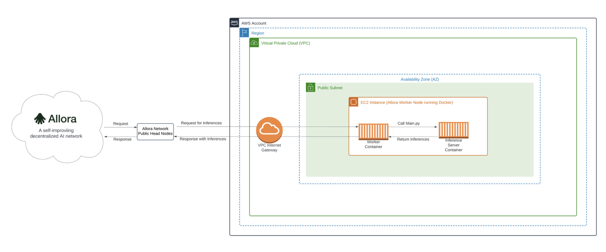

# Sample AWS Blockchain Node Runner app for Allora Worker Nodes

| Contributed by |
|:--------------------:|
| [@clementupshot](https://github.com/clementupshot), [@allora-rc](https://github.com/allora-rc), [@Madisonw](https://github.com/Madisonw)|

[Allora](https://www.allora.network/) is a self-improving decentralized Artificial Intelligence (AI) network. The primary goal of the network is to be the marketplace for intelligence. In other words, Allora aims to incentivize data scientists (workers) to provide high-quality inferences as requested by consumers. Inferences include predictions of arbitrary future events or difficult computations requiring specialized knowledge.

The Allora Network brings together:

  - [Consumers](https://docs.allora.network/devs) who pay for and acquire inferences or expertise to be revealed
  - [Workers](https://v2.docs.allora.network/datasci) who reveal inferences
  - [Reputers](https://docs.allora.network/nops) who determine how accurate workers are after a ground truth is revealed
  - [Validators](https://docs.allora.network/nops) who secure protocol state, history, and reward distributions

With these ingredients, the Allora Network is able to continuously learn and improve itself over time producing inferences that are more accurate than the most accurate participant.

Allora Worker nodes are the interfaces between data scientists' models and the Allora Network. A worker node is a machine-intelligent application registered on the Allora chain that provides inference/prediction on a particular topic it's subscribed to and gets rewarded based on the inference quality.

This blueprint is designed to assist in deploying a single Allora [Worker Node](https://v2.docs.allora.network/datasci) on AWS. It is intended for use in development, testing, or Proof of Concept (PoC) environments.

## Overview of Deployment Architecture

### Single Worker Node Setup


The AWS Cloud Development Kit (CDK) is used to deploy a single Allora Worker Node. The CDK application deploys the following infrastructure:
   
  - Virtual Private Cloud (VPC)
  - Internet Gateway (IGW) to allow inbound requests for inferences from consumers and outbound responses from the worker node revealing inferences
  - Public subnet that has a direct route to the IGW
  - Security Group (SG) with TCP Port 9010 open inbound allowing requests for inferences to be routed to the Allora Worker Node
  - Single Amazon Elastic Compute Cloud (EC2) instance (the Allora Worker Node) assigned to the public subnet

The Allora Worker Node is accessed by the user internally and is not exposed to the Internet to protect the node from unauthorized access. A user can gain access to the EC2 Instance using AWS Session Manager. 

Multiple processes run on the Allora Worker Node (EC2 instance):

  - Docker container with the worker node logic that handles communication between the worker and the public head nodes
  - Docker container running the model server that reveals inferences to consumers

Allora Public Head Nodes publish the Allora chain requests (requests for inferences from consumers) to Allora worker nodes. When a worker node is initialized, it starts with an environment variable called BOOT_NODES, which helps handle the connection and communications between worker nodes and the head nodes.

The worker node (docker container) will call the function that invokes custom logic that handles the actual inference. The request-response is a bidirectional flow from the Allora chain (inference requests from consumers) to the public head nodes to the worker node and finally to the model server that reveals inferences. 

## Additional materials

<details>

<summary>Well-Architected Checklist</summary>

This is the Well-Architected checklist for the Allora worker nodes implementation of the AWS Blockchain Node Runner app. This checklist takes into account questions from the [AWS Well-Architected Framework](https://aws.amazon.com/architecture/well-architected/) which are relevant to this workload. Please feel free to add more checks from the framework if required for your workload.

| Pillar                  | Control                           | Question/Check                                                                   | Remarks |
|:------------------------|:----------------------------------|:---------------------------------------------------------------------------------|:----------------------------------------------------------------------------------------------------------------------------------------------------------------------------------------------------------------------------------------------------------------------------------------------------------------------------------------------------------------------------------------------|
| Security                | Network protection                | Are there unnecessary open ports in security groups?                             | Please note that port 9010 (TCP) is open inbound to support requests for inferences from the Allora Network public head nodes. |
|                         |                                   | Traffic inspection                                                               | Traffic protection is not used in the solution. [AWS Web Applications Firewall (WAF)](https://docs.aws.amazon.com/waf/latest/developerguide/waf-chapter.html) could be implemented for traffic over HTTP(S), [AWS Shield](https://docs.aws.amazon.com/waf/latest/developerguide/shield-chapter.html) provides Distributed Denial of Service (DDoS) protection. Additional charges will apply. |
|                         | Compute protection                | Reduce attack surface                                                            | This solution uses Amazon Linux AMI. You may choose to run hardening scripts on it. |
|                         |                                   | Enable people to perform actions at a distance                                   | This solution uses [AWS Systems Manager for terminal session](https://docs.aws.amazon.com/systems-manager/latest/userguide/session-manager-working-with-sessions-start.html#start-sys-console). SSH Port 22 is not open inbound. |
|                         | Data protection at rest           | Use encrypted Amazon Elastic Block Store (Amazon EBS) volumes                    | This solution uses encrypted Amazon EBS volumes. |
|                         | Authorization and access control  | Use instance profile with Amazon Elastic Compute Cloud (Amazon EC2) instances    | This solution uses AWS Identity and Access Management (AWS IAM) role instead of IAM user. |
|                         |                                   | Following principle of least privilege access                                    | Root user is not used (using special user "ec2-user" instead). |
|                         | Application security              | Security focused development practices                                           | cdk-nag is being used with appropriate suppressions. |
| Cost optimization       | Service selection                 | Use cost effective resources                                                     | We use a T3 instance as T3 instances are a low cost burstable general purpose instance type that provide a baseline level of CPU performance with the ability to burst CPU usage at any time for as long as required. T3 instances are designed for applications with moderate CPU usage that experience temporary spikes in use. This profile aligns closely with the load profile of Allora Network worker nodes.                                                                                                             |
| Reliability             | Resiliency implementation         | Withstand component failures                                                     | This solution does not use an [AWS EC2 Auto Scaling Group](https://aws.amazon.com/ec2/autoscaling/) but one can be implemented.  |
|                         | Data backup                       | How is data backed up?                                                           | Considering blockchain data is replicated by Allora Cosmos AppChain Validator nodes, we don't use additional mechanisms to backup the data. |
|                         | Resource monitoring               | How are workload resources monitored?                                            | Resources are not being monitored using Amazon CloudWatch dashboards. Amazon CloudWatch custom metrics are being pushed via CloudWatch Agent.  |
| Performance efficiency  | Compute selection                 | How is compute solution selected?                                                | Compute solution is selected based on best price-performance, i.e. AWS EC2 T3 Medium instance suitable for bursty workloads. |
|                         | Storage selection                 | How is storage solution selected?                                                | Storage solution is selected based on best price-performance, i.e. Amazon EBS volumes with optimal IOPS and throughput. |
|                         | Architecture selection            | How is the best performance architecture selected?                               | A combination of recommendations from the Allora Network community and Allora Labs testing. |
| Sustainability          | Hardware & services               | Select most efficient hardware for your workload                                 | The solution uses AMD-powered instances. There is a potential to use AWS Graviton-based Amazon EC2 instances which offer the best performance per watt of energy use in Amazon EC2. 
</details>

## Worker Node System Requirements

- Operating System: Any modern Linux operating system
- CPU: Minimum of 2 cores
- Memory: Minimum of 4GB
- Storage: SSD or NVMe with minimum of 20GB of space

## Setup Instructions

### Setup Cloud9

We will use AWS Cloud9 to execute the subsequent commands. Follow the instructions in [Cloud9 Setup](../../docs/setup-cloud9.md).

### Clone this repository and install dependencies

```bash
   git clone https://github.com/aws-samples/aws-blockchain-node-runners.git
   cd aws-blockchain-node-runners
   npm install
```

### Deploy single worker node

1. Make sure you are in the root directory of the cloned repository

2. Configure your setup

    Create your own copy of `.env` file and edit it to update with your AWS Account ID and Region:
    ```bash
   # Make sure you are in aws-blockchain-node-runners/lib/allora
   cd lib/allora
   npm install
   pwd
   cp ./sample-configs/.env-sample-full .env
   nano .env
    ```
   > NOTE:
   > Example configuration parameters are set in the local `.env-sample` file. You can find more examples inside `sample-configs` directory.

   > IMPORTANT:
   > All AWS CDK v2 deployments use dedicated AWS resources to hold data during deployment. Therefore, your AWS account and Region must be [bootstrapped](https://docs.aws.amazon.com/cdk/v2/guide/bootstrapping.html) to create these resources before you can deploy. If you haven't already bootstrapped, issue the following command:
   > ```bash
   > cdk bootstrap aws://ACCOUNT-NUMBER/REGION
   > ```

3. Deploy Common Stack

   ```bash
   pwd
   # Make sure you are in aws-blockchain-node-runners/lib/allora
   npx cdk deploy allora-edge-common --json --outputs-file allora-edge-common-deploy.json
   ```

5. Deploy Allora Worker Node

   ```bash
   pwd
   # Make sure you are in aws-blockchain-node-runners/lib/allora
   npx cdk deploy allora-single-node --json --outputs-file single-node-deploy.json
   ```

## Clear up and undeploy everything

1. Undeploy worker node and common components

   ```bash
   # Setting the AWS account id and region in case local .env file is lost
   export AWS_ACCOUNT_ID=<your_target_AWS_account_id>
   export AWS_REGION=<your_target_AWS_region>

   pwd
   # Make sure you are in aws-blockchain-node-runners/lib/allora

   # Undeploy Single Node
   npx cdk destroy allora-single-node

   # Undeploy Common Stack
   npx cdk destroy allora-edge-common
   ```

2. Follow these steps to delete the Cloud9 instance in [Cloud9 Setup](../../docs/setup-cloud9.md)

   Navigate to the AWS Cloud9 service in your Management Console, then select the environment you have created. On the top right, click **Delete** button and  follow the instructions.

3. Delete the instance profile and IAM role

```bash
aws iam delete-instance-profile --instance-profile-name Cloud9-Developer-Access
aws iam delete-role --role-name Cloud9-Developer-Access
```

### FAQ

1. How to check the logs from the EC2 user-data script?

Please enter the [AWS Management Console - EC2 Instances](https://us-east-2.console.aws.amazon.com/ec2/home?region=us-east-2#Instances:instanceState=running), choose the correct region, copy the instance ID you need to query.

```bash
pwd
# Make sure you are in aws-blockchain-node-runners/lib/allora

export INSTANCE_ID="i-**************"
echo "INSTANCE_ID=" $INSTANCE_ID
aws ssm start-session --target $INSTANCE_ID --region $AWS_REGION
sudo cat /var/log/cloud-init-output.log
```
2. How to check the worker node connectivity to the Allora Network?

Please enter the [AWS Management Console - EC2 Instances](https://us-east-2.console.aws.amazon.com/ec2/home?region=us-east-2#Instances:instanceState=running), choose the correct region, copy the instance ID you need to query.

```bash
pwd
# Make sure you are in aws-blockchain-node-runners/lib/allora

export INSTANCE_ID="i-**************"
echo "INSTANCE_ID=" $INSTANCE_ID
aws ssm start-session --target $INSTANCE_ID --region $AWS_REGION
```

You should be able to query Topic 1 on the Allora Network and see similar output below
```bash
$ allorad q emissions topic 1 --node https://allora-rpc.testnet-1.testnet.allora.network
effective_revenue: "0"
topic:
  allow_negative: true
  alpha_regret: "0.1"
  creator: allo1lzf3xp0zqg4239mrswd0cclsgt3y8fl7l84hxu
  default_arg: ETH
  epoch_last_ended: "183177"
  epoch_length: "120"
  ground_truth_lag: "120"
  id: "1"
  inference_logic: bafybeifqs2c7ghellof657rygvrh6ht73scto3oznw4i747sqk3ihy7s5m
  inference_method: allora-inference-function.wasm
  loss_logic: bafybeid7mmrv5qr4w5un6c64a6kt2y4vce2vylsmfvnjt7z2wodngknway
  loss_method: loss-calculation-eth.wasm
  metadata: ETH 10min Prediction
  p_norm: "3"
  tolerance: "0.001"
weight: "0"
```
3. How to check the Allora worker containers are running?

Please enter the [AWS Management Console - EC2 Instances](https://us-east-2.console.aws.amazon.com/ec2/home?region=us-east-2#Instances:instanceState=running), choose the correct region, copy the instance ID you need to query.

```bash
pwd
# Make sure you are in aws-blockchain-node-runners/lib/allora

export INSTANCE_ID="i-**************"
echo "INSTANCE_ID=" $INSTANCE_ID
aws ssm start-session --target $INSTANCE_ID --region $AWS_REGION
```

```bash
[ec2-user@ip-192-168-0-224 ~]$ docker ps -a
CONTAINER ID   IMAGE                                             COMMAND                  CREATED        STATUS                    PORTS     NAMES
b10c12c51f32   worker-worker                                     "allora-node allora-…"   18 hours ago   Exited (2) 18 hours ago             worker
05273577ce7a   alloranetwork/allora-inference-base-head:latest   "allora-node allora-…"   18 hours ago   Exited (2) 18 hours ago             head
```