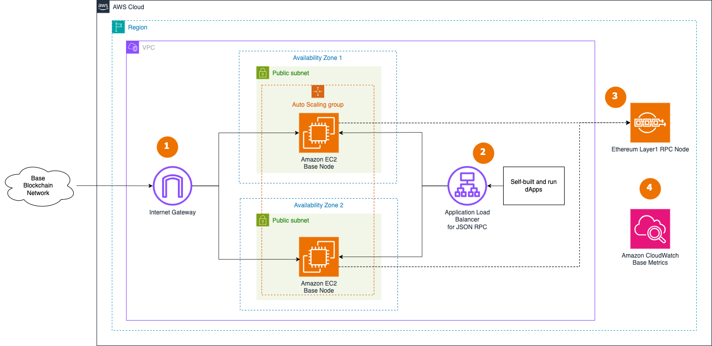

# Sample AWS Blockchain Node Runner app for Base Nodes

| Contributed by |
|:---------------|
|[@frbrkoala](https://github.com/frbrkoala), [@danyalprout](https://github.com/danyalprout)|

[Base](https://base.org/) is a Layer 2 blockchain network built on the Ethereum protocol. The network is governed by [Coinbase](https://www.coinbase.com/en-au/about), a leading cryptocurrency exchange. Base utilizes the [OP Stack](https://docs.optimism.io/stack/getting-started), a common development stack for Layer 2 blockchain networks. The Base blueprint provides a framework to deploy [Sequencer nodes](https://docs.optimism.io/builders/chain-operators/architecture) on Amazon Web Services (AWS) for development, testing, or proof-of-concept purposes.

## Overview of Deployment Architectures for Single Node setups

### Single node setup

The single node architecture blueprint illustrates the deployment of multiple Base nodes within the AWS Default Virtual Private Cloud (VPC) environment. This configuration is suitable for development, testing, or small-scale proof-of-concept scenarios.


1. The Base node in the [Default VPC](https://docs.aws.amazon.com/vpc/latest/userguide/default-vpc.html) is continuously synchronized with the broader Base blockchain network through the VPC's [Internet Gateway](https://docs.aws.amazon.com/vpc/latest/userguide/VPC_Internet_Gateway.html). This ensures the node maintains up-to-date ledger information.
2.	The Base node is designed to be accessed internally by decentralized applications (dApps) or development tools within the Default VPC. To protect the node from unauthorized access, the JSON-RPC API is not directly exposed to the internet.
3. The Base node requires access to a fully synchronized [Ethereum Mainnet or Sepolia testnet RPC endpoint](https://docs.base.org/tools/node-providers), as specified in the Base documentation, to interface with the broader Ethereum ecosystem.
4. The architecture includes integration with Amazon CloudWatch, which collects and monitors various metrics from both the EC2 instance hosting the Base node and the node software. This provides visibility into the node's operational status and performance.

### Highly Available setup

The Highly Available node architecture blueprint illustrates the deployment of two Base nodes across availability zones within the AWS Default Virtual Private Cloud (VPC) environment. This configuration is suitable for small-scale proof-of-concept scenarios.



1. Two RPC Base nodes in the [Auto Scaling Group](https://docs.aws.amazon.com/autoscaling/ec2/userguide/auto-scaling-groups.html) in the [Default VPC](https://docs.aws.amazon.com/vpc/latest/userguide/default-vpc.html) is continuously synchronized with the broader Base blockchain network through the VPC's [Internet Gateway](https://docs.aws.amazon.com/vpc/latest/userguide/VPC_Internet_Gateway.html).
2. dApps or development tools access Base nodes internally through [Application Load Balancer](https://docs.aws.amazon.com/elasticloadbalancing/latest/application/introduction.html). To protect the node from unauthorized access, the JSON-RPC API is not directly exposed to the internet. dApps need to handle user authentication and API protection, like [in this example for dApps on AWS](https://aws.amazon.com/blogs/architecture/dapp-authentication-with-amazon-cognito-and-web3-proxy-with-amazon-api-gateway/).
3. The Base nodes needs access to a fully-synced [Ethereum Mainnet or Sepolia RPC endpoint](https://docs.base.org/tools/node-providers).
4. The architecture includes integration with Amazon CloudWatch, which collects and monitors various metrics from the EC2 instances hosting the Base node and the nodes software. This provides visibility into the operational status and performance of the nodes.

## Additional materials

<details>
<summary>Review the for pros and cons of this solution.</summary>

### Well-Architected Checklist

This is the Well-Architected checklist for Base nodes implementation of the AWS Blockchain Node Runner app. This checklist takes into account questions from the [AWS Well-Architected Framework](https://aws.amazon.com/architecture/well-architected/) which are relevant to this workload. Please feel free to add more checks from the framework if required for your workload.

| Pillar                  | Control                           | Question/Check                                                                   | Remarks          |
|:------------------------|:----------------------------------|:---------------------------------------------------------------------------------|:-----------------|
| Security                | Network protection                | Are there unnecessary open ports in security groups?                             | Please note that port 9222 (TCP/UDP) for Base are open to public to support P2P protocols. We have to rely on the protection mechanisms built into the Base software to protect those ports.   |
|                         |                                   | Traffic inspection                                                               | AWS WAF could be implemented for traffic inspection. Additional charges will apply.  |
|                         | Compute protection                | Reduce attack surface                                                            | This solution uses Amazon Linux 2 AMI. You may choose to run hardening scripts on it.  |
|                         |                                   | Enable people to perform actions at a distance                                   | This solution uses AWS Systems Manager for terminal session, not ssh ports.  |
|                         | Data protection at rest           | Use encrypted Amazon Elastic Block Store (Amazon EBS) volumes                    | This solution uses encrypted Amazon EBS volumes.  |
|                         | Data protection in transit        | Use TLS                                                                          | By design TLS is not used in Base RPC and P2P protocols because the data is considered public. To protect RPC traffic we expose the port only for internal use. |
|                         | Authorization and access control  | Use instance profile with Amazon Elastic Compute Cloud (Amazon EC2) instances    | This solution uses AWS Identity and Access Management (AWS IAM) role instead of IAM user.  |
|                         |                                   | Following principle of least privilege access                                    | In the node, root user is not used (using special user "bcuser" instead).  |
|                         | Application security              | Security focused development practices                                           | cdk-nag is being used with documented suppressions.  |
| Cost optimization       | Service selection                 | Use cost effective resources                                                     | Base nodes works well on ARM architecture and we use Graviton3-powered EC2 instances for better cost effectiveness.  |
|                         | Cost awareness                    | Estimate costs                                                                   | One Base node with on-Demand priced m7g.2xlarge and 3TiB EBS gp3 volume will cost around US$599.27 per month in the US East (N. Virginia) region. Additional charges will apply for Ethereum L1 node and will depend on the service used. |
| Reliability             | Resiliency implementation         | Withstand component failures                                                     | This solution currently does not have high availability and is deployed to a single availability zone.  |
|                         | Data backup                       | How is data backed up?                                                           | The data is not specially backed up. The node will have to re-sync its state from other nodes in the Base network to recover.  |
|                         | Resource monitoring               | How are workload resources monitored?                                            | Resources are being monitored using Amazon CloudWatch dashboards. Amazon CloudWatch custom metrics are being pushed via CloudWatch Agent.  |
| Performance efficiency  | Compute selection                 | How is compute solution selected?                                                | Compute solution is selected based on the recommendations the from Base community to provide stable and cost-effective operations.  |
|                         | Storage selection                 | How is storage solution selected?                                                | Storage solution is selected based on the recommendations the from Base community to provide stable and cost-effective operations.  |
|                         | Architecture selection            | How is the best performance architecture selected?                               | In this solution we try to balance price and performance to achieve better cost efficiency, but not necessarily the best performance.  |
| Operational excellence  | Workload health                   | How is health of workload determined?                                            | We rely on the standard EC2 instance monitoring tool to detect stalled instances.  |
| Sustainability          | Hardware & services               | Select most efficient hardware for your workload                                 | We use ARM-powered EC2 instance type for better cost/performance balance.  |
</details>

<details>
<summary>Recommended Infrastructure</summary>

## Hardware Requirements

**Minimum for Base node sepolia**

- Instance type [m7g.2xlarge](https://aws.amazon.com/ec2/instance-types/m7g/).
- 1500GB EBS gp3 storage with at least 5000 IOPS.

**Recommended for Base node on mainnet**

- Instance type [m7g.2xlarge](https://aws.amazon.com/ec2/instance-types/m7g/).
- 4100GB EBS gp3 storage with at least 5000 IOPS.`

</details>

## Setup Instructions

### Open AWS CloudShell

To begin, ensure you login to your AWS account with permissions to create and modify resources in IAM, EC2, EBS, VPC, and S3.

From the AWS Management Console, open the [AWS CloudShell](https://docs.aws.amazon.com/cloudshell/latest/userguide/welcome.html), a web-based shell environment. If unfamiliar, review the [2-minute YouTube video](https://youtu.be/fz4rbjRaiQM) for an overview and check out [CloudShell with VPC environment](https://docs.aws.amazon.com/cloudshell/latest/userguide/creating-vpc-environment.html) that we'll use to test nodes API from internal IP address space.

Once ready, you can run the commands to deploy and test blueprints in the CloudShell.

### Make sure you have access to Ethereum L1 node

To configure Base blueprint you will need a URL to a Full Ethereum Node to validate blocks it receives. You can run your own with [Ethereum node blueprint](https://aws-samples.github.io/aws-blockchain-node-runners/docs/Blueprints/Ethereum) or use [one of partners of Base](https://docs.base.org/tools/node-providers).

### On your CloudShell: Clone this repository and install dependencies

```bash
git clone https://github.com/aws-samples/aws-blockchain-node-runners
cd aws-blockchain-node-runners
npm install
```

### From your CloudShell: Deploy required dependencies

1. Make sure you are in the root directory of the cloned repository

2. If you have deleted or don't have the default VPC, create default VPC

 ```bash
 aws ec2 create-default-vpc
 ```

:::note NOTE
You may see the following error if the default VPC already exists: `An error occurred (DefaultVpcAlreadyExists) when calling the CreateDefaultVpc operation: A Default VPC already exists for this account in this region.`. That means you can just continue with the following steps.
:::

3. Configure your setup

- Create your own copy of `.env` file and open with text editor like `nano` change `AWS_ACCOUNT_ID` and `AWS_REGION`:
```bash
cd lib/base
cp ./sample-configs/.env-sample-full-sepolia .env
nano .env
```

- For L1 node URL set `BASE_L1_EXECUTION_ENDPOINT` and `BASE_L1_CONSENSUS_ENDPOINT` properties of `.env` file. You can use one of [the providers recommended by Base](https://docs.base.org/tools/node-providers) or you can start your own Ethereum node [with Node Runner Ethereum blueprint](https://aws-samples.github.io/aws-blockchain-node-runners/docs/Blueprints/Ethereum) (tested with single-node `geth-lighthouse` combination). For example, for Sepolia network:

```bash
BASE_L1_EXECUTION_ENDPOINT="https://ethereum-sepolia-rpc.publicnode.com"
BASE_L1_CONSENSUS_ENDPOINT="https://ethereum-sepolia-beacon-api.publicnode.com"
```

4. Deploy common components such as IAM role

```bash
npx cdk deploy base-common
```

:::note NOTE
All AWS CDK v2 deployments use dedicated AWS resources to hold data during deployment. Therefore, your AWS account and Region must be [bootstrapped](https://docs.aws.amazon.com/cdk/v2/guide/bootstrapping.html) to create these resources before you can deploy. If you haven't already bootstrapped, issue the following command:
```bash
cdk bootstrap aws://ACCOUNT-NUMBER/REGION
```
:::

### Option 1: Deploy Single Node

1. Deploy Base RPC Node and wait for it to build binaries and sync. For Full node it takes about 10 minutes to build binaries from the source code and on Mainnet it might take a day to sync from snapshots or about a week if syncing from block 0. You can use snapshots provided by the Base team by setting `BASE_RESTORE_FROM_SNAPSHOT="true"` in `.env` file.

```bash
pwd
# Make sure you are in aws-blockchain-node-runners/lib/base
npx cdk deploy base-single-node --json --outputs-file single-node-deploy.json
```
- After deployment you can watch the progress with CloudWatch dashboard (see [Monitoring](#monitoring)) or check the progress manually. For manual access, use SSM to connect into EC2 first and watch the log like this:

```bash
export INSTANCE_ID=$(cat single-node-deploy.json | jq -r '..|.nodeinstanceid? | select(. != null)')
echo "INSTANCE_ID=" $INSTANCE_ID
export AWS_REGION=us-east-1
aws ssm start-session --target $INSTANCE_ID --region $AWS_REGION
```
- Check the difference between the latest block timestamp and current time on the EC2 instance:

```bash
echo Latest synced block behind by: $((($(date +%s)-$( \
curl -d '{"id":0,"jsonrpc":"2.0","method":"optimism_syncStatus"}' \
-H "Content-Type: application/json" http://localhost:7545 | \
jq -r .result.unsafe_l2.timestamp))/60)) minutes
```

2. To test Base RPC API, use `curl` to query from within the node instance:
```bash
curl -s -X POST -H "Content-Type: application/json" --data '{"jsonrpc":"2.0","method":"eth_blockNumber","params":[],"id":1}' http://localhost:8545
```

### Option 2: Highly Available RPC Nodes

1. Deploy Base RPC Node and wait for it to sync. For Mainnet it might a day when using snapshots or about a week if syncing from block 0. You can use snapshots provided by the Base team by setting `BASE_RESTORE_FROM_SNAPSHOT="true"` in `.env` file.

```bash
pwd
# Make sure you are in aws-blockchain-node-runners/lib/base
npx cdk deploy base-ha-nodes --json --outputs-file ha-nodes-deploy.json
```

2. Give the RPC nodes about 5 hours to initialize and then run the following query against the load balancer behind the RPC node created.

```bash
export RPC_ALB_URL=$(cat ha-nodes-deploy.json | jq -r '..|.alburl? | select(. != null)')
echo RPC_ALB_URL=$RPC_ALB_URL
```

- Copy output from the last `echo` command with `RPC_ALB_URL=<internal_IP>` and open [CloudShell tab with VPC environment](https://docs.aws.amazon.com/cloudshell/latest/userguide/creating-vpc-environment.html) to access internal IP address space. Paste `RPC_ALB_URL=<internal_IP>` into the new CloudShell tab. Then query the API:

```bash
curl http://$RPC_ALB_URL:8545 -X POST -H "Content-Type: application/json" \
--data '{"jsonrpc":"2.0","method":"eth_blockNumber","params":[],"id":1}'
```

:::note NOTE
By default and for security reasons the load balancer is available only from within the default VPC in the region where it is deployed. It is not available from the Internet and is not open for external connections. Before opening it up please make sure you protect your RPC APIs.
:::

:::warning WARNING
We currently don't recommend running **archive** nodes in HA setup, because it takes way too long to get them synced. Use single-node setup instead.
:::

### Monitoring
Every 5 minutes a script on the deployed node publishes to CloudWatch service the metrics for current block for L1/L2 clients as well as blocks behind metric for L1 and minutes behind for L2. When the node is fully synced the blocks behind metric should get to 4 and minutes behind should get down to 0. 

- To see the metrics for **single node only**:
   - Navigate to CloudWatch service (make sure you are in the region you have specified for AWS_REGION)
   - Open Dashboards and select `base-single-node-<network>-<your_ec2_instance_id>` from the list of dashboards.

Metrics for **ha nodes** configuration is not yet implemented (contributions are welcome!)

## From your CloudShell: Clear up and undeploy everything

1. Undeploy all Nodes and Common stacks

```bash
# Setting the AWS account id and region in case local .env file is lost
export AWS_ACCOUNT_ID=<your_target_AWS_account_id>
export AWS_REGION=<your_target_AWS_region>

pwd
# Make sure you are in aws-blockchain-node-runners/lib/base

# Undeploy Single Node
npx cdk destroy base-single-node

# Undeploy HA Nodes
npx cdk destroy base-ha-nodes

# Delete all common components like IAM role and Security Group
npx cdk destroy base-common
```

## FAQ

1. How to check the logs of the clients running on my Base node?

:::note NOTE
In blueprints use Session Manager instead. That allows to log all sessions in AWS CloudTrail to see who logged into the server and when. If you get an error saying `SessionManagerPlugin is not found`, [install Session Manager plugin for AWS CLI](https://docs.aws.amazon.com/systems-manager/latest/userguide/session-manager-working-with-install-plugin.html)
:::

```bash
pwd
# Make sure you are in aws-blockchain-node-runners/lib/base

export INSTANCE_ID=$(cat single-node-deploy.json | jq -r '..|.nodeinstanceid? | select(. != null)')
echo "INSTANCE_ID=" $INSTANCE_ID
export AWS_REGION=us-east-1
aws ssm start-session --target $INSTANCE_ID --region $AWS_REGION
```
```bash
sudo su bcuser
# Execution client logs:
docker logs --tail 50 node_execution_1 -f
# Base client logs:
docker logs --tail 50 node_node_1 -f
```
2. How to check the logs from the EC2 user-data script?

```bash
pwd
# Make sure you are in aws-blockchain-node-runners/lib/base
export INSTANCE_ID=$(cat single-node-deploy.json | jq -r '..|.nodeinstanceid? | select(. != null)')
echo "INSTANCE_ID=" $INSTANCE_ID
export AWS_REGION=us-east-1
aws ssm start-session --target $INSTANCE_ID --region $AWS_REGION
```
```bash
sudo cat /var/log/cloud-init-output.log
```

3. How can I restart the Base node?

``` bash
export INSTANCE_ID=$(cat single-node-deploy.json | jq -r '..|.nodeinstanceid? | select(. != null)')
echo "INSTANCE_ID=" $INSTANCE_ID
export AWS_REGION=us-east-1
aws ssm start-session --target $INSTANCE_ID --region $AWS_REGION
```
```bash
sudo su bcuser
/usr/local/bin/docker-compose -f /home/bcuser/node/docker-compose.yml down && \
/usr/local/bin/docker-compose -f /home/bcuser/node/docker-compose.yml up -d
```
4. Where to find the key Base client directories?

   - The data directory is `/data`