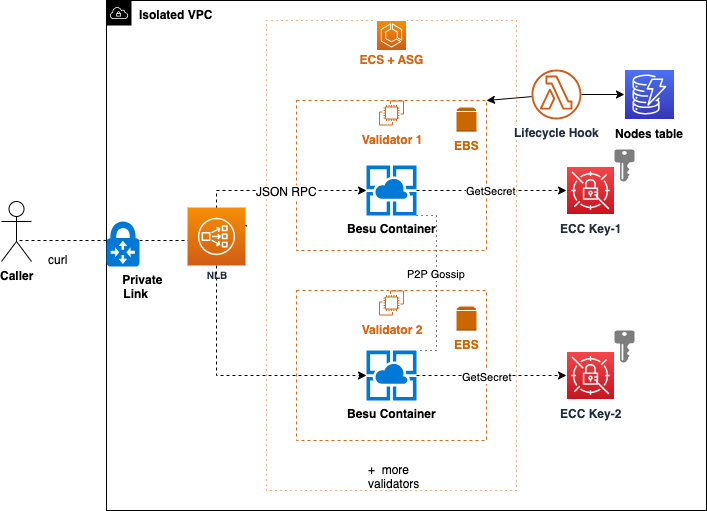

# AWS Blockchain Node Runners app for Besu IBFT Private Networks

| Contributed by |
|:--------------------:|
| [@dmitridr](https://github.com/dmitridr), [@phuongnd11](https://github.com/phuongnd11), [@ishansohony](https://github.com/ishansohony), [@gap892003](https://github.com/gap892003), and others. |


This blueprint deploys a ready to use private blockchain network as a service accessible via PrivateLink. The service is running [Hyperledger Besu](https://github.com/hyperledger/besu/)'s implementation of IBFT consensus under the hood, on top of ECS/EC2. 

## Table of Contents
1. [Architecture & Features](#architecture-overview)
2. [Setup / Configuration](#configuration)
3. [Deployment](#build-and-deploy)
4. [Querying the Private Besu Network](#querying-the-private-besu-network)
5. [Sample RPC request](#example-request-using-curl)
6. [Troubleshooting](#troubleshooting)
7. [Updating & Redeploying](#redeploying-and-softwarehardware-updates)
8. [Clean up](#clean-up)


## Architecture Overview




High Level Features include: 
- Automated blockchain node recovery based on deep health check.
- Automated key management after initial setup.
- Deployment of software changes without downtime.

## Configuration

Before deployment, make sure to install needed dependencies and configure your setup, see the steps below.

### Clone this repository and install dependencies

```bash
   git clone https://github.com/aws-samples/aws-blockchain-node-runners.git
   cd aws-blockchain-node-runners/lib/besu-private-chain
   npm install
```


### Configure your Setup.

First, create your own copy of `.env` file and edit it:
```bash
   # Make sure you are in aws-blockchain-node-runners/lib/besu-private-chain
   pwd
   cp ./.env-sample .env
```

The only required field to edit is your AWS account. The rest are populated with known working defaults.
For technical users, more detailed configurations are available in `lib/constants`, and `lib/genesis`. 

After you modify `.env`, make sure you run the following commmand to import the variables into your shell session:

```bash
source .env
```

### Upload a Hyperledger Besu Docker Image
As the node runner is configured to run in an isolated VPC with no internet access, it's up to you to provide the docker image of Besu you would like to use in Amazon Elastic Container Repository (ECR). This node runner was tested to work with Besu 24.7.0 : https://github.com/hyperledger/besu/releases/tag/24.7.0

Ensure the $AWS_ACCOUNT_ID variable is set in your .env file from the previous step, and execute the following steps to download the latest besu docker image and upload it into your ECR.

   ```bash
   docker pull --platform linux/arm64 hyperledger/besu
   docker tag hyperledger/besu:latest $AWS_ACCOUNT_ID.dkr.ecr.$AWS_REGION.amazonaws.com/besu:latest
   aws ecr get-login-password --region $AWS_REGION | docker login --username AWS --password-stdin $AWS_ACCOUNT_ID.dkr.ecr.$AWS_REGION.amazonaws.com
   aws ecr create-repository --repository-name besu
   docker push $AWS_ACCOUNT_ID.dkr.ecr.$AWS_REGION.amazonaws.com/besu:latest
   ```

When specifying `--platform` make sure to use the platform corresponding to the instance type in your `.env`, e.g. `linux/arm64` for Graviton instances. 

## Build and Deploy

Deploying the private chain infrastructure to your AWS account is a two-phase deployment. This requires an initial infrastructure deployment followed by a deployment of validator EC2 instances. Follow the steps in the sections below to get started.

### Deploy the validator fleet stack

Make sure you have downloaded the AWS CLI and loaded the proper credentials, environment or otherwise, into the shell you are using, corresponding to the AWS account you wish to deploy to. (If you have not loaded your IAM User's credentials, this can be done with the `aws configure` command.) 

Then run the following commands:

   ```bash
   export FIRST_DEPLOY=1
   npx tsc
   npx cdk bootstrap
   npx cdk synth
   npx cdk deploy dev-noderunners-${USER}-PrivateChainValidatorFleet --require-approval never
   ```

This will deploy a bootstrap stack to your account, followed by a basic infrastructure stack including VPC and relevant VPC resources and security groups, followed by core blockchain infrastructure including auto scaling groups and an ECS service with 0 validators. This infrastructure will remain inactive until a second deployment is performed after the correct ECC keypairs are added, in the steps below.

### Validator Key-Pair Configuration

Currently, before or after deployment you will need to generate the keys and upload them to the right place within your deployed infrastructure. This can be done either automatically or manually.

#### Automated Keypair Generation

1. Install jq `yum install jq`
2. Run the script with the following command in the base directory to automatically use KMS to generate public and private keypairs:
```bash
./scripts/generate-keys.sh
```
 
Public keys will be auto set in `lib/constants/keys.ts`, and private keys will be automatically uploaded to secrets manager.

If you wish to proceed manually in order to upload your own keys that you generated securely using a different process, see the manual steps below, otherwise skip to the second deployment.

#### Manual Keypair Generation

   This can be done with the method if your choice, but for the purposes of demonstration it can be done with one KMS command as follows.
   ```bash
   aws kms generate-data-key-pair --key-pair-spec ECC_SECG_P256K1 --key-id alias/PrivateChainEbsVolumeEncryptionKey
   ```

   Repeat this command and make note of the results to generate an ECC key-pair for every validator. These will be used in the next steps.

##### Manually Upload ECC Private Keys 

   After the first cdk deploy command is run and finishes succesfully, go through and find the keys labeled `Shard-1-ValidatorSignKey-X` in your AWS account, then upload your ECC private keys as base 64 encoded secrets into those secrets.

   If you used KMS to generate the keypair, this would be the field `PrivateKeyPlaintext` in the `generate-data-key-pair` command's output.


##### Manually Set ECC Public Keys in Constants

   Set the ECC public keys in the file `lib/constants/keys.ts`. Make sure to set them in the order for which you set the private keys, ie Key-0 must be in position 0.

   If you used KMS to generate the keypair, this would be the field, `PublicKey` in the `generate-data-key-pair` command's output.

### Deploy Again

Now that the infra has been deployed and keys uploaded it's time to provision the validators, which will use the keys to create blocks.

   ```bash
   unset FIRST_DEPLOY
   npx tsc
   npx cdk deploy dev-noderunners-${USER}-PrivateChainValidatorFleet --require-approval never
   ```

The private chain should now be running, you should be able to validate blockheight via metrics: look for the
BesuPrivateChain namespace in your cloudwatch console.

## Querying the Private Besu Network

The Besu fleet deployed in this node runner is fronted by a Network Load Balancer (NLB) which backs a [PrivateLink](https://docs.aws.amazon.com/vpc/latest/privatelink/privatelink-share-your-services.html) that can be used by your AWS account and shared with other AWS accounts with the help of VPC endpoints.

In order to send transactions and other RPC calls to your private blockchain you will need to set up a VPC endpoint and point it to the PrivateLink created by the blueprint you have deployed.

To do so, first find the VPC endpoint service generated by your deployment, and copy the `Service name` to your clipboard.

The `Service name` should look similar to the following:

```
com.amazonaws.vpce.us-east-1.vpce-svc-052df869f68666fb9
```

Now, you will go to VPC endpoints in the console, and create a VPC endpoint in the VPC and account that you will want to access
the private blockchain from. 

1. Navigate to the VPC Service in the AWS Management Console. In the left sidebar, click on `Endpoints`, and select `Create endpoint`. 
2. Below `Type`, choose "Endpoint services that use NLBs and GWLBs"
3. Under `Service settings`, paste the copied `Service name` and click on "Verify service". 
4. Select the VPC from which you want to access the deployed Besu network.
5. In the "Subnets" section, choose the specific subnets within your VPC that require access to the blockchain. 
5. Under "Security groups", select a security group to control network access to the endpoint. (If you do not specify a security group, the default security group for the VPC is automatically associated.)
6. Select `Create Endpoint`.  


* *Note, that if the AWS account from which you would like to send RPC requests to the blockchain is not the same account as the one that the private chain has been deployed to, there will be an additional [allowlisting permissions step](https://docs.aws.amazon.com/vpc/latest/privatelink/configure-endpoint-service.html#add-remove-permissions) that you need to take on the VPC endpoint service before creation of the VPC endpoint can succeed.*

After creating the VPC endpoint, ensure your security group settings allow traffic from your compute resources (e.g., EC2 instances) within the VPC to the endpoint. 


Take note of the endpoint's DNS name, which typically follows the format `*.vpce.amazonaws.com`. This DNS name will serve as the URL for your RPC requests, whether you're using libraries or curl commands to interact with your private blockchain. 

By using this endpoint, you maintain the security of your Besu network while enabling authorized access from within your VPC.

## Example request using curl

```bash
curl -H "Content-Type:text/html" -X POST -d '{"jsonrpc":"2.0","method":"eth_chainId","params":[],"id": 1}' http://vpce-0118de8e1d1f5be03-9raw1iaj.vpce-svc-0a174ea54498a1aa0.us-east-1.vpce.amazonaws.com

{"jsonrpc":"2.0","id":1,"result":"0x1150c"}
```

## Troubleshooting

If your request times out, it's likely due to a security group misconfiguration. Review the security group settings on the VPC endpoint and ensure the VPC endpoint is [properly configured](https://docs.aws.amazon.com/vpc/latest/privatelink/create-interface-endpoint.html) to respond to requests from your VPC and Availability Zone.

## Redeploying and Software/Hardware Updates

When changing the blueprint or a configuration, deploying can be done via :

   ```bash
   npx tsc
   npx cdk deploy dev-noderunners-${USER}-PrivateChainValidatorFleet --require-approval never
   ```

There is no need to deploy twice, as that is only necessary with the first deployment. 

Keep in mind that any changes to the ECS service will re-deploy the ECS service, which will take time.
Likewise, any changes to the EC2 AMI or EC2 configuration, will trigger a rolling update of the Auto Scaling Group, which will take time.

The cdk code has been built to handle both of these cases as seamlessly as possible, however both the rolling update and ECS deployments will take 10 minutes per validator to deploy. 

Deployment is one-at-a-time and so as long as greater than 4 validators are set this can be done without downtime for block production in the blockchain.

### Stuck Deployment
If your stack deployment is stuck on the Auto Scaling Group step, this can be due to a signalling issue, try signaling the stack as follows, to continue:
```bash
aws cloudformation signal-resource --stack-name dev-noderunners-${USER}-PrivateChainValidatorFleet --logical-resource-id validatorasg123 --unique-id  abc --status SUCCESS
```

or to abandon the deployment:
```bash
aws cloudformation signal-resource --stack-name dev-noderunners-${USER}-PrivateChainValidatorFleet --logical-resource-id validatorasg123 --unique-id  abc --status FAILURE
```

It may be necessary to run this a number of times with different unique ids equal to the number of validators deployed, this should get the deployment moving again and either roll back or roll forward, bypassing any ASG changes.


## Clean up
To remove all resources deployed by this project and avoid ongoing charges, follow these steps:

1. Delete the VPC Endpoint:
   - You manually created this endpoint to access the private Besu network.
   - It's not automatically managed by the CDK stack, so it needs to be deleted separately.
   - Steps:
     - Go to the AWS Management Console
     - Navigate to VPC > Endpoints
     - Select the endpoint you manually created (this should have the most recent deployment time)
     - Click "Actions" > "Delete VPC endpoints"
     - Confirm the deletion


2. Destroy the deployed CDK stacks:
   - Open your terminal
   - Navigate to the project directory
   - Run the following command:
     ```
     cdk destroy --all
     ```
   - Confirm the destruction when prompted

3. (Optional) Delete the Access Logs bucket:
   - By default, the Access Logs bucket is retained for monitoring/auditing purposes
   - If you want to delete it:
     - Go to the AWS Management Console
     - Navigate to S3
     - Find the bucket ending with the phrase `access-log-bucket`
     - Empty the bucket contents
     - Delete the bucket

**Note:** Be cautious when deleting resources. Make sure you don't need any of the data before proceeding with the cleanup.