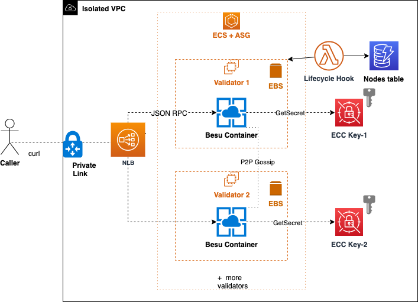

# Sample AWS Blockchain Node Runner app for Besu Private Network

| Contributed by |
|:--------------------:|
| [@dmitridr](https://github.com/dmitridr), [@phuongnd11](https://github.com/phuongnd11), [@ishansohony](https://github.com/ishansohony), [@gap892003](https://github.com/gap892003), and others. |

This blueprint deploys a ready-to-test private blockchain network powered by [Hyperledger Besu](https://github.com/hyperledger/besu/) with [IBFT consensus](https://arxiv.org/abs/2002.03613). It is accessible by applications via [AWS PrivateLink](https://aws.amazon.com/privatelink/) and [Network Load Balancer](https://docs.aws.amazon.com/elasticloadbalancing/latest/network/introduction.html) (NLB).

High-level features include: 
- Automated blockchain node recovery based on deep health check.
- Automated key management after initial setup.
- Deployment of software changes without downtime.

### Accessing the blueprint

:::info
This blueprint is published in a different repository.
:::

Open here: **[Besu Private Chain on aws-samples](https://github.com/aws-samples/besu-private-chain/tree/main)**

### Overview of Deployment Architecture

The [AWS CDK stack](https://github.com/worldwide-asset-exchange/wax-aws-cdk) deploys the system that:

1. Exposes the JSON-based Remote Procedure Call (RPC) API of 4-node Besu private network through NLB over AWS Private Link. (3 nodes is the minimum required for the functioning of IBFT consensus and 1 more is needed to tolerate a single faulty node)
2. Nodes run as Docker containers on [Amazon Elastic Container Service](https://aws.amazon.com/ecs/) (ECS) backed by [Amazon Elastic Compute Cloud](https://aws.amazon.com/ec2/) (EC2)and [Amazon Elastic Block Storage](https://aws.amazon.com/ebs/) (EBS) services with [Autoscaling Group](https://docs.aws.amazon.com/autoscaling/ec2/userguide/auto-scaling-groups.html) (ASG) for automatic recovery.
3. Nodes store secret keys in [AWS Secrets Manager](https://docs.aws.amazon.com/secretsmanager/latest/userguide/intro.html) to protect them from deletion during recovery. [AWS Lambda](https://aws.amazon.com/lambda/) functions keep track of the mapping between running container nodes and their secrets in a [Amazon DynamoDB](https://aws.amazon.com/dynamodb/) table. They update the mapping if nodes are terminated and replaced by new containers.
