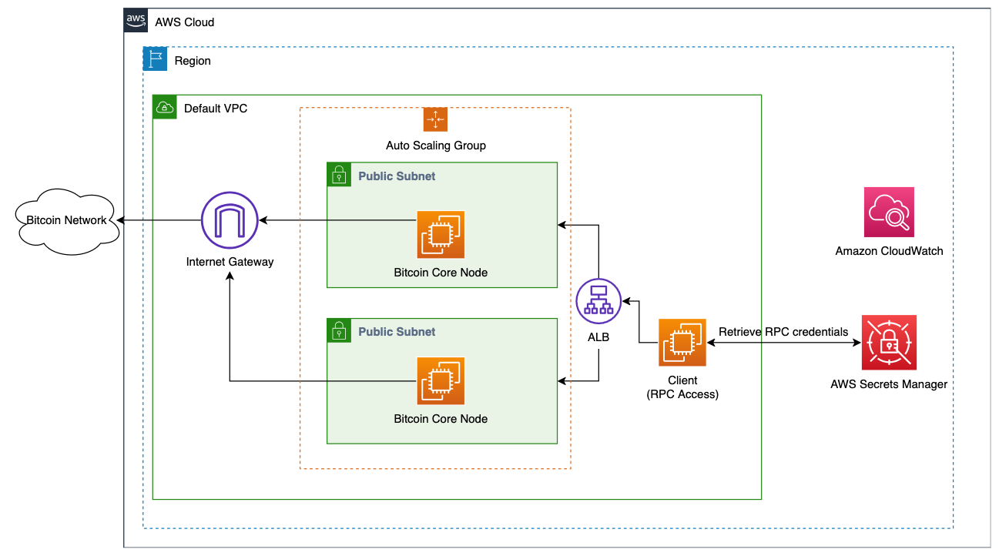

## Sample AWS Blockchain Node Runner app for Bitcoin Nodes

|          Contributed by          |
|:--------------------------------:|
| [Simon Goldberg](https://github.com/racket2000)|

### Overview

This guide walks you through deploying a Bitcoin Core mainnet node in a **Virtual Private Cloud (VPC)** using **Docker**, leveraging **AWS Secrets Manager** for secure credential handling. This configuration ensures robust security and performance while optimizing data transfer costs.

---

## Well-Architected

<details>
<summary>Review pros and cons of this solution.</summary>

### Well-Architected Checklist

This is the Well-Architected checklist for **Bitcoin Core node implementation** of the AWS Blockchain Node Runner app. This checklist takes into account questions from the [AWS Well-Architected Framework](https://aws.amazon.com/architecture/well-architected/) which are relevant to this workload. Please feel free to add more checks from the framework if required for your workload.

| Pillar                  | Control                           | Question/Check                                                                   | Remarks          |
|:------------------------|:----------------------------------|:---------------------------------------------------------------------------------|:-----------------|
| Security                | Network protection                | Are there unnecessary open ports in security groups?                             | Port 8332 (RPC) is restricted to the VPC. |
|                         |                                   | Traffic inspection                                                               | Optional: VPC Flow Logs or traffic mirroring can be enabled for deeper inspection. |
|                         | Compute protection                | Reduce attack surface                                                            | This solution uses Amazon Linux 2 AMI. No SSH access is enabled; SSM is used. |
|                         |                                   | Enable people to perform actions at a distance                                   | This solution uses AWS Systems Manager Session Manager. |
|                         | Data protection at rest           | Use encrypted Amazon Elastic Block Store (Amazon EBS) volumes                    | Encrypted Amazon EBS volumes are used. |
|                         | Data protection in transit        | Use TLS                                                                          | The AWS Application Load balancer currently uses HTTP listener. Create HTTPS listener with self signed certificate if TLS is desired. |
|                         | Authorization and access control  | Use instance profile with Amazon Elastic Compute Cloud (Amazon EC2) instances    | AWS IAM role is attached to the EC2 instance. |
|                         |                                   | Following principle of least privilege access                                    | IAM privileges are scoped down to what is necessary. |
|                         | Application security              | Security focused development practices                                           | `cdk-nag` is used with appropriate suppressions. |
| Cost optimization       | Service selection                 | Use cost effective resources                                                     | Cost efficient T3 instances provide a baseline level of CPU performance with the ability to burst CPU usage at any time for as long as required. T3 instances are designed for applications with moderate CPU usage that experience temporary spikes in use. |
| Reliability             | Resiliency implementation         | Withstand component failures                                                     | Single node deployment. Can be extended with backup nodes and monitoring. |
|                         | Resource monitoring               | How are workload resources monitored?                                            | Amazon CloudWatch Dashboards track CPU, memory, disk, network, and block height. |
| Performance efficiency  | Compute selection                 | How is compute solution selected?                                                | Compute solution is selected based on performance needs and budget. |
|                         | Storage selection                 | How is storage solution selected?                                                | EBS volumes (e.g. gp3 or io2) are selected for consistent throughput and IOPS. |
| Operational excellence  | Workload health                   | How is health of workload determined?                                            | Health is tracked using CloudWatch custom metrics including block height. |
| Sustainability          | Hardware & services               | Select most efficient hardware for your workload                                 | T3A instances offer efficient memory utilization, reducing power and cost. |

</details>

### Getting Started

#### Open AWS CloudShell

To begin, ensure you login to your AWS account with permissions to create and modify resources in IAM, EC2, EBS, VPC, S3, KMS, and Secrets Manager.

From the AWS Management Console, open the [AWS CloudShell](https://docs.aws.amazon.com/cloudshell/latest/userguide/welcome.html), a web-based shell environment. If unfamiliar, review the [2-minute YouTube video](https://youtu.be/fz4rbjRaiQM) for an overview and check out [CloudShell with VPC environment](https://docs.aws.amazon.com/cloudshell/latest/userguide/creating-vpc-environment.html) that we'll use to test nodes API from internal IP address space.

Once ready, you can run the commands to deploy and test blueprints in the CloudShell.

#### Cloning the Repository

First, clone the repository and install the dependencies:

```
git clone https://github.com/aws-samples/aws-blockchain-node-runners.git
cd aws-blockchain-node-runners
npm install
```

Before proceeding, ensure you have the AWS CLI installed and configured.

### Configuration

1. Make sure you are in the root directory of the cloned repository.

2. If you have deleted or don't have the default VPC, create default VPC

```
aws ec2 create-default-vpc
```
> **NOTE:** *You may see the following error if the default VPC already exists: `An error occurred (DefaultVpcAlreadyExists) when calling the CreateDefaultVpc operation: A Default VPC already exists for this account in this region.`. That means you can just continue with the following steps.*

3. Create your own copy of `.env` file and edit it to update with your AWS Account ID and Region:

```bash
cd lib/bitcoin-core
cp ./sample-configs/.env-sample-bitcoin-mainnet .env
vim .env
```

4. Deploy common components such as IAM role:

```bash
npx cdk deploy BitcoinCommonStack
```

The blueprint attaches a separate EBS volume (default 1 TB) to store the
blockchain data. During instance initialization this volume is automatically
formatted and mounted at `/home/bitcoin`, ensuring ample space for the
`datadir`.

### Generating RPC Authentication

To interact with the Bitcoin Core RPC endpoint within your isolated VPC environment, run the following command before deploying the Bitcoin Node via CDK:

```
# Make sure you are in aws-blockchain-node-runners/lib/bitcoin-core
node generateRPCAuth.js
```

For a deeper dive and an overview of credential rotation, see [RPC Authentication -- Deep Dive](#rpc-authentication----deep-dive).


### Deploying the Node

To deploy a single node setup, use the following command:

```
npx cdk deploy SingleNodeBitcoinCoreStack --json --outputs-file single-node-deploy.json
```

For High Availability (HA) node deployment, use:

```
npx cdk deploy HABitcoinCoreNodeStack --json --outputs-file ha-nodes-deploy.json
```

### Deployment Architectures for Bitcoin Nodes

#### Single Node Setup


- A **Bitcoin node** deployed in a **public subnet** continuously synchronizes with the Bitcoin network.
- Outbound peer-to-peer (P2P) communication flows through an **Internet Gateway (IGW)**.
- The node's security group permits incoming P2P connections on port 8333.
- The node's RPC methods can be accessed from within the VPC.
- The Bitcoin node sends various monitoring metrics to Amazon CloudWatch.

#### High Availability (HA) Setup


- Deploying **multiple Bitcoin nodes** in an **Auto Scaling Group** enhances fault tolerance and availability.
- The nodes' RPC endpoints are exposed through an **Application Load Balancer (ALB)**.  The ALB implements session persistence using a "stickiness cookie". This ensures that subsequent requests from the same client are consistently routed to the same node, maintaining session continuity. The stickiness duration is set to 90 minutes but can be configured for up to 7 days. Note: The Bitcoin Core nodes in the HA setup do not share state (e.g., wallet, mempool)
- HA nodes do not expose the RPC endpoint to the public internet. This endpoint can be accessed from within the VPC.

---

### Accessing and Using bitcoin-cli on a Bitcoin Core Instance

To interact with your Bitcoin Core instance, you'll need to use AWS Systems Manager, as direct SSH access is not available.

Bitcoin Core supports cookie-based authentication by default, so interacting with the `bitcoin-cli` from the node itself does not require credentials.

From your CloudShell terminal, run the following command to connect to your node via Systems Manager:

```
export INSTANCE_ID=$(jq -r '.SingleNodeBitcoinCoreStack.BitcoinNodeInstanceId' single-node-deploy.json)
echo "INSTANCE_ID="$INSTANCE_ID
aws ssm start-session --target $INSTANCE_ID --region $AWS_REGION
```

**Note**: You can alternatively connect to your node via Systems Manager in the AWS Console with the following steps:
 - Open the AWS Console and navigate to EC2 Instances.
   - Locate and select the instance named `SingleNodeBitcoinCoreStack/BitcoinSingleNode`.
   - Click the "Connect" button.
   - Choose "Session Manager" from the connection options.
   - Select "Connect" to establish a session.

**Execute an RPC Call:**
Once connected, you can interact with the Bitcoin Core node using Docker commands.

To test the RPC interface, use the following command:

```
sudo docker exec -it bitcoind bitcoin-cli getblockchaininfo
```

   This command executes the `getblockchaininfo` RPC method, which returns current state information about the blockchain.

**Interpreting Results:**
   - The output will provide detailed information about the current state of the blockchain, including the current block height, difficulty, and other relevant data.
   - You can use similar commands to execute other RPC methods supported by Bitcoin Core.

---
### Secure RPC Access with AWS Secrets Manager

For a client to securely interact with the Bitcoin Core RPC endpoint from a subnet within your VPC environment, AWS Secrets Manager is leveraged for credential storage and retrieval.

#### Retrieving Credentials
First, retrieve the RPC credentials from AWS Secrets Manager in your CloudShell tab:

```
export BTC_RPC_AUTH=$(aws secretsmanager get-secret-value --secret-id bitcoin_rpc_credentials --query SecretString --output text)
echo "BTC_RPC_AUTH=$BTC_RPC_AUTH"
```

#### Single node RPC Call using credentials
To make an RPC call to a single Bitcoin node, run the following command to retrieve the private IP address of your Bitcoin node:

```
export BITCOIN_NODE_IP=$(jq -r '.SingleNodeBitcoinCoreStack.BitcoinNodePrivateIP' single-node-deploy.json)
echo "BITCOIN_NODE_IP=$BITCOIN_NODE_IP"
```
Copy output from the last `echo` command with `BITCOIN_NODE_IP=<internal_IP>` and open [CloudShell tab with VPC environment](https://docs.aws.amazon.com/cloudshell/latest/userguide/creating-vpc-environment.html) to access internal IP address space. Paste `BITCOIN_NODE_IP=<internal_IP>` into the new CloudShell tab.

Additionally, copy the output from the first `echo` command with `BTC_RPC_AUTH=<rpc_credentials>` into the CloudShell VPC environment.

Then query the node:

```
curl --user "$BTC_RPC_AUTH" \
     --data-binary '{"jsonrpc": "1.0", "id": "curltest", "method": "getblockchaininfo", "params": []}' \
     -H 'content-type: text/plain;' http://$BITCOIN_NODE_IP:8332/
```

#### High Availability (HA) RPC Call using credentials

Use the following command from your CloudShell terminal to retrieve your load balancer's DNS name:

```
export LOAD_BALANCER_DNS=$(jq -r '.HABitcoinCoreNodeStack.LoadBalancerDNS' ha-nodes-deploy.json)
echo LOAD_BALANCER_DNS=$LOAD_BALANCER_DNS
```
Copy output from the last `echo` command with `RPC_ABL_URL=<internal_IP>` and open [CloudShell tab with VPC environment](https://docs.aws.amazon.com/cloudshell/latest/userguide/creating-vpc-environment.html) to access internal IP address space. Paste `RPC_ABL_URL=<internal_IP>` into the new CloudShell tab.

Note: Make sure that you pasted `BTC_RPC_AUTH=<rpc_credentials>` into the CloudShell VPC environment as well.

 Execute the following command to make an RPC request to your HA node setup:

```
curl --user "$BTC_RPC_AUTH" \
     --data-binary '{"jsonrpc": "1.0", "id": "curltest", "method": "getblockchaininfo", "params": []}' \
     -H 'content-type: text/plain;' \
     $LOAD_BALANCER_DNS
```

---


### **Bitcoin Core: Creating an Encrypted Wallet for Payments**

This guide covers how to create an encrypted Bitcoin Core wallet specifically designed for receiving and managing payments in a secure and efficient way.

Note: Make sure that you run the following commands after accessing the node via Systems Manager.

---

#### **1. Create an Encrypted Payment Wallet**

To create a wallet specifically for handling payments, use the following command:

```
sudo docker exec -it bitcoind bitcoin-cli createwallet "payments" false false "my_secure_passphrase"
```

- **payments:** The wallet name, indicating its purpose.  
- **passphrase:** A secure, memorable phrase to protect your funds.  

##### **Why Encrypt?**
- Protects against unauthorized access.  
- Ensures funds are safe even if the server is compromised.  

---

#### **2. Generate a Receiving Address**

To receive payments, generate a new address. You do not need to unlock the wallet for this step:

```
sudo docker exec -it bitcoind bitcoin-cli -rpcwallet="payments" getnewaddress "customer1" "bech32"
```

- **customer1:** Label to identify payments from this customer.  
- **bech32:** Generates a SegWit address for lower transaction fees.  

**Example Output:**
```
bc1qxyzabc123... (Bech32 address)
```

---

#### **3. Monitor Incoming Payments**

To check the balance and verify received payments:

```
sudo docker exec -it bitcoind bitcoin-cli -rpcwallet="payments" getbalance
```

- Displays the total balance held in the wallet.  

To view detailed transactions:

```
sudo docker exec -it bitcoind bitcoin-cli -rpcwallet="payments" listtransactions
```

---

#### **4. Sending Payments (Requires Unlocking)**

When making a payout or transferring funds, you need to unlock the wallet:

```
sudo docker exec -it bitcoind bitcoin-cli -rpcwallet="payments" walletpassphrase "my_secure_passphrase" 600
```

- Unlocks the wallet for **600 seconds (10 minutes)**.  

#### **Send Bitcoin to a specified address:**

```
sudo docker exec -it bitcoind bitcoin-cli -rpcwallet="payments" sendtoaddress "bc1qrecipientaddress" 0.01 "Payment for service"
```

- Sends **0.01 BTC** with an optional label for record-keeping.  


#### **5. Lock the Wallet After Use**

For enhanced security, immediately lock the wallet after transactions:

```
sudo docker exec -it bitcoind bitcoin-cli -rpcwallet="payments" walletlock
```


#### **6. Backup the Wallet**

To protect your payment data, back up the encrypted wallet regularly:

```
sudo docker exec -it bitcoind bitcoin-cli -rpcwallet="payments" backupwallet "/path/to/backup/payments.dat"
```


#### **Security Tips for Payment Wallets**
- Use strong passphrases and store them securely offline.  
- Regularly backup your wallet after creating new addresses or receiving payments.  
- Consider setting up automated wallet backups to ensure data integrity.  

---
### RPC Authentication -- Deep Dive

The `generateRPCAuth.js` script is responsible for generating secure authentication credentials for your Bitcoin node. This script creates a randomly generated **username** and **password** along with a **salt**. The password and salt are then combined and hashed using the **SHA256** algorithm to produce a secure **hash**. This hash is combined with the username to generate the final **rpcauth** parameter that is appended to the `bitcoin.conf` file.

The final `rpcauth` line in `bitcoin.conf` looks like this:

```
rpcauth=user_258:c220c5f38690bf880f0dd177547e55f7$77c6ec2dd90e792d60450b01a84cc8c2563a7fb1d0fbd73de49be818fde4b407
```

- The **rpcauth** part consists of a **username**, **salt**, and a **hashed password**, providing robust protection in the case that your `bitcoin.conf` is accessed by an unauthorized entity.
- The randomly generated **username** and **password** are securely stored in **AWS Secrets Manager**.

By using this script, it ensures that your node has unique and secure credentials.

### Rotating RPC Secrets

To maintain security, rotate RPC credentials periodically using the `generateRPCAuth.js` script:

```
node generateRPCAuth.js
```

This will update the value of your credentials in Secrets Manager.

**Replacing the Credentials and Restarting the Node to Apply Updates**

- Replace the old `rpcauth` value from the `bitcoin.conf` file with the new one. Make sure that you change the placeholder value for `[new rpcauth string with escape char]` (this is printed to the terminal after running the `generateRPCAuth` script):

  ```
  sudo docker exec -it bitcoind sh -c "sed -i 's/^rpcauth=.*/rpcauth=[new rpcauth string with escape char]/' /root/.bitcoin/bitcoin.conf"
  ```
- Restart the Bitcoin node to apply changes:
  ```
  sudo docker restart bitcoind
  ```

#### Verifying the Credential Rotation

Make an RPC call to ensure the new credentials are active:

```
curl --user "$BTC_RPC_AUTH" \
     --data-binary '{"jsonrpc": "1.0", "id": "curltest", "method": "getblockchaininfo", "params": []}' \
     -H 'content-type: text/plain;' http://<Bitcoin-Node-Private-IP>:8332/
```

---

### Monitoring and Troubleshooting

Keep your node healthy by monitoring logs and configurations.

These can be run after accessing the node via Systems Manager:

```
export INSTANCE_ID=$(jq -r '.SingleNodeBitcoinCoreStack.BitcoinNodeInstanceId' single-node-deploy.json)
echo "INSTANCE_ID="$INSTANCE_ID
aws ssm start-session --target $INSTANCE_ID --region $AWS_REGION
```

- Check recent Bitcoin logs:
  ```
  sudo docker logs -f --tail 100 bitcoind
  ```

- Check first 100 Bitcoin logs:
  ```
  sudo docker logs bitcoind | head -n 100
  ```

- View the configuration file:
  ```
  sudo docker exec -it bitcoind cat /root/.bitcoin/bitcoin.conf
  ```
- View user data logs:
  ```
  sudo cat /var/log/cloud-init-output.log
  ```


---

### Additional Tips and Best Practices

- Regularly rotate secrets and always remove old `rpcauth` entries before restarting the node.
- Use **CloudWatch** to monitor node performance and detect issues promptly.

---

### Cleaning up
To destroy the single node and HA configurations, you can run the following commands:

```
#Delete Single Node Infra
cdk destroy SingleNodeBitcoinCoreStack

#Delete HA Infra
cdk destroy HABitcoinCoreNodeStack
```


---

### Conclusion

Deploying and managing a Bitcoin node on AWS requires careful configuration to ensure security, cost efficiency, and high availability. By following the best practices outlined in this guide, you can maintain a robust and secure node while minimizing costs. Stay proactive with monitoring and regularly update credentials to keep your node running smoothly.
