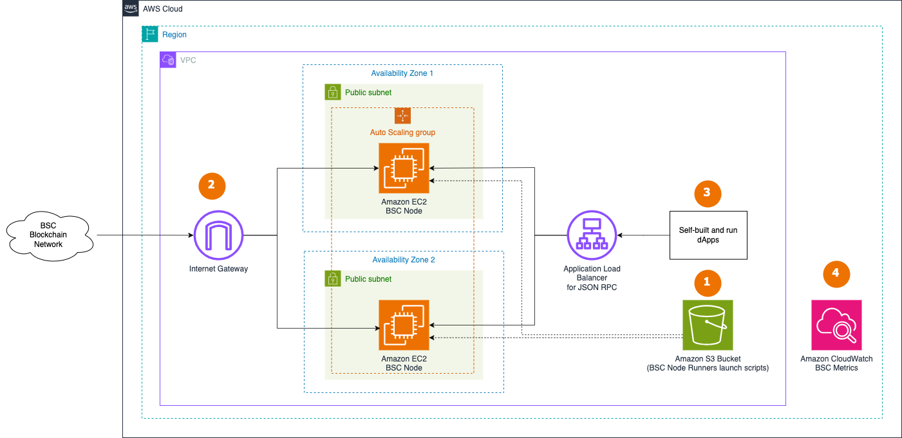

# Sample AWS Blockchain Node Runner app for BNB Smart Chain(BSC) Nodes

BNB Smart Chain, BSC for shot, is a blockchain that supports EVM-compatible smart contracts and protocols. It utilizes the [Proof of Stake Authority(PoSA)](https://docs.bnbchain.org/docs/learn/intro#proof-of-staked-authority) consensus mechanism, which is a hybrid consensus mechanism based on a combination of [Proof of Authority (PoA)](https://en.wikipedia.org/wiki/Proof_of_authority) and [Delegated Proof of Stake (DPoS)](https://bitcoinwiki.org/wiki/DPoS).

This blueprint is designed to assist in deploying a High Availability (HA) BNB Smart Chain (BSC) Fullnode on AWS. It is intended for use in development, testing, or Proof of Concept purposes. Learn more information about configuring the [Run A Fullnode on BNB Smart Chain](https://docs.bnbchain.org/docs/validator/fullnode), the following provides detailed information on High Availability deployment settings.

## Overview of Deployment Architectures for HA setups

### HA setup



1. The AWS Cloud Development Kit (CDK) deploys the highly available (HA) architecture built with stacks, as shown in the diagram above. An S3 bucket is utilized to store the execution scripts required when launching EC2 as the BSC Node and is updated through [User data](https://docs.aws.amazon.com/AWSEC2/latest/UserGuide/user-data.html).
2. A set of RPC BSC Fullnodes are deployed within the [Auto Scaling Group](https://docs.aws.amazon.com/autoscaling/ec2/userguide/auto-scaling-groups.html) in the [Default VPC](https://docs.aws.amazon.com/vpc/latest/userguide/default-vpc.html) continuously synchronizes with the rest of nodes on BSC Blockchain Network through [Internet Gateway](https://docs.aws.amazon.com/vpc/latest/userguide/VPC_Internet_Gateway.html).
3. The BSC nodes are accessed by dApps or development tools internally through [Application Load Balancer](https://docs.aws.amazon.com/elasticloadbalancing/latest/application/introduction.html). JSON RPC API is not exposed to the Internet to protect nodes from unauthorized access. dApps need to handle user authentication and API protection, like [in this example for dApps on AWS](https://aws.amazon.com/blogs/architecture/dapp-authentication-with-amazon-cognito-and-web3-proxy-with-amazon-api-gateway/).
4. The BSC nodes send various monitoring metrics for both EC2 and BSC nodes to Amazon CloudWatch.

## Additional materials

<details>

<summary>Well-Architected Checklist</summary>

This is the Well-Architected checklist for BSC nodes implementation of the AWS Blockchain Node Runner app. This checklist takes into account questions from the [AWS Well-Architected Framework](https://aws.amazon.com/architecture/well-architected/) which are relevant to this workload. Please feel free to add more checks from the framework if required for your workload.

| Pillar                  | Control                           | Question/Check                                                                   | Remarks                                                                                                                                                                                                                                                                                                                                                                                       |
|:------------------------|:----------------------------------|:---------------------------------------------------------------------------------|:----------------------------------------------------------------------------------------------------------------------------------------------------------------------------------------------------------------------------------------------------------------------------------------------------------------------------------------------------------------------------------------------|
| Security                | Network protection                | Are there unnecessary open ports in security groups?                             | Please note that ports 30303 (TCP/UDP) for BSC are open to public to support P2P protocols.                                                                                                                                                                                                                                                                                                   |
|                         |                                   | Traffic inspection                                                               | Traffic protection is not used in the solution. [AWS Web Applications Firewall (WAF)](https://docs.aws.amazon.com/waf/latest/developerguide/waf-chapter.html) could be implemented for traffic over HTTP(S), [AWS Shield](https://docs.aws.amazon.com/waf/latest/developerguide/shield-chapter.html) provides Distributed Denial of Service (DDoS) protection. Additional charges will apply. |
|                         | Compute protection                | Reduce attack surface                                                            | This solution uses Amazon Linux2 AMI(`Amazon Linux2 AMI(HVM)-Kernel 5.10`). You may choose to run hardening scripts on it.                                                                                                                                                                                                                                                                    |
|                         |                                   | Enable people to perform actions at a distance                                   | This solution uses AWS Systems Manager for terminal session, not ssh ports.                                                                                                                                                                                                                                                                                                                   |
|                         | Data protection at rest           | Use encrypted Amazon Elastic Block Store (Amazon EBS) volumes                    | This solution uses encrypted Amazon EBS volumes.                                                                                                                                                                                                                                                                                                                                              |
|                         |                                   | Use encrypted Amazon Simple Storage Service (Amazon S3) buckets                  | This solution uses Amazon S3 managed keys (SSE-S3) encryption.                                                                                                                                                                                                                                                                                                                                |
|                         | Data protection in transit        | Use TLS                                                                          | The AWS Application Load balancer currently uses HTTP listener. Create HTTPS listener with self signed certificate if TLS is desired.                                                                                                                                                                                                                                                         |
|                         | Authorization and access control  | Use instance profile with Amazon Elastic Compute Cloud (Amazon EC2) instances    | This solution uses AWS Identity and Access Management (AWS IAM) role instead of IAM user.                                                                                                                                                                                                                                                                                                     |
|                         |                                   | Following principle of least privilege access                                    | In all node types, root user is not used (using special user "bcuser" instead).                                                                                                                                                                                                                                                                                                             |
|                         | Application security              | Security focused development practices                                           | cdk-nag is being used with appropriate suppressions.                                                                                                                                                                                                                                                                                                                                          |
| Cost optimization       | Service selection                 | Use cost effective resources                                                     | 1/ The Geth client supports the ARM architecture, consider compiling Graviton-based binaries to improve costs for compute. We recommend using the `m7g.4xlarge` EC2 instance type to optimize computational costs.  2/ Cost-effective EBS gp3 are preferred instead of io2.                                                                                                                   |
|                         | Cost awareness                    | Estimate costs                                                                   | Single RPC node with `m7g.4xlarge` EBS gp3 volumes about 4000 GB(1000 IOPS, 700 MBps/s throughput) with On-Demand pricing will cost around US$854.54 per month in the US East (N. Virginia) region. More cost-optimal option with 3 year EC2 Instance Savings plan the cost goes down to 594.15 USD.                                                                                          |
| Reliability             | Resiliency implementation         | Withstand component failures                                                     | This solution uses AWS Application Load Balancer with RPC nodes for high availability. Newly provisioned BSC nodes triggered by Auto Scaling get up and running in about 300 minutes.                                                                                                                                                                                                         |
|                         | Data backup                       | How is data backed up?                                                           | Considering blockchain data is replicated by nodes automatically and BSC nodes sync from start within an hour, we don't use any additional mechanisms to backup the data.                                                                                                                                                                                                                     |
|                         | Resource monitoring               | How are workload resources monitored?                                            | Resources are being monitored using Amazon CloudWatch dashboards. Amazon CloudWatch custom metrics are being pushed via CloudWatch Agent.                                                                                                                                                                                                                                                     |
| Performance efficiency  | Compute selection                 | How is compute solution selected?                                                | Compute solution is selected based on best price-performance, i.e. AWS Graviton-based Amazon EC2 instances.                                                                                                                                                                                                                                                                                   |
|                         | Storage selection                 | How is storage solution selected?                                                | Storage solution is selected based on best price-performance, i.e. gp3 Amazon EBS volumes with optimal IOPS and throughput.                                                                                                                                                                                                                                                                   |
|                         | Architecture selection            | How is the best performance architecture selected?                               | We used a combination of recommendations from the BSC community and our own testing.                                                                                                                                                                                                                                                                                                          |
| Operational excellence  | Workload health                   | How is health of workload determined?                                            | Health of workload is determined via AWS Application Load Balancer Target Group Health Checks, on port 8845.                                                                                                                                                                                                                                                                                  |
| Sustainability          | Hardware & services               | Select most efficient hardware for your workload                                 | The solution uses Graviton-powered instances. There is a potential to use AWS Graviton-based Amazon EC2 instances which offer the best performance per watt of energy use in Amazon EC2.                                                                                                                                                                                                      |
</details>

<details>

<summary>Recommended Infrastructure</summary>


| Usage pattern                                     | Ideal configuration                                                                                                      | Primary option on AWS                                                  | Config reference                                      |
|---------------------------------------------------|--------------------------------------------------------------------------------------------------------------------------|------------------------------------------------------------------------|-------------------------------------------------------|
| 1/ Fullnode                                       | 16 vCPU, 64 GB RAM, Accounts volume: 4TB, 10K IOPS, 700 MB/s throughput, Data volume: 3TB, 10K IOPS, 700 MB/s throughput | `m7g.4xlarge`, Data volume: EBS gp3 4TB, 10K IOPS, 700 MB/s throughput | [.env-sample-full](./sample-configs/.env-sample-full) |
</details>

## Setup Instructions

### Setup Cloud9

We will use AWS Cloud9 to execute the subsequent commands. Follow the instructions in [Cloud9 Setup](../../docs/setup-cloud9.md)

### Clone this repository and install dependencies

```bash
git clone https://github.com/aws-samples/aws-blockchain-node-runners.git
cd aws-blockchain-node-runners
npm install
```

### Deploy the HA Nodes

1. Make sure you are in the root directory of the cloned repository

2. If you have deleted or don't have the default VPC, create default VPC

    ```bash
    aws ec2 create-default-vpc
    ```

   > **NOTE**:
   > You may see the following error if the default VPC already exists: `An error occurred (DefaultVpcAlreadyExists) when calling the CreateDefaultVpc operation: A Default VPC already exists for this account in this region.`. That means you can just continue with the following steps.


3. Configure and deploy multiple HA Nodes

   Create your own copy of `.env` file and edit it to update with your AWS Account ID, AWS Region, BSC SNAPSHOTS URI:

   ```bash
   # Make sure you are in aws-blockchain-node-runners/lib/bsc
   cd lib/bsc
   npm install
   pwd
   cp ./sample-configs/.env-sample-full .env
   vim .env
   ```
   > **IMPORTANT**:
   > 1. Example configuration parameters are set in the local `.env-sample` file. You can find more examples inside `sample-configs` directory.  
   > 2. Please check this GitHub: https://github.com/48Club/bsc-snapshots, use Geth full node link replace the `BSC_SNAPSHOTS_URI`.

4. Deploy common components such as IAM role

   ```bash
   pwd
   # Make sure you are in aws-blockchain-node-runners/lib/bsc
   npx cdk deploy bsc-common
   ```

   > **IMPORTANT**:
   > All AWS CDK v2 deployments use dedicated AWS resources to hold data during deployment. Therefore, your AWS account and Region must be [bootstrapped](https://docs.aws.amazon.com/cdk/v2/guide/bootstrapping.html) to create these resources before you can deploy. If you haven't already bootstrapped, issue the following command:
   > ```bash
   > cdk bootstrap aws://ACCOUNT-NUMBER/REGION

### Option 1: Single RPC Node

1. Deploying a BSC Fullnode node typically takes about 2-3 hours. The Fullnode uses snapshots data, and downloading and decompressing the data can take a considerable amount of time. You can grab a cup of coffee☕️ and patiently wait during this process. After deployment, you'll need to wait for the node to synchronize with the BSC Blockchain Network.

   ```bash
   pwd
   # Make sure you are in aws-blockchain-node-runners/lib/bsc
   npx cdk deploy bsc-single-node --json --outputs-file single-node.json
   ```

2. Give the new RPC nodes about few hours to initialize and then run the following query against the load balancer behind the RPC node created

   ```bash
   INSTANCE_ID=$(cat single-node-deploy.json | jq -r '..|.node-instance-id? | select(. != null)')
   NODE_INTERNAL_IP=$(aws ec2 describe-instances --instance-ids $INSTANCE_ID --query 'Reservations[*].Instances[*].PrivateIpAddress' --output text)

   ```
   
   Check [Geth Syncing](https://geth.ethereum.org/docs/fundamentals/logs#syncing) Status:

   ```bash
   curl http://$NODE_INTERNAL_IP:8545 -X POST -H "Content-Type: application/json" \
   --data '{ "jsonrpc": "2.0", "id": 1, "method": "eth_syncing", "params": []}'
   ```

   It will return `false` if the node is in sync. If `eth_syncing` returns anything other than false it has not finished syncing. Generally, if syncing is still ongoing, `eth_syncing` will return block info that looks as follows:
   
   ```javascript
   {
        "jsonrpc": "2.0",
        "id": 1,
        "result": {
                 "currentBlock": "0x211f0d8",
                 "healedBytecodeBytes": "0x0",
                 "healedBytecodes": "0x0",
                 "healedTrienodeBytes": "0x0",
                 "healedTrienodes": "0x0",
                 "healingBytecode": "0x0",
                 "healingTrienodes": "0x0",
                 "highestBlock": "0x2123bff",
                 "startingBlock": "0x20910d7",
                 "syncedAccountBytes": "0x0",
                 "syncedAccounts": "0x0",
                 "syncedBytecodeBytes": "0x0",
                 "syncedBytecodes": "0x0",
                 "syncedStorage": "0x0",
                 "syncedStorageBytes": "0x0"
        }
   }
   ```

### Option 2: Highly Available RPC Nodes

1. Deploy a BSC Fullnode node typically takes about 2-3 hours. The Fullnode uses snapshots data, and downloading and decompressing the data can take a considerable amount of time. You can grab a cup of coffee☕️ and patiently wait during this process. After deployment, you'll need to wait for the node to synchronize with the BSC Blockchain Network.

   ```bash
   pwd
   # Make sure you are in aws-blockchain-node-runners/lib/bsc
   npx cdk deploy bsc-ha-nodes --json --outputs-file ha-nodes-deploy.json
   ```

2. Give the new RPC nodes about few hours to initialize and then run the following query against the load balancer behind the RPC node created

   ```bash
   export RPC_ALB_URL=$(cat ha-nodes-deploy.json | jq -r '.["bsc-ha-nodes-full"].alburl? | select(. != null)')
   echo $RPC_ALB_URL
   ```
   
   Check [Geth Syncing](https://geth.ethereum.org/docs/fundamentals/logs#syncing) Status:

   ```bash
   curl http://$RPC_ALB_URL:8545 -X POST -H "Content-Type: application/json" \
   --data '{ "jsonrpc": "2.0", "id": 1, "method": "eth_syncing", "params": []}'
   ```

   It will return `false` if the node is in sync. If `eth_syncing` returns anything other than false it has not finished syncing. Generally, if syncing is still ongoing, `eth_syncing` will return block info that looks as follows:
   
   ```javascript
   {
        "jsonrpc": "2.0",
        "id": 1,
        "result": {
                 "currentBlock": "0x211f0d8",
                 "healedBytecodeBytes": "0x0",
                 "healedBytecodes": "0x0",
                 "healedTrienodeBytes": "0x0",
                 "healedTrienodes": "0x0",
                 "healingBytecode": "0x0",
                 "healingTrienodes": "0x0",
                 "highestBlock": "0x2123bff",
                 "startingBlock": "0x20910d7",
                 "syncedAccountBytes": "0x0",
                 "syncedAccounts": "0x0",
                 "syncedBytecodeBytes": "0x0",
                 "syncedBytecodes": "0x0",
                 "syncedStorage": "0x0",
                 "syncedStorageBytes": "0x0"
        }
   }
   ```

**NOTE:** By default and for security reasons the load balancer is available only from within the default VPC in the region where it is deployed. It is not available from the Internet and is not open for external connections. Before opening it up please make sure you protect your RPC APIs.

### Clearing up and undeploy everything

1. Undeploy HA Nodes, Single Nodes and Common stacks

```bash
# Setting the AWS account id and region in case local .env file is lost
export AWS_ACCOUNT_ID=<your_target_AWS_account_id>
export AWS_REGION=<your_target_AWS_region>

pwd
# Make sure you are in aws-blockchain-node-runners/lib/bsc

# Undeploy HA Nodes
cdk destroy bsc-ha-nodes

 # Delete all common components like IAM role and Security Group
cdk destroy bsc-common
```

2. Follow steps to delete the Cloud9 instance in [Cloud9 Setup](../../doc/setup-cloud9.md)

### FAQ

1. How to check the logs of the clients running on my sync node? Please enter the [AWS Management Console - EC2 Instances](https://us-east-2.console.aws.amazon.com/ec2/home?region=us-east-2#Instances:instanceState=running), choose the correct region, copy the instance ID you need to query.

   **Note:** In this tutorial we chose not to use SSH and use Session Manager instead. That allows you to log all sessions in AWS CloudTrail to see who logged into the server and when. If you receive an error similar to `SessionManagerPlugin is not found`, [install Session Manager plugin for AWS CLI](https://docs.aws.amazon.com/systems-manager/latest/userguide/session-manager-working-with-install-plugin.html)

```bash
pwd
# Make sure you are in aws-blockchain-node-runners/lib/bsc

export INSTANCE_ID="i-**************"
echo "INSTANCE_ID=" $INSTANCE_ID
aws ssm start-session --target $INSTANCE_ID --region $AWS_REGION
sudo su ec2-user
sudo journalctl -o cat -fu bsc
```
2. How to check the logs from the EC2 user-data script? Please enter the [AWS Management Console - EC2 Instances](https://us-east-2.console.aws.amazon.com/ec2/home?region=us-east-2#Instances:instanceState=running), choose the correct region, copy the instance ID you need to query.

```bash
pwd
# Make sure you are in aws-blockchain-node-runners/lib/bsc

export INSTANCE_ID="i-**************"
echo "INSTANCE_ID=" $INSTANCE_ID
aws ssm start-session --target $INSTANCE_ID --region $AWS_REGION
sudo cat /var/log/cloud-init-output.log
```

3. How can I check the BSC service log on EC2? Please enter the [AWS Management Console - EC2 Instances](https://us-east-2.console.aws.amazon.com/ec2/home?region=us-east-2#Instances:instanceState=running), choose the correct region, copy the instance ID you need to query.

```bash
pwd
# Make sure you are in aws-blockchain-node-runners/lib/bsc

export INSTANCE_ID="i-**************"
echo "INSTANCE_ID=" $INSTANCE_ID

aws ssm start-session --target $INSTANCE_ID --region $AWS_REGION
cd /data
cat bsc.log
```

4. How can I restart the BSC service? Please enter the [AWS Management Console - EC2 Instances](https://us-east-2.console.aws.amazon.com/ec2/home?region=us-east-2#Instances:instanceState=running), choose the correct region, copy the instance ID you need to query.

```bash
pwd
# Make sure you are in aws-blockchain-node-runners/lib/bsc

export INSTANCE_ID="i-**************"
echo "INSTANCE_ID=" $INSTANCE_ID

aws ssm start-session --target $INSTANCE_ID --region $AWS_REGION
sudo systemctl status bsc
```
**NOTE:** You can also try the following command to obtain more information：
- Check the BSC service status
  - `sudo systemctl status bsc`
- View BSC service configuration
  - `cat /etc/systemd/system/bsc.service`

5. Where can I find more infromation about BSC RPC API?

Please refer to more [JSON-RPC API METHODS](https://ethereum.org/en/developers/docs/apis/json-rpc/#json-rpc-methods). The following are some commonly used API methods:
   - eth_blockNumber
   - eth_getBalance
   - eth_accounts
   - eth_call
   - eth_estimateGas
   - eth_signTransaction
   - eth_sendTransaction
   - eth_getBlockByHash
   - eth_getBlockByNumber
   - eth_getTransactionByHash

## Upgrades

When nodes need to be upgraded or downgraded, [use blue/green pattern to do it](https://aws.amazon.com/blogs/devops/performing-bluegreen-deployments-with-aws-codedeploy-and-auto-scaling-groups/). This is not yet automated and contributions are welcome!
