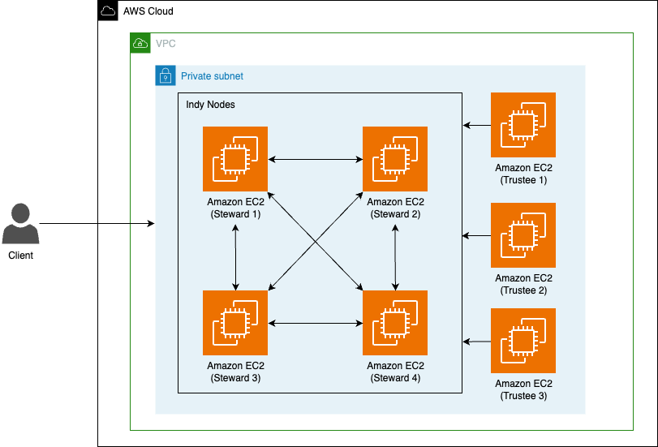

# Sample AWS Blockchain Node Runner app for Hyperledger Indy

[View this page in Japanese (日本語)](./README_ja.md)

## Architecture Overview



This is a sample of building a Hyperledger Indy network on AWS.
The overall architecture is shown below, processing itself is performed by 4 Stewards (Validator Nodes), and network management is performed with Trustee. It consists of 4 EC2 instances for Steward and 3 EC2 instances for Trustee.

## Solution Walkthrough

### Setup Cloud9

We will use AWS Cloud9 to execute the subsequent commands. Follow the instructions in [Cloud9 Setup](../../docs/setup-cloud9.md)

### Clone this repository and install dependencies

```bash
git clone https://github.com/aws-samples/aws-blockchain-node-runners.git
cd aws-blockchain-node-runners
npm install
```

**NOTE:** In this tutorial we will set all major configuration through environment variables, but you also can modify parameters in `config/config.ts`.

### Deploy Indy Nodes

#### Building resources

1. Install npm dependency packages

```bash
cd lib/indy
pwd
# Make sure you are in aws-blockchain-node-runners/lib/indy
npm install
```

2. Setting up initial AWS Cloud Development Kit (CDK)

The following command is executed only when using AWS CDK for the first time in the region where the deployment will be carried out.

```bash
npx cdk bootstrap
```

3. Deploying resources with CDK

```bash
npx cdk deploy

Outputs:
IndyNetworkStack.AnsibleFileTransferBucketName = 111122223333-ansible-file-transfer-bucket
IndyNetworkStack.steward1steward1InstanceId2F9F8910 = i-1234567890abcdef1
IndyNetworkStack.steward2steward2InstanceId995438F2 = i-1234567890abcdef2
IndyNetworkStack.steward3steward3InstanceIdB5D10BBE = i-1234567890abcdef3
IndyNetworkStack.steward4steward4InstanceIdB3DD7753 = i-1234567890abcdef4
IndyNetworkStack.trustee1trustee1InstanceId8FDDE052 = i-1234567890abcdef5
IndyNetworkStack.trustee2trustee2InstanceIdE12079EA = i-1234567890abcdef6
IndyNetworkStack.trustee3trustee3InstanceId508C4E4C = i-1234567890abcdef7
```

**NOTE:** User data for the Steward instance is created by referring to [the Community Docs](https://github.com/hyperledger/indy-node/blob/main/docs/source/install-docs/AWS-NodeInstall-20.04.md).

#### Building an environment using Ansible

When running on a Mac, set the following environment variables.

> export OBJC_DISABLE_INITIALIZE_FORK_SAFETY=YES


##### Preparing for Ansible

- Create a Python virtual environment and install ansible
 ```
 $cd ansible
 $ Python3 -m venv.venv
 $source.venv/bin/activate
 ```

 ```
 $ pip install -r requirements.txt
 ```

##### Ansible and Session Manager

- In order to achieve SSH access to the EC2 instance using Session Manager, refer to [Install the Session Manager plugin for the AWS CLI](https://docs.aws.amazon.com/systems-manager/latest/userguide/session-manager-working-with-install-plugin.html)  and install the Session Manager Plugin. By using the Session Manager, deployment by Ansible to an EC2 instance of a private subnet that cannot be accessed from the internet is possible without setting a security group.

- Installs a ansible plug-in for SSH access to EC2 using the AWS Systems Manager Session Manager.
 ```
 $ ansible-galaxy collection install community.aws
 ```

##### Describe instance information to be built in inventory.yml

- Create an indentory file containing information on the EC2 instance that will build the environment. Enter the instance ID described in the CDK output results in the settings column for each node. The value of `indyNetworkStack.ansibleFileTransferBucketName` described in CDK output results is inputted to `ansible_aws_ssm_bucket_name`. When Ansible transfers files to the target host, the Amazon Simple Storage Service (Amazon S3) bucket specified here is used.

  ```
  $ vi inventory/inventory.yml
  all:
    hosts:
      steward1:
        ansible_aws_ssm_instance_id: i-1234567890abcdef1
      steward2:
        ansible_aws_ssm_instance_id: i-1234567890abcdef2
      steward3:
        ansible_aws_ssm_instance_id: i-1234567890abcdef3
      steward4:
        ansible_aws_ssm_instance_id: i-1234567890abcdef4
      trustee1:
        ansible_aws_ssm_instance_id: i-1234567890abcdef5
      trustee2:
        ansible_aws_ssm_instance_id: i-1234567890abcdef6
      trustee3:
        ansible_aws_ssm_instance_id: i-1234567890abcdef7
    children:
      steward:  
        hosts:
          steward[1:4]:
      trustee:
        hosts:
          trustee1

    vars:
      ansible_connection: aws_ssm
      ansible_aws_ssm_region: aa-example-1
      ansible_aws_ssm_s3_addressing_style: virtual
      ansible_aws_ssm_bucket_name: 111122223333-ansible-file-transfer-bucket
  ```


##### Ansible parameter settings
Define the parameters referred to by Ansible in the configuration file. Set Indy's network name

```
$ vi inventory/group_vars/all.yml
INDY_NETEORK_NAME: sample-network
```

##### Execute environment construction with Ansible

- Use ansible's `ping` module to confirm that ansible can connect to the instance set in inventory/inventory.yml

  ```
  $ ansible -m ping all -i inventory/inventory.yml  
  steward2 | SUCCESS => {
      "changed": false,
      "ping": "pong"
  }
  steward3 | SUCCESS => {
      "changed": false,
      "ping": "pong"
  }
  trustee1 | SUCCESS => {
      "changed": false,
      "ping": "pong"
  }
  steward4 | SUCCESS => {
      "changed": false,
      "ping": "pong"
  }
  trustee2 | SUCCESS => {
      "changed": false,
      "ping": "pong"
  }
  trustee3 | SUCCESS => {
      "changed": false,
      "ping": "pong"
  }
  steward1 | SUCCESS => {
      "changed": false,
      "ping": "pong"
  }
  ```

- Execute Hyperledger Indy environment construction for target EC2 instances defined in `inventory/inventory.yml` in ansible
 ```
 $ ansible-playbook playbook/site.yml
 ```


#### reference information

-   [Buidling Indy Network](https://github.com/pSchlarb/indy-node/blob/documentationUpdate/docs/source/NewNetwork/NewNetwork.md)
-   [Setting up EC2 instances for Indy Node](https://github.com/hyperledger/indy-node/blob/main/docs/source/install-docs/AWS-NodeInstall-20.04.md)
-   [Setting up Indy Node](https://github.com/pSchlarb/indy-node/blob/documentationUpdate/docs/source/installation-and-configuration.md)
    ​

### Considerations

Matters to be examined in additional development etc. when using this sample are described.

-   Change the instance type to M
    -   Currently, it is a T instance, but in production environments, it is recommended to change to M
-   Fix the security group for Node NICs attached to Steward (Validator Node)
    -   Limit source IPs to node IPs of other nodes (currently open within VPC and can also be accessed by clients)
    -   Fix Node's private IP
-   If necessary, change the subnet to which the node belongs to a public subnet
-   Make Steward and Node separate instances
