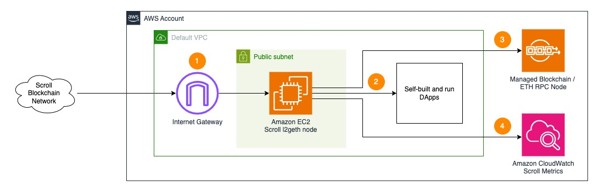

# Sample AWS Blockchain Node Runner app for Scroll Nodes

This is RPC Scroll nodes (L2Geth) setup on AWS guide.

## Overview of Deployment Architectures for Single Node setups

### Single node setup



1.	A Scroll node deployed in the [Default VPC](https://docs.aws.amazon.com/vpc/latest/userguide/default-vpc.html) continuously synchronizes with the rest of nodes on [Scroll Clusters](https://docs.scroll.com/clusters) through [Internet Gateway](https://docs.aws.amazon.com/vpc/latest/userguide/VPC_Internet_Gateway.html).
2.	The Scroll node is used by dApps or development tools internally from within the Default VPC. JSON RPC API is not exposed to the Internet directly to protect nodes from unauthorized access.
3. You will need access to a fully-synced Ethereum Mainnet RPC endpoint before running l2geth.
4. The Scroll node sends various monitoring metrics for both EC2 and Scroll nodes to Amazon CloudWatch.


## Additional materials

<details>

<summary>Review the for pros and cons of this solution.</summary>

### Well-Architected Checklist

This is the Well-Architected checklist for Ethereum nodes implementation of the AWS Blockchain Node Runner app. This checklist takes into account questions from the [AWS Well-Architected Framework](https://aws.amazon.com/architecture/well-architected/) which are relevant to this workload. Please feel free to add more checks from the framework if required for your workload.

| Pillar                  | Control                           | Question/Check                                                                   | Remarks          |
|:------------------------|:----------------------------------|:---------------------------------------------------------------------------------|:-----------------|
| Security                | Network protection                | Are there unnecessary open ports in security groups?                             | Please note that ports 30303 (TCP/UDP) for Scroll are open to public to support P2P protocols. We have to rely on the protection mechanisms built into the Scroll software to protect those ports.   |
|                         |                                   | Traffic inspection                                                               | AWS WAF could be implemented for traffic inspection. Additional charges will apply.  |
|                         | Compute protection                | Reduce attack surface                                                            | This solution uses Ubuntu 20.04 LTS AMI. You may choose to run hardening scripts on it.  |
|                         |                                   | Enable people to perform actions at a distance                                   | This solution uses AWS Systems Manager for terminal session, not ssh ports.  |
|                         | Data protection at rest           | Use encrypted Amazon Elastic Block Store (Amazon EBS) volumes                    | This solution uses encrypted Amazon EBS volumes.  |
|                         | Data protection in transit        | Use TLS                                                                          | By design TLS is not used in Scroll RPC and P2P protocols because the data is considered public. To protect RPC traffic we expose the port only for internal use. |
|                         | Authorization and access control  | Use instance profile with Amazon Elastic Compute Cloud (Amazon EC2) instances    | This solution uses AWS Identity and Access Management (AWS IAM) role instead of IAM user.  |
|                         |                                   | Following principle of least privilege access                                    | In the node, root user is not used (using special user "ubuntu" instead).  |
|                         | Application security              | Security focused development practices                                           | cdk-nag is being used with documented suppressions.  |
| Cost optimization       | Service selection                 | Use cost effective resources                                                     | Scroll nodes currently doesn't provide binaries for ARM architecture, so AMD-powered EC2 instance type for better cost effectiveness.  |
|                         | Cost awareness                    | Estimate costs                                                                   | One Scroll node on m6a.2xlarge and 1T EBS gp3 volume will cost around US$367.21 per month in the US East (N. Virginia) region. Additionally the AMB Access Ethereum on bc.m5.xlarge will cost additional ~US$202 per month in the US East (N. Virginia) region. Approximately the total cost will be US$367.21 + US$202 = US$569.21 per month. |
| Reliability             | Resiliency implementation         | Withstand component failures                                                     | This solution currently does not have high availability and is deployed to a single availability zone.  |
|                         | Data backup                       | How is data backed up?                                                           | The data is not specially backed up. The node will have to re-sync its state from other nodes in the Scroll network to recover.  |
|                         | Resource monitoring               | How are workload resources monitored?                                            | Resources are being monitored using Amazon CloudWatch dashboards. Amazon CloudWatch custom metrics are being pushed via CloudWatch Agent.  |
| Performance efficiency  | Compute selection                 | How is compute solution selected?                                                | Compute solution is selected based on the recommendations the from Scroll community to provide stable and cost-effective operations.  |
|                         | Storage selection                 | How is storage solution selected?                                                | Storage solution is selected based on the recommendations the from Scroll community to provide stable and cost-effective operations.  |
|                         | Architecture selection            | How is the best performance architecture selected?                               | In this solution we try to balance price and performance to achieve better cost efficiency, but not necessarily the best performance.  |
| Operational excellence  | Workload health                   | How is health of workload determined?                                            | We rely on the standard EC2 instance monitoring tool to detect stalled instances.  |
| Sustainability          | Hardware & services               | Select most efficient hardware for your workload                                 | Scroll nodes currently doesn't provide binaries for ARM architecture, so AMD-powered EC2 instance type for better cost effectiveness.  |
</details>
<details>
<summary>Recommended Infrastructure</summary>

## Hardware Requirements

**Minimum for Scroll node**

- Instance type [m6a.large](https://aws.amazon.com/ec2/instance-types/m6a/).
- 500GB EBS gp3 storage with at least 3000 IOPS.

**Recommended for Scroll node**

- Instance type [m6a.2xlarge](https://aws.amazon.com/ec2/instance-types/m6a/).
- 1TB EBS gp3 storage with at least 3000 IOPS.`

**Amazon Managed Blockchain Ethereum L1**

- Minimum instance type: [bc.m5.xlarge](https://aws.amazon.com/managed-blockchain/instance-types/)
- Recommended instance type: [bc.m5.2xlarge](https://aws.amazon.com/managed-blockchain/instance-types/)

</details>

## Setup Instructions

### Setup Cloud9

We will use AWS Cloud9 to execute the subsequent commands. Follow the instructions in [Cloud9 Setup](../../docs/setup-cloud9.md)

### Clone this repository and install dependencies

```bash
   git clone https://github.com/alickwong/aws-blockchain-node-runners
   cd aws-blockchain-node-runners
   npm install
```

### Deploy Single Node

1. Make sure you are in the root directory of the cloned repository

2. If you have deleted or don't have the default VPC, create default VPC

    ```bash
    aws ec2 create-default-vpc
    ```

   > NOTE:
   > You may see the following error if the default VPC already exists: `An error occurred (DefaultVpcAlreadyExists) when calling the CreateDefaultVpc operation: A Default VPC already exists for this account in this region.`. That means you can just continue with the following steps.

3. Configure your setup

    Create your own copy of `.env` file and edit it to update with your AWS Account ID and Region:
    ```bash
   # Make sure you are in aws-blockchain-node-runners/lib/scroll
   cd lib/scroll
   npm install
   pwd
   cp ./sample-configs/.env-sample-full .env
   nano .env
    ```
   > NOTE:
   > Example configuration parameters are set in the local `.env-sample` file. You can find more examples inside `sample-configs` directory.

4. Deploy common components such as IAM role

   ```bash
   pwd
   # Make sure you are in aws-blockchain-node-runners/lib/scroll
   npx cdk deploy scroll-common
   ```

   > IMPORTANT:
   > All AWS CDK v2 deployments use dedicated AWS resources to hold data during deployment. Therefore, your AWS account and Region must be [bootstrapped](https://docs.aws.amazon.com/cdk/v2/guide/bootstrapping.html) to create these resources before you can deploy. If you haven't already bootstrapped, issue the following command:
   > ```bash
   > cdk bootstrap aws://ACCOUNT-NUMBER/REGION
   > ```

5. Deploy Amazon Managed Blockchain (AMB) Access Ethereum node and wait about 35-70 minutes for the node to sync

   ```bash
   pwd
   # Make sure you are in aws-blockchain-node-runners/lib/scroll
   npx cdk deploy scroll-ethereum-l1-node --json --outputs-file scroll-ethereum-l1-node.json
   ```
   To watch the progress, open the [AMB Web UI](https://console.aws.amazon.com/managedblockchain/home), click the name of your target network from the list (Mainnet, Goerly, etc.) and watch the status of the node to change from `Creating` to `Available`.

6. Deploy Scroll Full Node and wait for another 10-20 minutes for it to sync
   You will need access to a fully-synced Ethereum Mainnet RPC endpoint before running l2geth. Please be reminded to update L2GETH_L1_ENDPOINT in .env file.
   ```bash
   nano .env
   ```

   Once you have updated .env file, you may deploy the node now:
   ```bash
   pwd
   # Make sure you are in aws-blockchain-node-runners/lib/scroll
   npx cdk deploy scroll-single-node --json --outputs-file single-node-deploy.json
   ```
   After starting the node you will need to wait for the initial synchronization process to finish.To see the progress, you may use SSM to connect into EC2 first and watch the log like this:

   ```bash
   export INSTANCE_ID=$(cat single-node-deploy.json | jq -r '..|.node-instance-id? | select(. != null)')
   echo "INSTANCE_ID=" $INSTANCE_ID
   export AWS_REGION=us-east-1
   aws ssm start-session --target $INSTANCE_ID --region $AWS_REGION
   tail -f /var/log/scroll/error.log
   ```

   When the process complete, you will see `L1 message initial sync completed` in the log:
   ```
   INFO [12-13|08:25:46.095] Syncing L1 messages                      processed=18,683,700 confirmed=18,775,938 collected=77348 progress(%)=99.509
   INFO [12-13|08:25:56.165] Syncing L1 messages                      processed=18,699,700 confirmed=18,775,938 collected=78100 progress(%)=99.594
   INFO [12-13|08:26:06.122] Syncing L1 messages                      processed=18,709,300 confirmed=18,775,938 collected=79042 progress(%)=99.645
   INFO [12-13|08:26:16.107] Syncing L1 messages                      processed=18,729,400 confirmed=18,775,938 collected=79585 progress(%)=99.752
   INFO [12-13|08:26:26.127] Syncing L1 messages                      processed=18,741,900 confirmed=18,775,938 collected=80688 progress(%)=99.819
   INFO [12-13|08:26:36.208] Syncing L1 messages                      processed=18,750,200 confirmed=18,775,938 collected=82535 progress(%)=99.863
   INFO [12-13|08:26:46.124] Syncing L1 messages                      processed=18,755,400 confirmed=18,775,938 collected=84176 progress(%)=99.891
   INFO [12-13|08:26:56.120] Syncing L1 messages                      processed=18,768,200 confirmed=18,775,938 collected=85240 progress(%)=99.959
   INFO [12-13|08:27:00.524] L1 message initial sync completed        latestProcessedBlock=18,775,938
   ```

7. Test Scroll RPC API
   Use curl to query from within the node instance:
   ```bash
   export INSTANCE_ID=$(cat single-node-deploy.json | jq -r '..|.node-instance-id? | select(. != null)')
   echo "INSTANCE_ID=" $INSTANCE_ID
   export AWS_REGION=us-east-1
   aws ssm start-session --target $INSTANCE_ID --region $AWS_REGION

   curl -s -X POST -H "Content-Type: application/json" --data '{"jsonrpc":"2.0","method":"eth_blockNumber","params":[],"id":1}' http://localhost:8545
   ```

### Monitoring
 It may take about 30 minutes and you can use Amazon CloudWatch to track the progress. There is a script that publishes CloudWatch metrics every 5 minutes, where you can watch current block and slots behind metrics. When the node is fully synced the slots behind metric should go to 0. To see them:

Navigate to CloudWatch service (make sure you are in the region you have specified for AWS_REGION)
Open Dashboards and select scroll-single-node from the list of dashboards.

## Clear up and undeploy everything

1. Undeploy all Nodes and Common stacks

   ```bash
   # Setting the AWS account id and region in case local .env file is lost
   export AWS_ACCOUNT_ID=<your_target_AWS_account_id>
   export AWS_REGION=<your_target_AWS_region>

   pwd
   # Make sure you are in aws-blockchain-node-runners/lib/scroll

   # Undeploy Single Node
   npx cdk destroy scroll-single-node

   # Undeploy AMB Etheruem node
   npx cdk destroy scroll-ethereum-l1-node

   # Delete all common components like IAM role and Security Group
   npx cdk destroy scroll-common
   ```

2. Follow steps to delete the Cloud9 instance in [Cloud9 Setup](../../doc/setup-cloud9.md)

## FAQ

1. How to check the logs of the clients running on my Scroll node?

   **Note:** In this tutorial we chose not to use SSH and use Session Manager instead. That allows you to log all sessions in AWS CloudTrail to see who logged into the server and when. If you receive an error similar to `SessionManagerPlugin is not found`, [install Session Manager plugin for AWS CLI](https://docs.aws.amazon.com/systems-manager/latest/userguide/session-manager-working-with-install-plugin.html)

   ```bash
   pwd
   # Make sure you are in aws-blockchain-node-runners/lib/scroll

   export INSTANCE_ID=$(cat single-node-deploy.json | jq -r '..|.node-instance-id? | select(. != null)')
   echo "INSTANCE_ID=" $INSTANCE_ID
   export AWS_REGION=us-east-1
   aws ssm start-session --target $INSTANCE_ID --region $AWS_REGION
   sudo journalctl -o cat -fu sol
   ```
2. How to check the logs from the EC2 user-data script?

   ```bash
   pwd
   # Make sure you are in aws-blockchain-node-runners/lib/scroll

   export INSTANCE_ID=$(cat single-node-deploy.json | jq -r '..|.node-instance-id? | select(. != null)')
   echo "INSTANCE_ID=" $INSTANCE_ID
   export AWS_REGION=us-east-1
   aws ssm start-session --target $INSTANCE_ID --region $AWS_REGION
   sudo cat /var/log/cloud-init-output.log
   ```

3. How can I restart the Scroll service?

   ``` bash
   export INSTANCE_ID=$(cat single-node-deploy.json | jq -r '..|.node-instance-id? | select(. != null)')
   echo "INSTANCE_ID=" $INSTANCE_ID
   export AWS_REGION=us-east-1
   aws ssm start-session --target $INSTANCE_ID --region $AWS_REGION
   sudo systemctl status scroll.service
   sudo systemctl restart scroll.service
   ```
4. Where to find the key l2geth directories?

   - The directory with binaries is `/home/ubuntu/l2geth-source`.
   - The data directory of l2geth agent is `/home/ubuntu/l2geth-source/l2geth-datadir`

5. You can now attach to l2geth?

   ```bash
   sudo - ubuntu
   cd /home/ubuntu/l2geth-source/
   alias l2geth=./build/bin/geth
   l2geth attach "./l2geth-datadir/geth.ipc"

   > admin.peers.length
   14

   > eth.blockNumber
   10000
   ```
