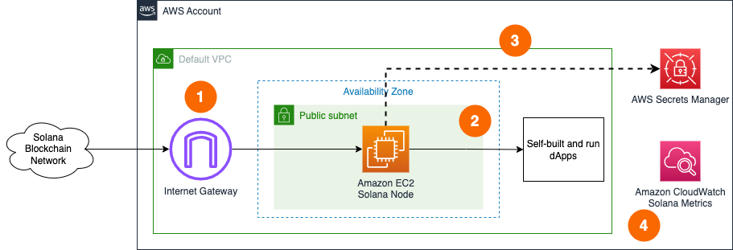

# Sample AWS Blockchain Node Runner app for Solana Nodes

Solana nodes on AWS can be deployed in 3 different configurations: Consensus, base RPC and extended RPC with secondary indexes. In addition, you can choose to deploy those configurations as a single node or a highly available (HA) nodes setup. Learn more about configurations on [Solana on AWS documentation page](https://solana.com/developers/guides/rpc/configure-solana-rpc-on-aws) and below are the details on single node and HA deployment setups.

## Overview of Deployment Architectures for Single and HA setups

### Single node setup



1.	A Solana node deployed in the [Default VPC](https://docs.aws.amazon.com/vpc/latest/userguide/default-vpc.html) continuously synchronizes with the rest of nodes on [Solana Clusters](https://docs.solana.com/clusters) through [Internet Gateway](https://docs.aws.amazon.com/vpc/latest/userguide/VPC_Internet_Gateway.html).
2.	The Solana node is used by dApps or development tools internally from within the Default VPC. JSON RPC API is not exposed to the Internet directly to protect nodes from unauthorized access.
3.	The Solana node uses all required secrets locally, but stores a copy in [AWS Secrets Manager](https://docs.aws.amazon.com/secretsmanager/latest/userguide/intro.html) as secure backup.
4.	The Solana node sends various monitoring metrics for both EC2 and Solana nodes to Amazon CloudWatch.

### HA setup


1.	A set of Base or Extended RPC Solana nodes are deployed within the [Auto Scaling Group](https://docs.aws.amazon.com/autoscaling/ec2/userguide/auto-scaling-groups.html) in the [Default VPC](https://docs.aws.amazon.com/vpc/latest/userguide/default-vpc.html) continuously synchronizes with the rest of nodes on [Solana Clusters](https://docs.solana.com/clusters) through [Internet Gateway](https://docs.aws.amazon.com/vpc/latest/userguide/VPC_Internet_Gateway.html). **Note that HA setup is not suitable for Consensus nodes.**
2.	The Solana nodes are accessed by dApps or development tools internally through [Application Load Balancer](https://docs.aws.amazon.com/elasticloadbalancing/latest/application/introduction.html). JSON RPC API is not exposed to the Internet to protect nodes from unauthorized access. dApps need to handle user authentication and API protection, like [in this example for dApps on AWS](https://aws.amazon.com/blogs/architecture/dapp-authentication-with-amazon-cognito-and-web3-proxy-with-amazon-api-gateway/).
3.	The Solana nodes use all required secrets locally, but store a copy in [AWS Secrets Manager](https://docs.aws.amazon.com/secretsmanager/latest/userguide/intro.html) as secure backup.
4.	The Solana nodes send various monitoring metrics for both EC2 and Solana nodes to Amazon CloudWatch.

## Additional materials

<details>

<summary>Managing Secrets</summary>

During the startup, if a node can't find the necessary identity file on the attached Root EBS volume, it generates a new one and stores it in AWS Secrets Manager. For a single-node deployment, the ARN of a secret can be provided within the `.env` configuration file with configuration and the node will pick it up.

Base RPC and Extended RPC nodes use only 1 secret:

- **Solana Node Identity Secret**: The identity key pair for a Solana node.

Consensus node uses up to 3 more identity secrets:

- **Vote Account Secret**: The [Validator Identity's key pair](https://docs.solana.com/running-validator/vote-accounts#validator-identity).

- **Authorized Withdrawer Account Secret**: The [Authorized Withdrawer key pair](https://docs.solana.com/running-validator/vote-accounts#authorized-withdrawer).

- **Registration Transaction Funding Account Secret**: An account that has sufficient SOL to pay for on-chain validator creation transaction. If not present, the node provisioning script assumes the on-chain validator creation transaction was issued elsewhere and will skip it.

</details>

<details>

<summary>Well-Architected Checklist</summary>

This is the Well-Architected checklist for Solana nodes implementation of the AWS Blockchain Node Runner app. This checklist takes into account questions from the [AWS Well-Architected Framework](https://aws.amazon.com/architecture/well-architected/) which are relevant to this workload. Please feel free to add more checks from the framework if required for your workload.

| Pillar                  | Control                           | Question/Check                                                                   | Remarks          |
|:------------------------|:----------------------------------|:---------------------------------------------------------------------------------|:-----------------|
| Security                | Network protection                | Are there unnecessary open ports in security groups?                             | Please note that ports 8801 to 8812 (TCP/UDP) for Solana are open to public to support P2P protocols. We have to rely on the protection mechanisms built into the Solana validators software to protect those ports.  |
|                         |                                   | Traffic inspection                                                               | Traffic protection is not used in the solution. AWS Web Applications Firewall (WAF) could be implemented for traffic inspection. Additional charges will apply.  |
|                         | Compute protection                | Reduce attack surface                                                            | This solution uses Ubuntu 20.04 AMI. You may choose to run hardening scripts on it.  |
|                         |                                   | Enable people to perform actions at a distance                                   | This solution uses AWS Systems Manager for terminal session, not ssh ports.  |
|                         | Data protection at rest           | Use encrypted Amazon Elastic Block Store (Amazon EBS) volumes                    | This solution uses encrypted Amazon EBS volumes.  |
|                         |                                   | Use encrypted Amazon Simple Storage Service (Amazon S3) buckets                  | This solution uses Amazon S3 managed keys (SSE-S3) encryption.  |
|                         | Data protection in transit        | Use TLS                                                                          | The AWS Application Load balancer currently uses HTTP listener. Create HTTPS listener with self signed certificate if TLS is desired.  |
|                         | Authorization and access control  | Use instance profile with Amazon Elastic Compute Cloud (Amazon EC2) instances    | This solution uses AWS Identity and Access Management (AWS IAM) role instead of IAM user.  |
|                         |                                   | Following principle of least privilege access                                    | In all node types, root user is not used (using special user "solana" instead).  |
|                         | Application security              | Security focused development practices                                           | cdk-nag is being used with appropriate suppressions.  |
| Cost optimization       | Service selection                 | Use cost effective resources                                                     | 1/ AMD-based instances are used for Consensus and RPC node to save the costs. Consider compiling Graviton-based binaries to improve costs for compute. 2/ Cost-effective EBS gp3 are preferred instead of io2. 3/ Solana nodes generate a substantial amount of outgoing data traffic, which deeds to be addressed with non-technical means like getting private agreements with AWS.  |
|                         | Cost awareness                    | Estimate costs                                                                   | Single RPC node with `r6a.8xlarge` EBS gp3 volumes about 2549 GB with On-Demand pricing will cost around US$1,596.43 per month in the US East (N. Virginia) region. More cost-optimal option with 3 year Compute Savings plan the cost goes down to $962.84 USD. Additionally, the data transfer costs can be about $1,356.80 USD per month for 15TB of outgoing traffic. |
| Reliability             | Resiliency implementation         | Withstand component failures                                                     | This solution uses AWS Application Load Balancer with RPC nodes for high availability. Newly provisioned Solana nodes triggered by Auto Scaling get up and running in about 30-50 minutes. |
|                         | Data backup                       | How is data backed up?                                                           | Considering blockchain data is replicated by nodes automatically and Solana nodes sync from start within an hour, we don't use any additional mechanisms to backup the data.  |
|                         | Resource monitoring               | How are workload resources monitored?                                            | Resources are being monitored using Amazon CloudWatch dashboards. Amazon CloudWatch custom metrics are being pushed via CloudWatch Agent.  |
| Performance efficiency  | Compute selection                 | How is compute solution selected?                                                | Compute solution is selected based on best price-performance, i.e. AWS AMD-based Amazon EC2 instances.  |
|                         | Storage selection                 | How is storage solution selected?                                                | Storage solution is selected based on best price-performance, i.e. gp3 Amazon EBS volumes with optimal IOPS and throughput.  |
|                         | Architecture selection            | How is the best performance architecture selected?                               | We used a combination of recommendations from the Solana community and our own testing.  |
| Operational excellence  | Workload health                   | How is health of workload determined?                                            | Health of workload is determined via AWS Application Load Balancer Target Group Health Checks, on port 8899.  |
| Sustainability          | Hardware & services               | Select most efficient hardware for your workload                                 | The solution uses AMD-powered instances. There is a potential to use AWS Graviton-based Amazon EC2 instances which offer the best performance per watt of energy use in Amazon EC2.  |
</details>

<details>

<summary>Recommended Infrastructure</summary>

| Usage pattern  | Ideal configuration  | Primary option on AWS  | Data Transfer Estimates | Config reference |
|---|---|---|---|---|
| 1/ Consensus node | 32 vCPU, 256 GB RAM, Accounts volume: 1TB, 5K IOPS, 700 MB/s throughput, Data volume: 3TB, 10K IOPS, 700 MB/s throughput   | r6a.8xlarge, Accounts volume: EBS gp3 1TB, 5K IOPS, 700 MB/s throughput, Data volume: EBS gp3 10K IOPS, 700 MB/s throughput | Proportional to the amount at stake. Between 200TB to 400TB/month  | [.env-sample-consensus](./sample-configs/.env-sample-consensus) |
| 2/ Base RPC node (no secondary indexes) | 32 vCPU, 256 GB RAM, Accounts volume: 1TB, 5K IOPS, 700 MB/s throughput, Data volume: 3TB, 12K IOPS, 700 MB/s throughput   | r6a.8xlarge, Accounts volume: EBS gp3 1TB, 5K IOPS, 700 MB/s throughput Data volume: EBS gp3 12K IOPS, 700 MB/s throughput | 150-200TB/month (no staking) | [.env-sample-baserpc](./sample-configs/.env-sample-baserpc) |
| 3/ Extended RPC node (with all secondary indexes) | 64 vCPU, 1 TB RAM, Accounts volume: 1TB, 7K IOPS, 700 MB/s throughput, Data volume: 3TB, 16K IOPS, 700 MB/s throughput    | x2idn.16xlarge, Accounts: instance storage (ephemeral NVMe volumes) 1.9 TB, Data volume: 3TB, 12K IOPS, 700 MB/s throughput | 150-200TB/month (no staking) | [.env-sample-extendedrpc](./sample-configs/.env-sample-extendedrpc) |
</details>

## Setup Instructions

### Setup Cloud9

We will use AWS Cloud9 to execute the subsequent commands. Follow the instructions in [Cloud9 Setup](../../docs/setup-cloud9.md)

### Clone this repository and install dependencies

```bash
   git clone https://github.com/aws-samples/aws-blockchain-node-runners.git
   cd aws-blockchain-node-runners
   npm install
```

### Deploy Single Node

1. Make sure you are in the root directory of the cloned repository

2. If you have deleted or don't have the default VPC, create default VPC

```bash
    aws ec2 create-default-vpc
   ```

   **NOTE:** You may see the following error if the default VPC already exists: `An error occurred (DefaultVpcAlreadyExists) when calling the CreateDefaultVpc operation: A Default VPC already exists for this account in this region.`. That means you can just continue with the following steps.

3. Configure  your setup

Create your own copy of `.env` file and edit it to update with your AWS Account ID and Region:
```bash
   # Make sure you are in aws-blockchain-node-runners/lib/solana
   cd lib/solana
   pwd
   cp ./sample-configs/.env-sample-baserpc .env
   nano .env
```
   **NOTE:** Example configuration parameters are set in the local `.env-sample` file. You can find more examples inside `sample-configs` directory.


4. Deploy common components such as IAM role, and Amazon S3 bucket to store data snapshots

```bash
   pwd
   # Make sure you are in aws-blockchain-node-runners/lib/solana
   npx cdk deploy solana-common
```

5. Deploy Sync Node

```bash
   pwd
   # Make sure you are in aws-blockchain-node-runners/lib/solana
   npx cdk deploy solana-single-node --json --outputs-file single-node-deploy.json
```

6. After starting the node you need to wait for the initial synchronization process to finish. It may take about 30 minutes and you can use Amazon CloudWatch to track the progress. There is a script that publishes CloudWatch metrics every 5 minutes, where you can watch `current block` and `slots behind` metrics. When the node is fully synced the `slots behind` metric should go to 0. To see them:

    - Navigate to [CloudWatch service](https://console.aws.amazon.com/cloudwatch/) (make sure you are in the region you have specified for `AWS_REGION`)
    - Open `Dashboards` and select `solana-single-node` from the list of dashboards.

7. Connect with the RPC API exposed by the node:

```bash
   INSTANCE_ID=$(cat single-node-deploy.json | jq -r '..|.node-instance-id? | select(. != null)')
   NODE_INTERNAL_IP=$(aws ec2 describe-instances --instance-ids $INSTANCE_ID --query 'Reservations[*].Instances[*].PublicIpAddress' --output text)
    # We query token balance this account: https://solanabeach.io/address/9WzDXwBbmkg8ZTbNMqUxvQRAyrZzDsGYdLVL9zYtAWWM
    curl http://$NODE_INTERNAL_IP:8899 -X POST -H "Content-Type: application/json" \
    --data '{ "jsonrpc": "2.0", "id": 1, "method": "getBalance", "params": ["9WzDXwBbmkg8ZTbNMqUxvQRAyrZzDsGYdLVL9zYtAWWM"]}'
```

### Deploy the HA Nodes

1. Configure and deploy multiple HA Nodes

```bash
   pwd
   # Make sure you are in aws-blockchain-node-runners/lib/solana
   npx cdk deploy solana-ha-nodes --json --outputs-file ha-nodes-deploy.json
```

2. Give the new RPC nodes about 30 minutes to initialize and then run the following query against the load balancer behind the RPC node created

```bash
    export RPC_ABL_URL=$(cat ha-nodes-deploy.json | jq -r '..|.ALBURL? | select(. != null)')
    echo $RPC_ABL_URL

    # We query token balance this account: https://solanabeach.io/address/9WzDXwBbmkg8ZTbNMqUxvQRAyrZzDsGYdLVL9zYtAWWM
    curl http://$RPC_ABL_URL:8899 -X POST -H "Content-Type: application/json" \
    --data '{ "jsonrpc": "2.0", "id": 1, "method": "getBalance", "params": ["9WzDXwBbmkg8ZTbNMqUxvQRAyrZzDsGYdLVL9zYtAWWM"]}'
```

The result should be like this (the actual balance might change):

```javascript
   {"jsonrpc":"2.0","result":{"context":{"apiVersion":"1.16.15","slot":221433176},"value":12870473061872488},"id":1}
```

   If the nodes are still starting and catching up with the chain, you will see the following response:

```HTML
   <html>
   <head><title>503 Service Temporarily Unavailable</title></head>
   <body>
   <center><h1>503 Service Temporarily Unavailable</h1></center>
   </body>
```

**NOTE:** By default and for security reasons the load balancer is available only from within the default VPC in the region where it is deployed. It is not available from the Internet and is not open for external connections. Before opening it up please make sure you protect your RPC APIs.

### Clearing up and undeploy everything

1. Undeploy HA Nodes, Single Nodes and Common stacks

```bash
   # Setting the AWS account id and region in case local .env file is lost
    export AWS_ACCOUNT_ID=<your_target_AWS_account_id>
    export AWS_REGION=<your_target_AWS_region>

   pwd
   # Make sure you are in aws-blockchain-node-runners/lib/solana

   # Undeploy HA Nodes
    cdk destroy solana-ha-nodes

    # Undeploy Single Node
    cdk destroy sync-single-node

    # Delete all common components like IAM role and Security Group
    cdk destroy solana-common
```

2. Follow steps to delete the Cloud9 instance in [Cloud9 Setup](../../doc/setup-cloud9.md)

### FAQ

1. How to check the logs of the clients running on my sync node?

   **Note:** In this tutorial we chose not to use SSH and use Session Manager instead. That allows you to log all sessions in AWS CloudTrail to see who logged into the server and when. If you receive an error similar to `SessionManagerPlugin is not found`, [install Session Manager plugin for AWS CLI](https://docs.aws.amazon.com/systems-manager/latest/userguide/session-manager-working-with-install-plugin.html)

```bash
   pwd
   # Make sure you are in aws-blockchain-node-runners/lib/solana

   export INSTANCE_ID=$(cat single-node-deploy.json | jq -r '..|.node-instance-id? | select(. != null)')
   echo "INSTANCE_ID=" $INSTANCE_ID
   aws ssm start-session --target $INSTANCE_ID --region $AWS_REGION
   sudo su bcuser
   sudo journalctl -o cat -fu sol
```
2. How to check the logs from the EC2 user-data script?

```bash
   pwd
   # Make sure you are in aws-blockchain-node-runners/lib/solana

   export INSTANCE_ID=$(cat single-node-deploy.json | jq -r '..|.node-instance-id? | select(. != null)')
   echo "INSTANCE_ID=" $INSTANCE_ID
   aws ssm start-session --target $INSTANCE_ID --region $AWS_REGION
   sudo cat /var/log/cloud-init-output.log
```

3. How can I restart the Solana service?

``` bash
   export INSTANCE_ID=$(cat single-node-deploy.json | jq -r '..|.node-instance-id? | select(. != null)')
   echo "INSTANCE_ID=" $INSTANCE_ID
   aws ssm start-session --target $INSTANCE_ID --region $AWS_REGION
   sudo systemctl status sol
```
4. How to upload a secret to AWS Secrets Manager?
```bash
    # Create key pair
    sudo ./solana-keygen new --no-passphrase -o /tmp/keypair.json
    SOLANA_ADDRESS=$(sudo ./solana-keygen pubkey /tmp/keypair.json)
    # Upload key pair to AWS Secrets Manager"
    export AWS_REGION=<your_region>
    sudo aws secretsmanager create-secret --name "solana/"$SOLANA_ADDRESS --description "Solana secret key pair" --secret-string file:///tmp/keypair.json --region $AWS_REGION
    #Delete key pair from the local file system
    rm -rf /tmp/keypair.json

```
5. How can I add swap space to the instance if my Solana node runs out of RAM during the initial sync?

   There are two ways. Using the existing volume or using a new one. If your instance has Instance Store volume attached, it is better to keep your swap on it.

   - Option 1: Dedicated Instance Store volume
   
```bash
   sudo mkswap /dev/nvme3n1
   sudo swapon /dev/nvme3n1
   # Check the memory space is updated
   free -g
```

   - Option 2: Existing volume (using Data directory as example):

```bash
   sudo mkdir /var/solana/data/swapfile
   sudo dd if=/dev/zero of=/var/solana/data/swapfile bs=1MiB count=250KiB
   sudo chmod 0600 /var/solana/data/swapfile
   sudo mkswap /var/solana/data/swapfile
   sudo swapon /var/solana/data/swapfile
   free -g
   sudo sysctl vm.swappiness=10

```

## Upgrades

When nodes need to be upgraded or downgraded, [use blue/green pattern to do it](https://aws.amazon.com/blogs/devops/performing-bluegreen-deployments-with-aws-codedeploy-and-auto-scaling-groups/). This is not yet automated and contributions are welcome!
