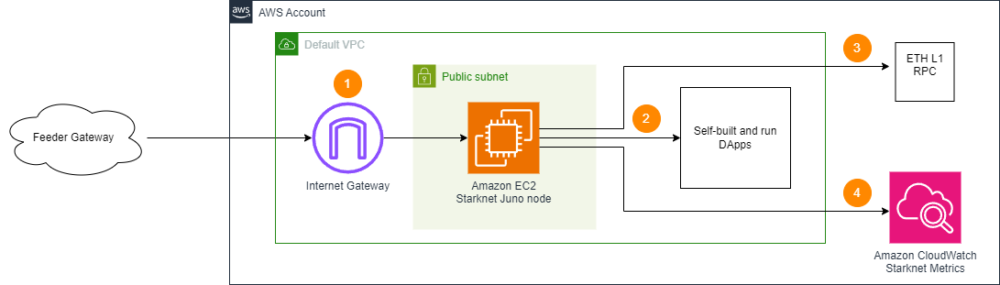

# Sample AWS Blockchain Node Runner app for Starknet Nodes

| Contributed by |
|:--------------------:|
| [@wojciechos](https://github.com/wojciechos) |

[Starknet](https://docs.starknet.io/documentation/) is a "Layer 2" scaling solution for Ethereum leveraging zero knowledge proofs. This blueprint helps to deploy Starknet nodes (Juno) on AWS as RPC nodes. It is meant to be used for development, testing or Proof of Concept purposes.

## Overview of Deployment Architectures for Single Node setups

### Single node setup



1.	A Starknet node deployed in the [Default VPC](https://docs.aws.amazon.com/vpc/latest/userguide/default-vpc.html) continuously synchronizes with the [Sequencer](https://docs.starknet.io/documentation/architecture_and_concepts/Network_Architecture/starknet_architecture_overview/) through [Internet Gateway](https://docs.aws.amazon.com/vpc/latest/userguide/VPC_Internet_Gateway.html).
2.	The Starknet node is used by dApps or development tools internally from within the Default VPC. JSON RPC API is not exposed to the Internet directly to protect nodes from unauthorized access.
3. You will need access to a fully-synced Ethereum RPC endpoint before running Juno.
4. The Starknet node sends various monitoring metrics for both EC2 and Starknet nodes to Amazon CloudWatch.

## Additional Materials

<details>

<summary>Well-Architected Checklist</summary>

This is the Well-Architected checklist for Stacks nodes implementation of the AWS Blockchain Node Runner app. This checklist takes into account questions from the [AWS Well-Architected Framework](https://aws.amazon.com/architecture/well-architected/) which are relevant to this workload. Please feel free to add more checks from the framework if required for your workload.

| Pillar                  | Control                           | Question/Check                                                                   | Remarks          |
|:------------------------|:----------------------------------|:---------------------------------------------------------------------------------|:-----------------|
| Security                | Network protection                | Are there unnecessary open ports in security groups?                             | There are no ports open to public. RPC port 6060 is open only IP addresses from the same VPC. |
|                         |                                   | Traffic inspection                                                               | AWS WAF could be implemented for traffic inspection. Additional charges will apply.  |
|                         | Compute protection                | Reduce attack surface                                                            | This solution uses Ubuntu Server 20.04 AMI. You may choose to run hardening scripts on it.  |
|                         |                                   | Enable people to perform actions at a distance                                   | This solution uses AWS Systems Manager for terminal session, not ssh ports.  |
|                         | Data protection at rest           | Use encrypted Amazon Elastic Block Store (Amazon EBS) volumes                    | This solution uses encrypted Amazon EBS volumes.  |
|                         |                                   | Use encrypted Amazon Simple Storage Service (Amazon S3) buckets                  | This solution uses Amazon S3 managed keys (SSE-S3) encryption.  |
|                         | Data protection in transit        | Use TLS                                                                          | TLS is not used in this solution. Port 6060 is the only open port, but you may create HTTPS listener with self signed certificate if TLS is desired.  |
|                         | Authorization and access control  | Use instance profile with Amazon Elastic Compute Cloud (Amazon EC2) instances    | This solution uses AWS Identity and Access Management (AWS IAM) role instead of IAM user.  |
|                         |                                   | Following principle of least privilege access                                    | In all node types, root user is not used (using special user "ubuntu" instead).  |
|                         | Application security              | Security focused development practices                                           | cdk-nag is being used with appropriate suppressions.  |
| Cost optimization       | Service selection                 | Use cost effective resources                                                     | 1. AMD-based instances are used for Consensus and RPC node to save the costs. Consider compiling Graviton-based binaries to improve costs for compute.<br/>2. Cost-effective EBS gp3 are preferred instead of io2. |
|                         | Cost awareness                    | Estimate costs                                                                   | Single RPC node with `m6a.2xlarge` EBS gp3 volume about 600 GB with On-Demand pricing will cost around US$323.29 per month in the US East (N. Virginia) region not including network requests for follower nodes. More analysis needed. |
| Reliability             | Resiliency implementation         | Withstand component failures                                                     | This solution ues only for a single-node deployment. If the running node failed, you will need to undeploy the existing stack and re-deploy the node again. |
|                         | Data backup                       | How is data backed up?                                                           | Considering blockchain data is replicated by nodes automatically and Starknet nodes sync from start within an hour and a half, we don't use any additional mechanisms to backup the data.  |
|                         | Resource monitoring               | How are workload resources monitored?                                            | Resources are being monitored using Amazon CloudWatch dashboards. Amazon CloudWatch custom metrics are being pushed via CloudWatch Agent.  |
| Performance efficiency  | Compute selection                 | How is compute solution selected?                                                | Compute solution is selected based on best price-performance, i.e. AWS AMD-based Amazon EC2 instances.  |
|                         | Storage selection                 | How is storage solution selected?                                                | Storage solution is selected based on best price-performance, i.e. gp3 Amazon EBS volumes with optimal IOPS and throughput.  |
|                         | Architecture selection            | How is the best performance architecture selected?                               | We used a combination of recommendations from the Starknet community.  |
| Operational excellence  | Workload health                   | How is health of workload determined?                                            | We rely on metrics reported to CloudWatch by `/opt/syncchecker.sh` script. |
| Sustainability          | Hardware & services               | Select most efficient hardware for your workload                                 | The solution uses AMD-powered instances. There is a potential to use AWS Graviton-based Amazon EC2 instances which offer the best performance per watt of energy use in Amazon EC2.  |
</details>

### Hardware Requirements

**Minimum for Starknet node**

- Instance type [m6a.large](https://aws.amazon.com/ec2/instance-types/m6a/).
- 250GB EBS gp3 storage with at least 3000 IOPS.

**Recommended for Starknet node**

- Instance type [m6a.2xlarge](https://aws.amazon.com/ec2/instance-types/m6a/).
- 600GB EBS gp3 storage with at least 3000 IOPS to store and upzip snapshots.

## Setup Instructions

### Setup Cloud9

We will use AWS Cloud9 to execute the subsequent commands. Follow the instructions in [Cloud9 Setup](../../docs/setup-cloud9.md)

### Clone this repository and install dependencies

```bash
   git clone https://github.com/aws-samples/aws-blockchain-node-runners.git
   cd aws-blockchain-node-runners
   npm install
```

### Deploy Single Node

1. Make sure you are in the root directory of the cloned repository

2. If you have deleted or don't have the default VPC, create default VPC

    ```bash
    aws ec2 create-default-vpc
    ```

   > NOTE:
   > You may see the following error if the default VPC already exists: `An error occurred (DefaultVpcAlreadyExists) when calling the CreateDefaultVpc operation: A Default VPC already exists for this account in this region.`. That means you can just continue with the following steps.

3. Configure your setup

    Create your own copy of `.env` file and edit it to update with your AWS Account ID and Region:
    ```bash
   # Make sure you are in aws-blockchain-node-runners/lib/starknet
   cd lib/starknet
   npm install
   pwd
   cp ./sample-configs/.env-sample-full .env
   nano .env
    ```
   > NOTE:
   > Example configuration parameters are set in the local `.env-sample` file. You can find more examples inside `sample-configs` directory.

4. Deploy common components such as IAM role

   ```bash
   pwd
   # Make sure you are in aws-blockchain-node-runners/lib/starknet
   npx cdk deploy starknet-common
   ```

   > IMPORTANT:
   > All AWS CDK v2 deployments use dedicated AWS resources to hold data during deployment. Therefore, your AWS account and Region must be [bootstrapped](https://docs.aws.amazon.com/cdk/v2/guide/bootstrapping.html) to create these resources before you can deploy. If you haven't already bootstrapped, issue the following command:
   > ```bash
   > cdk bootstrap aws://ACCOUNT-NUMBER/REGION
   > ```

5. [OPTIONAL] You can use Amazon Managed Blockchain (AMB) Access Ethereum node as L1 node. To do that, leave `STARKNET_L1_ENDPOINT` URL empty and, deploy Amazon Managed Blockchain (AMB) Access Ethereum node. Wait about 35-70 minutes for the node to sync.

   ```bash
   pwd
   # Make sure you are in aws-blockchain-node-runners/lib/starknet
   npx cdk deploy starknet-ethereum-l1-node --json --outputs-file starknet-ethereum-l1-node.json
   ```
   To watch the progress, open the [AMB Web UI](https://console.aws.amazon.com/managedblockchain/home), click the name of your target network from the list (Mainnet, Goerly, etc.) and watch the status of the node to change from `Creating` to `Available`.

6. Deploy Starknet Full Node

   ```bash
   pwd
   # Make sure you are in aws-blockchain-node-runners/lib/starknet
   npx cdk deploy starknet-single-node --json --outputs-file single-node-deploy.json
   ```
   After starting the node you will need to wait for the initial synchronization process to finish. When using snapshot, the node should become available within a couple of hours, but migh take about 3-4 days to sync it from block 0. To check the progress, you may use SSM to connect into EC2 first and watch the log like this:

   ```bash
   export INSTANCE_ID=$(cat single-node-deploy.json | jq -r '..|.nodeinstanceid? | select(. != null)')
   echo "INSTANCE_ID="$INSTANCE_ID
   export AWS_REGION=us-east-1
   aws ssm start-session --target $INSTANCE_ID --region $AWS_REGION
   tail -f /var/log/starknet/error.log
   ```
   

7. Test Starknet RPC API
   Use curl to query from within the node instance:
   ```bash
   export INSTANCE_ID=$(cat single-node-deploy.json | jq -r '..|.node-instance-id? | select(. != null)')
   echo "INSTANCE_ID=" $INSTANCE_ID
   export AWS_REGION=us-east-1
   aws ssm start-session --target $INSTANCE_ID --region $AWS_REGION

   curl --location 'http://localhost:6060' \
   --header 'Content-Type: application/json' \
   --data '{
      "jsonrpc":"2.0",
      "method":"starknet_chainId",
      "params":[],
      "id":1
   }'
   ```

### Monitoring
A script on the Starknet node publishes current block and blocks behind metrics to CloudWatch metrics every 5 minutes. When the node is fully synced the blocks behind metric should get to 0.To see the metrics:

- Navigate to CloudWatch service (make sure you are in the region you have specified for AWS_REGION)
- Open Dashboards and select `starknet-single-node-<network_id>` from the list of dashboards.

## Clear up and undeploy everything

1. Undeploy all Nodes and Common stacks

   ```bash
   # Setting the AWS account id and region in case local .env file is lost
   export AWS_ACCOUNT_ID=<your_target_AWS_account_id>
   export AWS_REGION=<your_target_AWS_region>

   pwd
   # Make sure you are in aws-blockchain-node-runners/lib/starknet

   # Undeploy Single Node
   npx cdk destroy starknet-single-node

   # Undeploy AMB Etheruem node
   npx cdk destroy starknet-ethereum-l1-node

   # Delete all common components like IAM role and Security Group
   npx cdk destroy starknet-common
   ```

2. Follow steps to delete the Cloud9 instance in [Cloud9 Setup](../../doc/setup-cloud9.md)

## FAQ

1. How to check the logs of the clients running on my Starknet node?

   **Note:** In this tutorial we chose not to use SSH and use Session Manager instead. That allows you to log all sessions in AWS CloudTrail to see who logged into the server and when. If you receive an error similar to `SessionManagerPlugin is not found`, [install Session Manager plugin for AWS CLI](https://docs.aws.amazon.com/systems-manager/latest/userguide/session-manager-working-with-install-plugin.html)

   ```bash
   pwd
   # Make sure you are in aws-blockchain-node-runners/lib/starknet

   export INSTANCE_ID=$(cat single-node-deploy.json | jq -r '..|.nodeinstanceid? | select(. != null)')
   echo "INSTANCE_ID="$INSTANCE_ID
   export AWS_REGION=us-east-1
   aws ssm start-session --target $INSTANCE_ID --region $AWS_REGION
   tail -f /var/log/starknet/error.log
   ```
2. How to check the logs from the EC2 user-data script?

   ```bash
   pwd
   # Make sure you are in aws-blockchain-node-runners/lib/starknet

   export INSTANCE_ID=$(cat single-node-deploy.json | jq -r '..|.nodeinstanceid? | select(. != null)')
   echo "INSTANCE_ID=" $INSTANCE_ID
   export AWS_REGION=us-east-1
   aws ssm start-session --target $INSTANCE_ID --region $AWS_REGION
   sudo cat /var/log/cloud-init-output.log
   ```

3. How can I restart the Starknet service?

   ``` bash
   export INSTANCE_ID=$(cat single-node-deploy.json | jq -r '..|.nodeinstanceid? | select(. != null)')
   echo "INSTANCE_ID=" $INSTANCE_ID
   export AWS_REGION=us-east-1
   aws ssm start-session --target $INSTANCE_ID --region $AWS_REGION
   sudo systemctl status starknet.service
   sudo systemctl restart starknet.service
   ```
4. Where to find the key juno directories?

   - The directory with binaries is `/home/ubuntu/juno-source`.
   - The data directory of juno agent is `/data`
