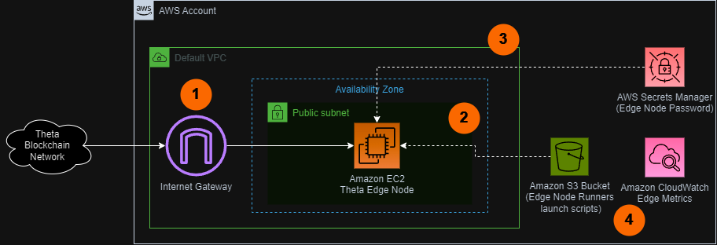

# Sample AWS Blockchain Node Runner app for Theta Edge Nodes

| Contributed by |
|:--------------------:|
| [@jonathan-eid](https://github.com/jonathan-eid), [@onching](https://github.com/onching) |

The Edge Node turns your computer into an edge computing node in the Theta EdgeCloud. The Edge Node can execute various types of jobs including AI/deep learning model training and inference, as well as video transcoding and relaying. By running the edge node, you can contribute unused computational and bandwidth resources and earn token rewards.

This blueprint is designed to assist in deploying a single node  [Theta Edge Network Edge Node](https://docs.thetatoken.org/docs/setup-theta-edge-node) on AWS. It is intended for research and develoment use purposes.

## Overview of Deployment Architectures

### Single Node setup


1. A single RPC Theta Edge Node is deployed within in the [Default VPC](https://docs.aws.amazon.com/vpc/latest/userguide/default-vpc.html) and continuously synchronizes with the rest of nodes on Theta Blockchain Network through [Internet Gateway](https://docs.aws.amazon.com/vpc/latest/userguide/VPC_Internet_Gateway.html). The Theta node is accessed by the user internally. JSON RPC API is not exposed to the Internet to protect the node from unauthorized access. User can get console acess to EC2 Instance using Session Manager to interact with the RPC API from CLI.
2. The AWS Cloud Development Kit (CDK) is used to deploy a single node. The CDK application stores assets like scripts and config files in S3 bucket to copy them to the EC2 instance when launching an Edge Node.
3. The Theta node pulls password from Secrets Manager during startup only.
4. The Theta node sends various monitoring metrics for both the EC2 Instance and Edge Node to Amazon CloudWatch.


## Additional materials

<details>

<summary>Well-Architected Checklist</summary>

This is the Well-Architected checklist for Edge nodes implementation of the AWS Blockchain Node Runner app. This checklist takes into account questions from the [AWS Well-Architected Framework](https://aws.amazon.com/architecture/well-architected/) which are relevant to this workload. Please feel free to add more checks from the framework if required for your workload.

| Pillar                  | Control                           | Question/Check                                                                   | Remarks |
|:------------------------|:----------------------------------|:---------------------------------------------------------------------------------|:----------------------------------------------------------------------------------------------------------------------------------------------------------------------------------------------------------------------------------------------------------------------------------------------------------------------------------------------------------------------------------------------|
|                         |                                   | Traffic inspection                                                               | Traffic protection is not used in the solution. [AWS Web Applications Firewall (WAF)](https://docs.aws.amazon.com/waf/latest/developerguide/waf-chapter.html) could be implemented for traffic over HTTP(S), [AWS Shield](https://docs.aws.amazon.com/waf/latest/developerguide/shield-chapter.html) provides Distributed Denial of Service (DDoS) protection. Additional charges will apply. |
|                         | Compute protection                | Reduce attack surface                                                            | This solution uses Amazon Linux2 AMI(`Amazon Linux2 AMI(HVM)-Kernel 5.10`). You may choose to run hardening scripts on it. |
|                         |                                   | Enable people to perform actions at a distance                                   | This solution uses [AWS Systems Manager for terminal session](https://docs.aws.amazon.com/systems-manager/latest/userguide/session-manager-working-with-sessions-start.html#start-sys-console), not ssh ports. |
|                         | Data protection at rest           | Use encrypted Amazon Elastic Block Store (Amazon EBS) volumes                    | This solution uses encrypted Amazon EBS volumes. |
|                         | Authorization and access control  | Use instance profile with Amazon Elastic Compute Cloud (Amazon EC2) instances    | This solution uses AWS Identity and Access Management (AWS IAM) role instead of IAM user. |
|                         |                                   | Following principle of least privilege access                                    | In all node types, root user is not used (using special user "bcuser" instead). |
|                         | Application security              | Security focused development practices                                           | cdk-nag is being used with appropriate suppressions. |
| Cost optimization       | Service selection                 | Use cost effective resources                                                     | Although we can run the Edge Node without a GPU, we choose to use a `g4dn.xlarge` w/ a T4 GPU & 256gb GP3 EBS Storage to take advantage of the jobs the Theta Edge Network has to offer|
|                         | Cost awareness                    | Estimate costs                                                                   | Single RPC node with `g4dn.xlarge` EBS gp3 volumes about 256 GB(10000 IOPS, 125 MBps/s throughput) with On-Demand pricing will cost around US$296.81 per month in the US East (N. Virginia) region. More cost-optimal option with 3 year EC2 Instance Savings plan the cost goes down to $159.80 USD. To create your own estimate use [AWS Pricing Calculator](https://calculator.aws/#/)                                                                                          |
| Reliability             | Resiliency implementation         | Withstand component failures                                                     | Docker service and Edge Node container is set to always restart in the case of an EC2 outage. There is no restart mechanism on the single node instance as of now.  |
|                         | Data backup                       | How is data backed up?                                                           | Considering blockchain data is replicated by nodes automatically and Theta nodes sync on run, we don't use any additional mechanisms to backup the data. |
|                         | Resource monitoring               | How are workload resources monitored?                                            | Resources are being monitored using Amazon CloudWatch dashboards. Amazon CloudWatch custom metrics are being pushed via CloudWatch Agent.  |
| Performance efficiency  | Compute selection                 | How is compute solution selected?                                                | Compute solution is selected based on best price-performance, i.e. AWS lower end GPU Amazon EC2 instances. |
|                         | Storage selection                 | How is storage solution selected?                                                | Storage solution is selected based on best price-performance, i.e. gp3 Amazon EBS volumes with optimal IOPS and throughput. |
|                         | Architecture selection            | How is the best performance architecture selected?                               | We used a combination of recommendations from the Theta community. |
| Operational excellence  | Workload health                   | How is health of workload determined?                                            | Health of the workload is based on EC2 status checks. |
| Sustainability          | Hardware & services               | Select most efficient hardware for your workload                                 | The solution uses T4-powered instances. This is a lower end, data-center GPU that will be sufficient for getting the average user up and running on the Theta Edge Network. |
</details>

<details>

<summary>Recommended Infrastructure</summary>


| Usage pattern                                     | Ideal configuration                                                                                                      | Primary option on AWS                                                  | Config reference                                      |
|---------------------------------------------------|--------------------------------------------------------------------------------------------------------------------------|------------------------------------------------------------------------|-------------------------------------------------------|
| Edge Node                                       | 4 vCPU, 16 GB RAM, Data volume: EBS gp3 256GB, 3K IOPS, 125 MB/s throughput | `g4dn.2xlarge` EBS gp3 volumes about 256 GB(10000 IOPS, 125 MBps/s throughput) | [.env-sample-full](./sample-configs/.env-sample-full) |
</details>

## Setup Instructions

### Setup Cloud9

We will use AWS Cloud9 to execute the subsequent commands. Follow the instructions in [Cloud9 Setup](../../docs/setup-cloud9.md)

### Clone this repository and install dependencies

```bash
git clone https://github.com/aws-samples/aws-blockchain-node-runners.git
cd aws-blockchain-node-runners
npm install
```

### Deploy Commons

1. Make sure you are in the root directory of the cloned repository

2. If you have deleted or don't have the default VPC, create default VPC

    ```bash
    aws ec2 create-default-vpc
    ```

   > **NOTE**:
   > You may see the following error if the default VPC already exists: `An error occurred (DefaultVpcAlreadyExists) when calling the CreateDefaultVpc operation: A Default VPC already exists for this account in this region.`. That means you can just continue with the following steps.


3. Configure the CDK app

   Create your own copy of `.env` file and edit it to update with your AWS Account ID, AWS Region:

   ```bash
   # Make sure you are in aws-blockchain-node-runners/lib/theta
   cd lib/theta
   pwd
   cp ./sample-configs/.env-sample-full .env
   nano .env
   ```


4. Deploy common components such as IAM role
   <br>

   > **IMPORTANT**:
   > All AWS CDK v2 deployments use dedicated AWS resources to hold data during deployment. Therefore, your AWS account and Region must be [bootstrapped](https://docs.aws.amazon.com/cdk/v2/guide/bootstrapping.html) to create these resources before you can deploy. If you haven't already bootstrapped, issue the following command:
   > ```bash
   > npx cdk bootstrap aws://ACCOUNT-NUMBER/REGION
   >```

   ```bash
   pwd
   # Make sure you are in aws-blockchain-node-runners/lib/theta

   # Set a password for your theta edge node wallet client
   EDGE_NODE_PASSWORD=letscompute # please change 'letscompute' to something more secure
   npx cdk deploy theta-edge-common --parameters edgeNodePassword=$EDGE_NODE_PASSWORD
   ```


### Single RPC Edge Node

1. Deploy the stack
   ```bash
      pwd
      # Make sure you are in aws-blockchain-node-runners/lib/theta
      npx cdk deploy theta-edge-single-node --json --outputs-file single-node-deploy.json
   ```

2. After the node is initialised you need to wait another 10 minutes for the inital edge node startup process to complete. You can use Amazon CloudWatch to track the progress. There is a script that publishes CloudWatch metrics every minute, where you can watch `theta_current_block_height`. When the node is fully launched you should see the `Theta Client Block Height` & `Theta Client Peer Count` dashboards populate. To see them:

    - Navigate to [CloudWatch service](https://console.aws.amazon.com/cloudwatch/) (make sure you are in the region you have specified for `AWS_REGION`)
    - Open `Dashboards` and select `edge-single-node-<node_configuration>-<your_edge_network>-<ec2_instance_id>` from the list of dashboards.

Alternatively, you can manually check. Run the following query from within a Session Manager Session inside the instance:

   ```bash
      curl -X POST -H 'Content-Type: application/json' \
      --data '{"jsonrpc":"2.0","method":"edgecore.GetStatus","params":[],"id":1}' http://localhost:17888/rpc
   ```

   You should get a response similar to:

   ```javascript
   {
      "jsonrpc": "2.0",
      "id": 1,
      "result": {
         "address": "0x095f9CF353a4e2B8CD1f876cd8990d42bEcf6455",
         "chain_id": "mainnet",
         "peer_id": "0x095f9CF353a4e2B8CD1f876cd8990d42bEcf6455",
         "current_height": "25223860",
         "current_time": "1715637778"
      }
   }
   ```


3. Once the startup is done, you should be able to access the RPC API of that node from within the same VPC. The RPC port is not exposed to the Internet.


### Clearing up and undeploy everything

1. Destroy Single Nodes and Common stacks

```bash
export AWS_ACCOUNT_ID=<your_target_AWS_account_id>
export AWS_REGION=<your_target_AWS_region>

pwd
# Make sure you are in aws-blockchain-node-runners/lib/theta

# Destroy Single Node
npx cdk destroy theta-edge-single-node


 # Delete all common components like IAM role and Security Group
npx cdk destroy theta-edge-common
```
2. Follow steps to delete the Cloud9 instance in [Cloud9 Setup](../../doc/setup-cloud9.md)


### FAQ

1. How to check the logs of the clients running on my edge node?

Please enter the [AWS Management Console - EC2 Instances](https://us-east-2.console.aws.amazon.com/ec2/home?region=us-east-2#Instances:instanceState=running), choose the correct region, copy the instance ID you need to query.

   **Note:** In this tutorial we chose not to use SSH and use Session Manager instead. That allows you to log all sessions in AWS CloudTrail to see who logged into the server and when. If you receive an error similar to `SessionManagerPlugin is not found`, [install Session Manager plugin for AWS CLI](https://docs.aws.amazon.com/systems-manager/latest/userguide/session-manager-working-with-install-plugin.html)

```bash
pwd
# Make sure you are in aws-blockchain-node-runners/lib/theta

export INSTANCE_ID="i-**************"
echo "INSTANCE_ID=" $INSTANCE_ID
aws ssm start-session --target $INSTANCE_ID --region $AWS_REGION
sudo docker logs $(sudo docker ps -q)

```
2. How to check the logs from the EC2 user-data script?

Please enter the [AWS Management Console - EC2 Instances](https://us-east-2.console.aws.amazon.com/ec2/home?region=us-east-2#Instances:instanceState=running), choose the correct region, copy the instance ID you need to query.

```bash
pwd
# Make sure you are in aws-blockchain-node-runners/lib/theta

export INSTANCE_ID="i-**************"
echo "INSTANCE_ID=" $INSTANCE_ID
aws ssm start-session --target $INSTANCE_ID --region $AWS_REGION
sudo cat /var/log/cloud-init-output.log
```


3. How can I restart the Edge Node?

Please enter the [AWS Management Console - EC2 Instances](https://us-east-2.console.aws.amazon.com/ec2/home?region=us-east-2#Instances:instanceState=running), choose the correct region, copy the instance ID you need to query.

```bash
pwd
# Make sure you are in aws-blockchain-node-runners/lib/theta

export INSTANCE_ID="i-**************"
echo "INSTANCE_ID=" $INSTANCE_ID

aws ssm start-session --target $INSTANCE_ID --region $AWS_REGION
sudo docker restart $(sudo docker ps -q)
```


5. Where can I find more infromation about EDGE RPC API?

Please refer to more [JSON-RPC API METHODS](https://docs.thetatoken.org/docs/edge-node-api). The following are some commonly used API methods:

```bash
# Query Status
curl -X POST -H 'Content-Type: application/json' --data '{"jsonrpc":"2.0","method":"edgecore.GetStatus","params":[],"id":1}' http://localhost:17888/rpc

# Query Peers
curl -X POST -H 'Content-Type: application/json' --data '{"jsonrpc":"2.0","method":"edgecore.GetPeers","params":[],"id":1}' http://localhost:17888/rpc

# Query Past Jobs
curl -X POST -H 'Content-Type: application/json' http://localhost:15888/rpc -d '{"jsonrpc": "2.0", "method": "edgelauncher.GetPastJobs", "params": [{"type": "lavita", "page": 0, "num": 10}], "id": 1}'

```


## Upgrades

When nodes need to be upgraded or downgraded, CDK does not automatically attach old volumes to new EC2 instances. This is not yet automated and contributions are welcome!
