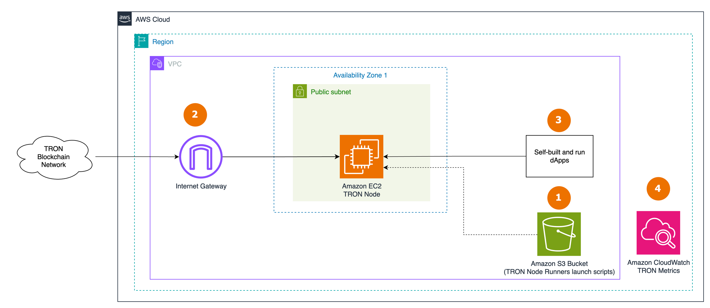
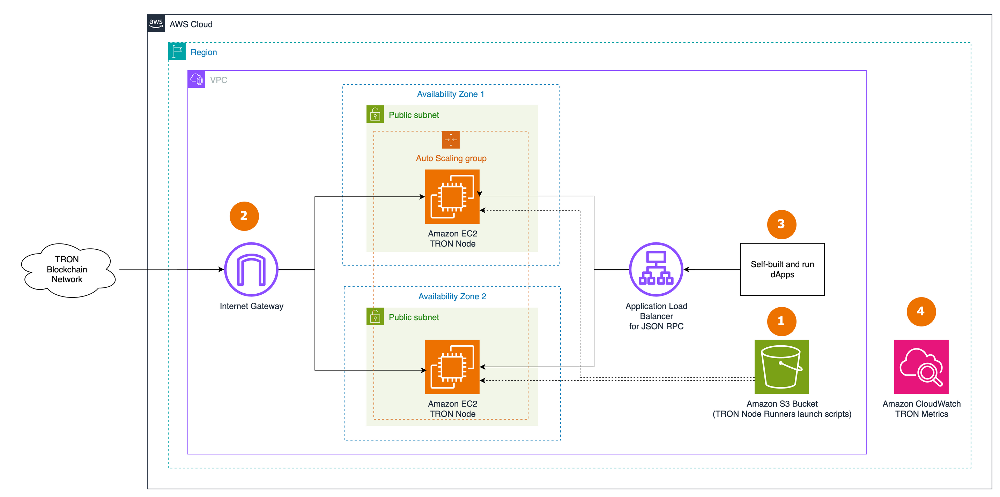

# Sample AWS Blockchain Node Runner app for TRON Nodes

| Contributed by |
|:--------------:|
| [@snese](https://github.com/snese) |

[TRON](https://tron.network/) is a high-throughput, EVM-compatible (via the TRON Virtual Machine, TVM) Layer-1 blockchain using Delegated Proof of Stake (DPoS). Nodes run the [java-tron](https://github.com/tronprotocol/java-tron) client.

This blueprint deploys a single node or a Highly Available (HA) set of TRON RPC nodes on AWS. It is intended for development, testing, or Proof of Concept purposes.

## Overview of Deployment Architectures

### Single Node setup



1. The AWS CDK deploys a single node, storing scripts and config in an S3 bucket copied to the EC2 instance at launch.
2. A single TRON RPC FullNode (or Lite FullNode) is deployed in the [Default VPC](https://docs.aws.amazon.com/vpc/latest/userguide/default-vpc.html) and synchronizes with the TRON network through an [Internet Gateway](https://docs.aws.amazon.com/vpc/latest/userguide/VPC_Internet_Gateway.html). The P2P port (18888) is open to the Internet for peer discovery.
3. The node is accessed by dApps or development tools internally over HTTP (8090) and gRPC (50051). The RPC APIs are **not** exposed to the Internet.
4. The node sends EC2 and TRON client metrics to Amazon CloudWatch.

### Highly Available setup



1. The CDK deploys nodes in an [Auto Scaling Group](https://docs.aws.amazon.com/autoscaling/ec2/userguide/auto-scaling-groups.html) behind an internal [Application Load Balancer](https://docs.aws.amazon.com/elasticloadbalancing/latest/application/introduction.html).
2. The ALB health check targets `GET /wallet/getnowblock` on port 8090 (java-tron returns HTTP 200 on this endpoint; `/` returns 404).
3. RPC APIs are reachable only from within the VPC through the ALB.
4. Nodes publish EC2 and TRON metrics to CloudWatch.

## Node Types

| Type | `TRON_NODE_CONFIGURATION` | Data size (mainnet) | Use case |
|------|---------------------------|---------------------|----------|
| Lite FullNode | `lite` | ~53 GB snapshot (state + latest 65536 blocks) | Follow chain, send/broadcast tx, query post-startup data. Fast start, low cost. |
| FullNode | `full` | ~2.9–3 TB snapshot (complete history) | Full historical queries, dApp/exchange backend. |

The same `FullNode.jar` runs both; the difference is the snapshot the node starts from. Lite nodes set `openHistoryQueryWhenLiteFN = true` so history APIs work for blocks synced after startup.

## Snapshot Acceleration

Syncing from genesis is slow, so the blueprint bootstraps the database from a snapshot. Set `TRON_SNAPSHOT_TYPE`:

| `TRON_SNAPSHOT_TYPE` | Source | Notes |
|----------------------|--------|-------|
| `none` | Sync from genesis | Slowest. |
| `public` | TRON's official snapshot host | Lite uses `aria2c` multi-connection download; Full streams `wget \| tar` (4 TB volume) or uses `aria2c` when the volume has room. Decompresses with `pigz`. |
| `s3` | Your own private S3 staging bucket (`s5cmd` + `zstd`) | Fastest and most repeatable. Requires deploying the snapshot node first to populate the bucket (`tron-snapshots-<account>-<region>`, created by `tron-common`). |

For a FullNode used repeatedly, `s3` is recommended: the snapshot node pays the slow public download once and re-stages the data as multithreaded `zstd`, so every other node restores in-region at transfer-bound speed. This mirrors the ethereum/tezos S3 sync-node and BSC/base zstd patterns in this repo.

### [OPTIONAL] Deploy the snapshot node (only for `TRON_SNAPSHOT_TYPE=s3`)

The snapshot node syncs from the public source and uploads its database to the private S3 bucket daily (cron), so RPC/single nodes can restore quickly.

```bash
npx cdk deploy tron-snapshot-node --json --outputs-file snapshot-node-deploy.json
```

Once it has synced and uploaded at least once (check `/tmp/upload-snapshot.log` on the instance), deploy your RPC/single/HA nodes with `TRON_SNAPSHOT_TYPE=s3`. To remove it: `cdk destroy tron-snapshot-node`, then empty and delete the S3 bucket.

## java-tron on AWS Graviton (ARM64)

This blueprint defaults to AWS Graviton (ARM64) for price-performance. java-tron on ARM64 has specific requirements that the blueprint handles automatically:

- **JDK**: ARM64 uses Amazon Corretto 17 (x86_64 uses Corretto 8). java-tron is not validated on newer JDKs.
- **Garbage collector**: TRON's documented `-XX:+UseConcMarkSweepGC` (CMS) was removed in JDK 14+. On ARM64/JDK17 the blueprint uses G1GC; on x86_64/JDK8 it uses CMS.
- **Client jar**: the generic `FullNode.jar` bundles an x86_64-only RocksDB native library and fails on ARM64 with `UnsatisfiedLinkError`. The blueprint downloads `FullNode-aarch64.jar` on ARM64 and `FullNode.jar` on x86_64.
- **Storage engine**: ARM64 supports RocksDB only (`db.engine = ROCKSDB`); the snapshot source must match (the blueprint uses the official RocksDB snapshot).

## Well-Architected Checklist

Well-Architected checklist for the TRON node implementation, based on the [AWS Well-Architected Framework](https://aws.amazon.com/architecture/well-architected/).

| Pillar | Control | Question/Check | Remarks |
|:-------|:--------|:---------------|:--------|
| Security | Network protection | Are there unnecessary open ports in security groups? | Only TRON P2P port 18888 (TCP/UDP) is open to the public, as required by the P2P protocol. RPC ports 8090 (HTTP) and 50051 (gRPC) are restricted to the VPC CIDR. |
| | Traffic inspection | Traffic protection | WAF/Shield are not used. Consider [AWS WAF](https://docs.aws.amazon.com/waf/latest/developerguide/waf-chapter.html) and [AWS Shield](https://docs.aws.amazon.com/waf/latest/developerguide/shield-chapter.html) if exposing RPC publicly (additional cost). |
| | Compute protection | Reduce attack surface | Uses the Amazon Linux 2 AMI; apply hardening as needed. |
| | | Actions at a distance | Uses [AWS Systems Manager Session Manager](https://docs.aws.amazon.com/systems-manager/latest/userguide/session-manager.html), not SSH ports. |
| | Data protection at rest | Encrypted EBS volumes | All EBS volumes are encrypted. |
| | Data protection in transit | Use TLS | The ALB uses an HTTP listener. Add an HTTPS listener with a certificate if TLS is required. |
| | Authorization & access control | Use instance profile | Uses an IAM role (not IAM user) via instance profile. |
| | | Least privilege | Runs the node as a non-root user (`bcuser`). |
| | Application security | Secure development | cdk-nag with documented suppressions. Snapshot and client-jar downloads use the official TRON snapshot host and tronprotocol GitHub releases; the snapshot host is plain HTTP (override via `TRON_SNAPSHOTS_URI`) and integrity caveats are noted inline in the scripts. |
| Cost optimization | Service selection | Cost effective resources | Graviton instances with the `aarch64` client jar; Lite uses `m7g.2xlarge`, Full uses `m7g.4xlarge`; gp3 EBS. |
| | Cost awareness | Estimate costs | Lite and Full differ significantly. Use the [AWS Pricing Calculator](https://calculator.aws/#/). |
| Reliability | Resiliency | Withstand component failures | The HA setup uses an ALB with an Auto Scaling Group across AZs. |
| | Data backup | How is data backed up? | TRON data is replicated by the network; nodes restore from snapshots, so no extra backup is used. |
| | Resource monitoring | How are resources monitored? | CloudWatch dashboards and custom metrics (block height, blocks behind) via the CloudWatch Agent. |
| Performance efficiency | Compute selection | How is compute selected? | AWS Graviton (ARM64) with the matching `aarch64` jar and Corretto 17. |
| | Storage selection | How is storage selected? | gp3 EBS with tuned IOPS/throughput; 4 TB for FullNode, 600 GB for Lite. |
| | Architecture selection | Best performance architecture | Based on TRON's recommended configuration plus testing on AWS. |
| Operational excellence | Workload health | How is health determined? | ALB Target Group health checks on `GET /wallet/getnowblock` (port 8090); CloudWatch sync metrics. |
| Sustainability | Hardware & services | Efficient hardware | AWS Graviton offers strong performance per watt in Amazon EC2. |

## Recommended Infrastructure

| Usage pattern | Ideal configuration | Primary AWS option | Config reference |
|---------------|---------------------|--------------------|------------------|
| Lite FullNode | 8 vCPU, 32 GB RAM, 600 GB gp3 | `m7g.2xlarge` | [.env-sample-lite](./sample-configs/.env-sample-lite) |
| FullNode | 16 vCPU, 64 GB RAM, 4 TB gp3 (10K IOPS, 700 MB/s) | `m7g.4xlarge` | [.env-sample-full](./sample-configs/.env-sample-full) |

## Setup Instructions

### Open AWS CloudShell

Log in to your AWS account with permissions to create/modify IAM, EC2, EBS, VPC, S3, and KMS resources, then open [AWS CloudShell](https://docs.aws.amazon.com/cloudshell/latest/userguide/welcome.html).

### Clone this repository and install dependencies

```bash
git clone https://github.com/aws-samples/aws-blockchain-node-runners.git
cd aws-blockchain-node-runners
npm install
```

### Configure the CDK app

```bash
cd lib/tron
# For a Lite FullNode:
cp ./sample-configs/.env-sample-lite .env
# For a FullNode:
# cp ./sample-configs/.env-sample-full .env
nano .env   # set AWS_ACCOUNT_ID, AWS_REGION, and optionally TRON_SNAPSHOTS_URL
```

> If you have deleted the default VPC, create one with `aws ec2 create-default-vpc`.
> If your account/region is not bootstrapped: `cdk bootstrap aws://ACCOUNT-NUMBER/REGION`.

### Deploy common components (IAM role + snapshot bucket)

```bash
npx cdk deploy tron-common
```

### Option 1: Single RPC Node

```bash
npx cdk deploy tron-single-node --json --outputs-file single-node-deploy.json
```

A Lite node initializes in roughly 20–30 minutes (53 GB snapshot); a FullNode downloads ~3 TB and takes several hours. Track progress in the CloudWatch dashboard `tron-single-node-<type>-<network>-<instance-id>`, or query the node from within the VPC:

```bash
INSTANCE_ID=$(cat single-node-deploy.json | jq -r '..|.singleinstanceid? | select(. != null)')
NODE_INTERNAL_IP=$(aws ec2 describe-instances --instance-ids $INSTANCE_ID --query 'Reservations[*].Instances[*].PrivateIpAddress' --output text)
curl -s -X POST http://$NODE_INTERNAL_IP:8090/wallet/getnowblock
```

The response includes `block_header.raw_data.number` (current block height). Compare it to [Tronscan](https://tronscan.org/) to confirm the node is syncing.

### Option 2: Highly Available RPC Nodes

```bash
npx cdk deploy tron-ha-nodes --json --outputs-file ha-nodes-deploy.json

RPC_ALB_URL=$(cat ha-nodes-deploy.json | jq -r '..|.alburl? | select(. != null)')
curl -s -X POST http://$RPC_ALB_URL:8090/wallet/getnowblock
```

> The ALB is internal (not Internet-facing). Protect your RPC APIs before any public exposure.

### Clearing up

```bash
export AWS_ACCOUNT_ID=<your_account_id>
export AWS_REGION=<your_region>
cd lib/tron
cdk destroy tron-single-node
cdk destroy tron-ha-nodes
cdk destroy tron-common
```

## FAQ

1. Check the node logs: `aws ssm start-session --target <instance-id> --region $AWS_REGION` then `sudo tail -f /home/bcuser/tron/logs/tron.log`
2. Check the user-data logs: `sudo cat /var/log/cloud-init-output.log`
3. Restart the service: `sudo systemctl restart tron && sudo systemctl status tron`
4. TRON RPC API reference: [HTTP API](https://developers.tron.network/reference/full-node-api-overview) and [gRPC](https://developers.tron.network/docs/trons-grpc-calls).

## Upgrades

When the client needs upgrading, use a blue/green pattern. This is not yet automated and contributions are welcome.
