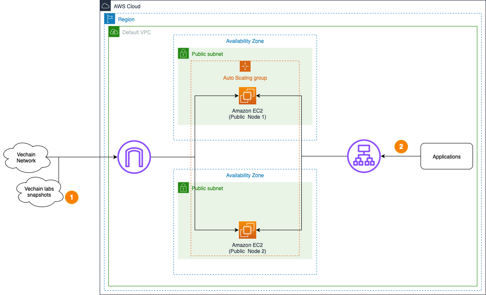

# AWS Blockchain Node Runner for Vechain Nodes

|               Contributed by               |
| :----------------------------------------: |
| [David-O-M)](https://github.com/David-O-M) |

vechain node deployment on AWS. Supports both Authority and Public node types with single node and
high availability (HA) setups.

## Overview of Deployment Architectures for Single and HA setups

### Single node setup


1. A vechain node deployed in the
   [Default VPC](https://docs.aws.amazon.com/vpc/latest/userguide/default-vpc.html) continuously
   synchronizes with the rest of nodes on the configured vechain network through
   [Internet Gateway](https://docs.aws.amazon.com/vpc/latest/userguide/VPC_Internet_Gateway.html).
2. The vechain node is used by dApps or development tools internally from within the Default VPC.
   RPC API is not exposed to the Internet directly to protect nodes from unauthorized access.
3. The vechain node sends various monitoring metrics for both EC2 and node health to Amazon
   CloudWatch. It also supports public snapshot synchronization for faster node startup when `SYNC_FROM_PUBLIC_SNAPSHOT=true` is set in the `.env` file (see sample-config files for examples).

### HA setup

> **⚠️ IMPORTANT:** HA setup is **NOT supported** for Authority node type. If you attempt to deploy HA with Authority nodes, the deployment will fail. Only Public node type supports HA deployment.



1. A set of vechain nodes are deployed within an
   [Auto Scaling Group](https://docs.aws.amazon.com/autoscaling/ec2/userguide/auto-scaling-groups.html)
   in the [Default VPC](https://docs.aws.amazon.com/vpc/latest/userguide/default-vpc.html)
   continuously synchronizing with the rest of nodes on the configured vechain network through
   [Internet Gateway](https://docs.aws.amazon.com/vpc/latest/userguide/VPC_Internet_Gateway.html).
2. The vechain nodes are accessed by dApps or development tools internally through
   [Application Load Balancer](https://docs.aws.amazon.com/elasticloadbalancing/latest/application/introduction.html).
   RPC API is not exposed to the Internet to protect nodes from unauthorized access.
3. The vechain nodes send various monitoring metrics for EC2 to Amazon CloudWatch and support
   automatic health checks and failover. They also support public snapshot synchronization for faster startup when `SYNC_FROM_PUBLIC_SNAPSHOT=true` is set in the `.env` file (see sample-config files for examples).

## Features

-   **Node Types**: Support for both Authority and Public node types
-   **Networks**: Mainnet and Testnet support
-   **Snapshot Sync**: Optional public snapshot synchronization for faster startup (controlled by `SYNC_FROM_PUBLIC_SNAPSHOT` flag in `.env`, see sample-config files for examples)
-   **Storage Options**: EBS volumes (GP3, IO2, IO1) and instance store support
-   **Health Monitoring**: Built-in health checks and CloudWatch metrics
-   **Auto Scaling**: High availability with load balancer and auto scaling groups
-   **Security**: IAM roles, security groups

## Well-Architected

<details>
<summary>Review pros and cons of this solution.</summary>

### Well-Architected Checklist

This is the Well-Architected checklist for vechain nodes implementation of the AWS Blockchain Node
Runner app. This checklist takes into account questions from the
[AWS Well-Architected Framework](https://aws.amazon.com/architecture/well-architected/) which are
relevant to this workload.

| Pillar                 | Control                          | Question/Check                                                                | Remarks                                                                                                                                                                       |
| :--------------------- | :------------------------------- | :---------------------------------------------------------------------------- | :---------------------------------------------------------------------------------------------------------------------------------------------------------------------------- |
| Security               | Network protection               | Are there unnecessary open ports in security groups?                          | RPC port 80 is open for internal access only. P2P ports are configured for network synchronization.                                                                           |
|                        |                                  | Traffic inspection                                                            | AWS WAF could be implemented for traffic inspection. Additional charges will apply.                                                                                           |
|                        | Compute protection               | Reduce attack surface                                                         | This solution uses Amazon Linux 2 AMI. You may choose to run hardening scripts on it.                                                                                         |
|                        |                                  | Connection to the instance ?                                                  | This solution uses AWS Systems Manager for terminal session, not ssh ports.                                                                                                   |
|                        | Data protection at rest          | Use encrypted Amazon Elastic Block Store (Amazon EBS) volumes                 | This solution uses encrypted Amazon EBS volumes.                                                                                                                              |
|                        |                                  | Use encrypted Amazon Simple Storage Service (Amazon S3) buckets               | This solution uses Amazon S3 managed keys (SSE-S3) encryption for the assets.                                                                                                 |
|                        | Data protection in transit       | Use TLS                                                                       | The AWS Application Load balancer currently uses HTTP listener. Create HTTPS listener with self signed certificate if TLS is desired.                                         |
|                        | Authorization and access control | Use instance profile with Amazon Elastic Compute Cloud (Amazon EC2) instances | This solution uses AWS Identity and Access Management (AWS IAM) role instead of IAM user.                                                                                     |
|                        |                                  | Following principle of least privilege access                                 | Privileges are scoped down.                                                                                                                                                   |
|                        | Application security             | Security focused development practices                                        | cdk-nag is being used with appropriate suppressions.                                                                                                                          |
| Cost optimization      | Service selection                | Use cost effective resources                                                  | Cost efficient instance types are being used, with support for both EBS and instance store options.                                                                           |
| Reliability            | Resiliency implementation        | Withstand component failures                                                  | This solution uses AWS Application Load Balancer with ASG for high availability.                                                                                              |
|                        | Resource monitoring              | How are workload resources monitored?                                         | Resources are being monitored using Amazon CloudWatch dashboards. Amazon CloudWatch custom metrics are being pushed via CloudWatch Agent.                                     |
| Performance efficiency | Compute selection                | How is compute solution selected?                                             | Compute solution is selected based on best price-performance.                                                                                                                 |
|                        | Storage selection                | How is storage solution selected?                                             | Storage solution is selected based on best price-performance with support for both EBS and instance store.                                                                    |
| Operational excellence | Workload health                  | How is health of workload determined?                                         | Health of workload is determined via AWS Application Load Balancer Target Group Health Checks, on port 80.                                                                    |
| Sustainability         | Hardware & services              | Select most efficient hardware for your workload                              | Amazon EC2 instances support the Sustainability Pillar by offering efficient resource utilization, potentially reducing overall energy consumption and hardware requirements. |

</details>

## Setup Instructions

### Open AWS CloudShell

To begin, ensure you login to your AWS account with permissions to create and modify resources in
IAM, EC2, EBS, VPC, S3, and KMS.

From the AWS Management Console, open the
[AWS CloudShell](https://docs.aws.amazon.com/cloudshell/latest/userguide/welcome.html), a web-based
shell environment. If unfamiliar, review the [2-minute YouTube video](https://youtu.be/fz4rbjRaiQM)
for an overview and check out
[CloudShell with VPC environment](https://docs.aws.amazon.com/cloudshell/latest/userguide/creating-vpc-environment.html)
that we'll use to test nodes API from internal IP address space.

Once ready, you can run the commands to deploy and test blueprints in the CloudShell.

### Clone this repository and install dependencies

```bash
git clone https://github.com/aws-samples/aws-blockchain-node-runners.git
cd aws-blockchain-node-runners
npm install
```

### Configure your setup

1. Make sure you are in the root directory of the cloned repository

2. If you have deleted or don't have the default VPC, create default VPC

```bash
aws ec2 create-default-vpc
```

> **NOTE:** _You may see the following error if the default VPC already exists:
> `An error occurred (DefaultVpcAlreadyExists) when calling the CreateDefaultVpc operation: A Default VPC already exists for this account in this region.`.
> That means you can just continue with the following steps._

3. Configure your setup

Create your own copy of `.env` file and edit it to update with your AWS Account ID and Region:

> **NOTE:** These steps deploy a Public node. To deploy an Authority node, copy `./sample-configs/.env-authority` to `.env`

> **NOTE:** _You can find more examples inside `sample-configs`_

```bash
cd lib/vechain
cp ./sample-configs/.env-public .env
nano .env
```

1. Deploy common components such as IAM role:

```bash
npx cdk deploy vet-common
```

### Deploy a Single Node

1. Deploy the node

```bash
npx cdk deploy vet-single-node --json --outputs-file single-node-deploy.json
```

1. Once the node has started, allow time for the initial synchronization to complete. If you have set
   `SYNC_FROM_PUBLIC_SNAPSHOT=true` in your `.env` file.
2. Once the initial synchronization is done, you should be able to access the RPC API of that node
   from within the same VPC. The RPC port is not exposed to the Internet. Run the following command
   to retrieve the private IP of the single RPC node you deployed:

```bash
export INSTANCE_ID=$(cat single-node-deploy.json | jq -r '.["vet-single-node"].nodeinstanceid')
NODE_INTERNAL_IP=$(aws ec2 describe-instances --instance-ids $INSTANCE_ID --query 'Reservations[*].Instances[*].PrivateIpAddress' --output text)
echo "NODE_INTERNAL_IP=$NODE_INTERNAL_IP"
```

Copy output from the last `echo` command with `NODE_INTERNAL_IP=<internal_IP>` and open
[CloudShell tab with VPC environment](https://docs.aws.amazon.com/cloudshell/latest/userguide/creating-vpc-environment.html)
to access internal IP address space. Paste `NODE_INTERNAL_IP=<internal_IP>` into the new CloudShell
tab.

Then query the RPC API to receive the latest block height:

```bash
# IMPORTANT: Run from CloudShell VPC environment tab
# For Public nodes
curl -X GET http://$NODE_INTERNAL_IP:80/blocks/best
# For Authority nodes
curl -X GET http://$NODE_INTERNAL_IP:2113/admin/health
```

### Deploy HA Nodes

1. Deploy multiple HA Nodes

```bash
pwd
# Make sure you are in aws-blockchain-node-runners/lib/vechain
npx cdk deploy vet-ha-node --json --outputs-file ha-nodes-deploy.json
```

2. Give the new nodes time to initialize

3. To perform an RPC request to your load balancer, run the following command to retrieve the ALB
   URL:

```bash
export VET_RPC_ALB_URL=$(cat ha-nodes-deploy.json | jq -r '..|.alburl? | select(. != null)')
echo VET_RPC_ALB_URL=$VET_RPC_ALB_URL
```

Copy output from the last `echo` command with `VET_RPC_ALB_URL=<alb_url>` and open
[CloudShell tab with VPC environment](https://docs.aws.amazon.com/cloudshell/latest/userguide/creating-vpc-environment.html)
to access internal IP address space. Paste `VET_RPC_ALB_URL=<alb_url>` into the VPC CloudShell tab.

Then query the load balancer to retrieve the current block height:

```bash
curl -X GET http://$VET_RPC_ALB_URL:80/blocks/best
```

> **NOTE:** _By default and for security reasons the load balancer is available only from within the
> default VPC in the region where it is deployed. It is not available from the Internet and is not
> open for external connections. Before opening it up please make sure you protect your RPC APIs._

### Monitoring and CloudWatch Dashboard

The deployment provisions a CloudWatch dashboard with key EC2 and node metrics to help you monitor health and sync progress.

-   **Included metrics**: CPU utilization, IO wait, disk throughput/latency, network in/out, disk used, and **vechain Best Block**.
-   **Best Block metric**: Published as `CWAgent/vet_best_block` with dimension `InstanceId=${INSTANCE_ID}` (stat: Maximum). This reflects the latest block number your node has processed and is useful for tracking sync progress over time.
-   **How it’s published**: A lightweight script runs periodically on the instance to query `http://localhost/blocks/best` and push the value to CloudWatch.
-   **Where to view**: In the AWS Console, open CloudWatch → Dashboards and select the dashboard created for your vechain node stack. The widget is titled "vechain Best Block (number)".

> NOTE: Increasing the publishing frequency will increase CloudWatch metrics cost. The default cadence is set conservatively.

### Cleaning up and undeploying everything

Destroy HA Nodes, Single Nodes and Common stacks

```bash
pwd
# Make sure you are in aws-blockchain-node-runners/lib/vechain

# Destroy HA Nodes
npx cdk destroy vet-ha-node

# Destroy Single Node
npx cdk destroy vet-single-node

# Delete all common components like IAM role and Security Group
npx cdk destroy vet-common
```

## Testing

Run tests for vechain:

```bash
cd lib/vechain
npx jest
```

Tests use the `.env-test` file in the `test/` directory. Update `AWS_ACCOUNT_ID` and `AWS_REGION` before running.

### FAQ

1. How to check the logs from the EC2 user-data script?

```bash
pwd
# Make sure you are in aws-blockchain-node-runners/lib/vechain

export INSTANCE_ID=$(cat single-node-deploy.json | jq -r '.["vet-single-node"].nodeinstanceid')
echo "INSTANCE_ID=" $INSTANCE_ID
aws ssm start-session --target $INSTANCE_ID --region $AWS_REGION
sudo cat /var/log/cloud-init-output.log
sudo cat /var/log/user-data.log
```

2. How can I change vechain node configuration?

    Configure your vechain node in the `.env` file by specifying the network and node type:

    ```bash
    VET_NETWORK="testnet"
    VET_NODE_TYPE="public"
    SYNC_FROM_PUBLIC_SNAPSHOT="true"
    ```

3. What instance types support instance store?

    For a complete and up-to-date list of all AWS instance types that support instance store, see the
    [AWS Instance Types with Instance Store](https://aws.amazon.com/ec2/instance-types/#Instance_Storage)
    page.

4. How does snapshot synchronization work?

    When `SYNC_FROM_PUBLIC_SNAPSHOT=true` is set in your `.env` file (see sample-config files for examples), the node will:

    - Download the appropriate snapshot from vechain Labs based on your node type and network:
        - **Authority + Mainnet**: `https://snapshots.vechainlabs.io/node-authority-mainnet.tar.zst`
        - **Authority + Testnet**: `https://snapshots.vechainlabs.io/node-authority-testnet.tar.zst`
        - **Public + Mainnet**: `https://snapshots.vechainlabs.io/node-hosting-mainnet.tar.zst`
        - **Public + Testnet**: `https://snapshots.vechainlabs.io/node-hosting-testnet.tar.zst`
    - Extract the snapshot data to `/thor`
    - Start the node with the pre-synced data for faster startup.
        ```bash
        docker compose up -d
        ```

5. What ports are used?

    **Authority Node:**

    - **Port 2113**: Metrics endpoint
    - **Port 11235**: P2P communication (TCP/UDP)

    **Public Node:**

    - **Port 80**: RPC API endpoint
    - **Port 2113**: Metrics endpoint
    - **Port 11235**: P2P communication (TCP/UDP)
